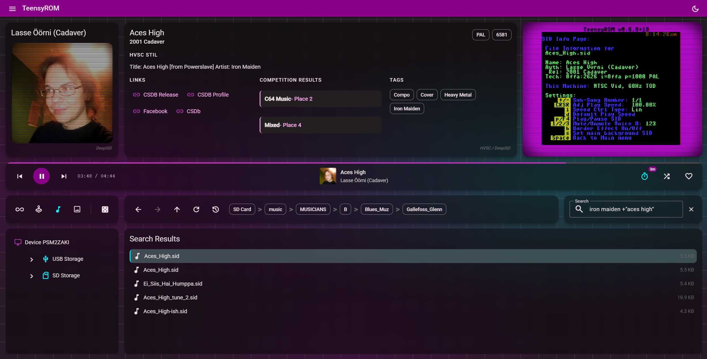
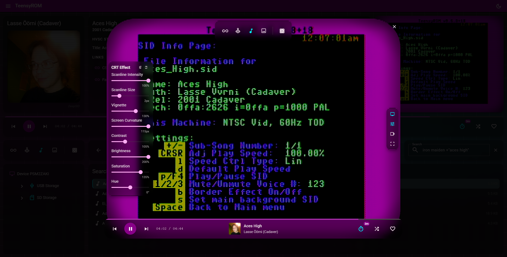
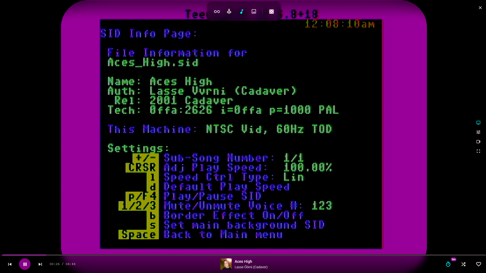
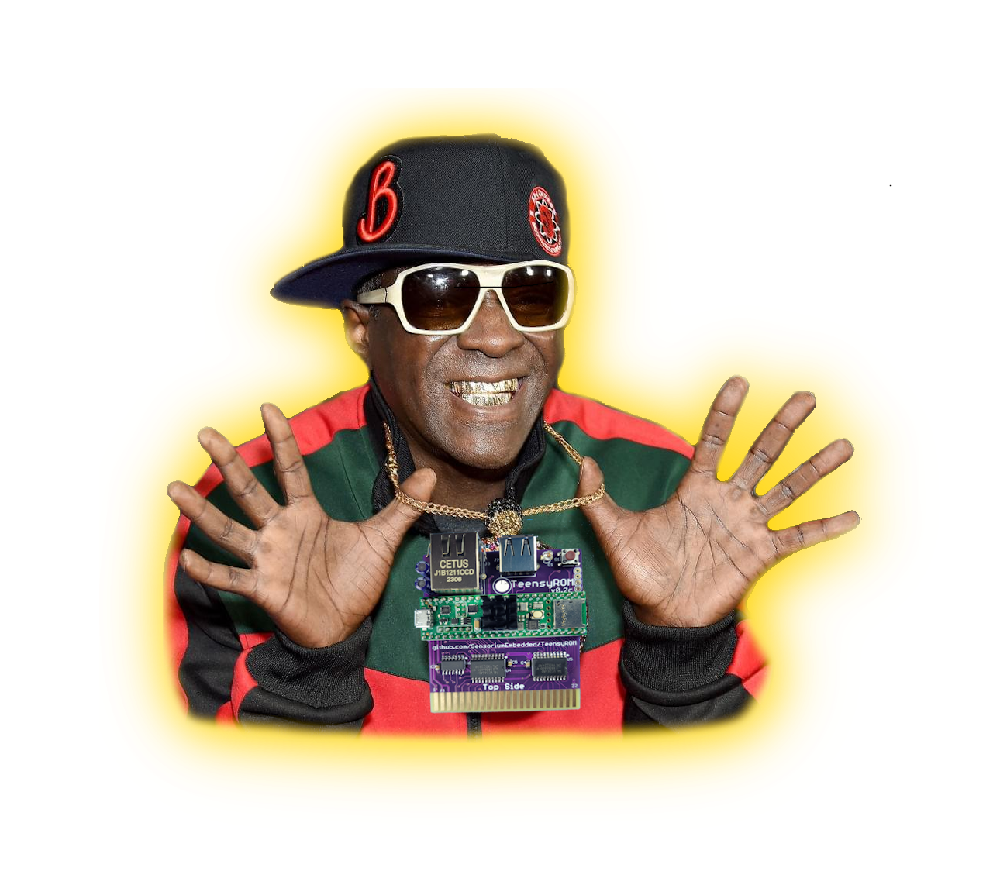

# TeensyROM Web

A mashup of ancient hardware and modern technology, this cross-platform web app controls your Commodore 64/128 using the [TeensyROM Hardware Cartridge](https://github.com/SensoriumEmbedded/TeensyROM). Unlock lightning-fast exploration and instant remote launching of your favorite games, SID music, scene demos, and images—all from massive file collections stored on your TeensyROM cartridge.

> **Note**: This project is the spiritual successor to the original [TeensyROM-UI WPF desktop application](https://github.com/MetalHexx/TeensyROM-UI). While the original application provided a Windows-only desktop experience, this new implementation offers cross-platform compatibility through a modern web architecture that can run on Windows, macOS, and Linux.



<table style="width: 100%; border:none;">
  <tr>
    <td align="center">
      <b>Launch Games and SIDs</b><br>
      <div style="width: 250px; height: 200px; margin: 0 auto; overflow: hidden;">
        
      </div>
    </td>
    <td align="center">
      <b>With CRT Emulation</b><br>
      <div style="width: 250px; height: 200px; margin: 0 auto; overflow: hidden;">
        
      </div>
    </td>
    <td align="center">
      <b>And Full Screen Immersion</b><br>
      <div style="width: 250px; height: 200px; margin: 0 auto; overflow: hidden;">
        
      </div>
    </td>
  </tr>
</table>


## ✨ Features

### Media Player & Playback
- **File Launch**: Remote launching of Games, Demos, SID music, and images
- **Random Launch**: Random launching of all file types across storage devices.
- **Playback Controls**: Play, pause, stop, next, and previous navigation
- **Launch Modes**: 
  - **Sequential Mode**: Navigate through files in directory order
  - **Shuffle Mode**: Random file playback with customizable scope and filters
- **Progress Bar**: Visual playback progress with elapsed/total time for SID music
- **Auto-Play**: Continuous playback through directories or shuffle queues
- **File Compatibility**: Real-time validation and error feedback for incompatible files
- **Current File Info**: Display file metadata, creator, release info, and status

### Video Integration & CRT Emulation
> **Note**:  The video integration is completely optional, but highly recommended!
- **Modern Meets Retro**: Seamlessly blend modern streaming control overlays with authentic CRT Video aesthetics to recreate the authentic Commodore 64 experience
- **Live Video Capture**: Real-time video stream from connected video capture devices
- **Authentic CRT Effects**: Customizable cathode ray tube emulation with scanlines, vignette, screen curvature, and color filters
- **Multiple Display Modes**:
  - **Compact Integrated View**: Watch gameplay inline within the player interface
  - **Dialog Mode**: And expanded "Theatre Style" video dialog with full control toolbar and device selector
  - **Fullscreen Mode**: Immersive full-screen experience with responsive CRT effects
- **CRT Customization**: Adjust scanline intensity, vignette strength, screen curvature, contrast, brightness, saturation, and hue in real-time
- **Preset Configurations**: Quick-apply CRT presets (full, standard, minimal) for instant visual style switching
- **Device Selection**: Switch between multiple connected video capture devices on-the-fly

### Search & Filter
- **Full-Text Search**: Search across all indexed files on SD or USB storage (per storage type)
- **Boolean / Phrase Search**: Group phrases in quotes or add a plus for required terms/phrases E.g., `Iron +Maiden +"Aces High"`
- **Search Results View**: Dedicated view for browsing and launching search results
- **File Type Filters**: Filter by All, Games, Music, Images, or Demos

### Play History & Favorites
- **Play History Tracking**: Complete history of all launched files with timestamps
- **History Navigation**: Browse backwards and forwards through play history
- **History View**: Dedicated panel for viewing and launching files from play history.
- **Favorites System**: Mark files as favorites and toggle favorite status

### File Browser & Navigation
- **Dual Storage**: Navigate both SD and USB storage with independent directory trees
- **Directory Tree**: Collapsible tree view for hierarchical folder navigation
- **File Listings**: Virtual scrolling file lists optimized for large directories (2000+ items)
- **Breadcrumb Navigation**: Directory breadcrumb with quick navigation to parent folders
- **Browser-like Directory Nav:**: Backtrack backward or forward through your directory navigation history
- **Multi-Device Views**: Simultaneous file browsing across multiple connected devices

### Device Management
- **Auto-Discovery**: Automatic detection of connected TeensyROM devices via serial ports
- **Multi-Device Support**: Connect and manage multiple TeensyROM cartridges simultaneously
- **Real-Time Device Logs**: Live device log debug monitoring of backend / serial operations
- **Device Controls**: Ping and reset operations across all connected devices
- **Storage Indexing**: Index SD and USB storage for fast file access, random launches and search

### API & Integration
- **RESTful API**: Complete REST API with Scalar documentation (available at `/scalar/v1`)
- **OpenAPI Integration**: Auto-generated TypeScript client from .NET API specification
- **SignalR Hubs**: Real-time bidirectional communication for device events and logs
- **Cross-Platform**: Runs on Windows, macOS, and Linux

## 🚧 Roadmap

Features planned for future releases:

- **Official Releases**: Installable binaries without need to compile source
- **SID DJ Controls**: Advanced controls for live SID music mixing and performance
- **MIDI Integration**: Full application control from MIDI devices
- **Cross-Storage Random Launch**:  Random selection across both SD and USB storage
- **Cross-Storage Search**: Search across both SD and USB storage simultaneously
- **Playlists**: Create, manage, and play custom playlists of games, music, and images
- **File Transfer**: Drag-and-drop file uploads to device storage with progress tracking
- **Settings Management**: User preferences, default behaviors, and application configuration
- **Theme System**: Light/dark mode with custom color schemes and Material theme customization
- **Keyboard Controls**: Keyboard shortcuts for playback, navigation, and common operations
- **Cross Storage Scope Selection**: Search/shuffle across all connected device storage (per device, per storage type)
- **Ethernet Support**: Ethernet support for device communication (alternative to Serial/USB)
- **Scope Selection**: 
  - **Storage Scope**: Search/shuffle across all storage devices SD or USB storage
  - **Directory Pinning**: Search/shuffle scoped to a specific directory and children.

## 🏗️ Architecture

TeensyROM Web is built as a hybrid application combining:

- **Backend**: .NET 9 Web API 
  - Cross-platform serial port management

- **Frontend**: Angular 19 with Nx monorepo architecture
  - Frontend Web Application that communicates with API

## 🎯 Deployment Modes

This application can be deployed in two ways:

1. **Standalone Web Application** - Full-stack application with integrated API and web UI
2. **API-Only Mode** - Headless API server for integration with custom clients or automation

## 🚀 Quick Start

_For now, if you want to try it out, you'll have to compile and run from source. An installable binary release will be available later in Q4._

### Prerequisites
- .NET 9 SDK
- Talk to Travis or I for a pre-release FW if you want to try this out.

**Install .NET 9 SDK:**

Download and install the .NET 9 SDK from the [official Microsoft download page](https://dotnet.microsoft.com/download/dotnet/9.0).

After installation, verify the installation:
```bash
dotnet --version
```

### Setup & Run

```bash
# Clone the repository
git clone https://github.com/MetalHexx/TeensyROM-Web.git
cd TeensyROM-Web/src/apps/api/src/TeensyRom.Api

# Build and run the application
dotnet build
dotnet run
```

### Access the Application

The API now serves the web application as a single integrated unit:

**Web UI:**
```
http://localhost:5168
```

**API Documentation (Scalar):**
```
http://localhost:5168/scalar/v1
```

## 🛠️ Building the Web Application from Source

If you want to modify and build the web application yourself, you'll need additional prerequisites.

### Additional Prerequisites for Web Development

**Install Node.js:**

Node.js includes npm (Node Package Manager) which is required to install PNPM.

#### Windows

Install Node.js LTS using Windows Package Manager (winget):

```bash
winget install OpenJS.NodeJS.LTS
```

After installation, verify the installation:
```bash
node --version
npm --version
```

Restart your terminal to ensure npm is available in your PATH.

#### macOS

_Coming soon_

#### Linux

_Coming soon_

**Install PNPM:**

This project uses PNPM as the package manager. Install it globally using npm:

```bash
npm install -g pnpm
```

After installation, restart your terminal to ensure pnpm is available in your PATH.

Or using other installation methods from [pnpm.io](https://pnpm.io/installation).

### Web Application Development

**Install Dependencies:**
```bash
cd TeensyROM-Web/src
pnpm install
```

**Development Mode (Two Terminals):**

For active web development with hot-reload, run the API and frontend separately:

**Terminal 1 - Start the API Backend:**
```bash
cd TeensyROM-Web/src/apps/api/src/TeensyRom.Api
dotnet run
```

**Terminal 2 - Start the Frontend:**
```bash
cd TeensyROM-Web/src
pnpm start
```

Access the development server at `http://localhost:4200`

**Production Build:**

Build the web application and integrate it with the API:

```bash
cd TeensyROM-Web/src
pnpm run build:frontend
```

This builds the Angular application and copies the production files to the API's `wwwroot` folder. The API will then serve these files when you run `dotnet run`.

## 🤝 Contributing

This project is currently in active development. Come talk to me about contributions.  It's mostly a one-person project at the moment, but I'm open to ideas and testing help!  Tag @hExx to reach me.

## 💬 Discord

Join the TeensyROM community on Discord for support, discussions, and updates:

<p align="left">
  <a href="https://discord.com/invite/ubSAb74S5U">
    
  </a>
</p>

## 🙏 Acknowledgments

- **Travis Smith / Sensorium** - Creator of the [TeensyROM Hardware](https://github.com/SensoriumEmbedded/TeensyROM)
- **Jens-Christian Huus / DeepSID** - [DeepSID Repo](https://github.com/Chordian/deepsid) lots of metadata sourced from this project.
- **StatMat / Oneload64** - [Oneload64](https://oneload64.github.io/) lots of metadata sourced from this project.

## 🔗 Related Projects

- [TeensyROM Hardware](https://github.com/SensoriumEmbedded/TeensyROM) - The hardware cartridge this application controls
- [TeensyROM-UI](https://github.com/MetalHexx/TeensyROM-UI) - The original Windows desktop UI application
- [TeensyROM-CLI](https://github.com/MetalHexx/TeensyROM-CLI) - Cross-platform command-line interface for TeensyROM device management

## 📜 License

See [LICENSE.md](LICENSE.md) for details.

<p align="center">
  
</p>

