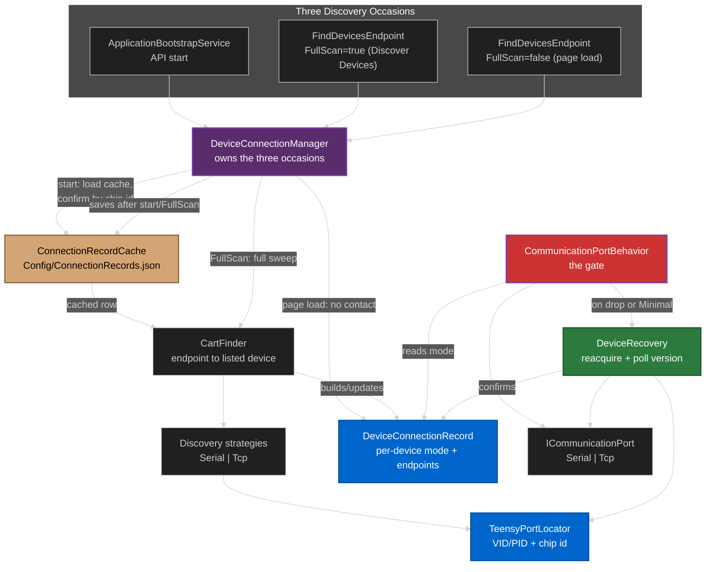
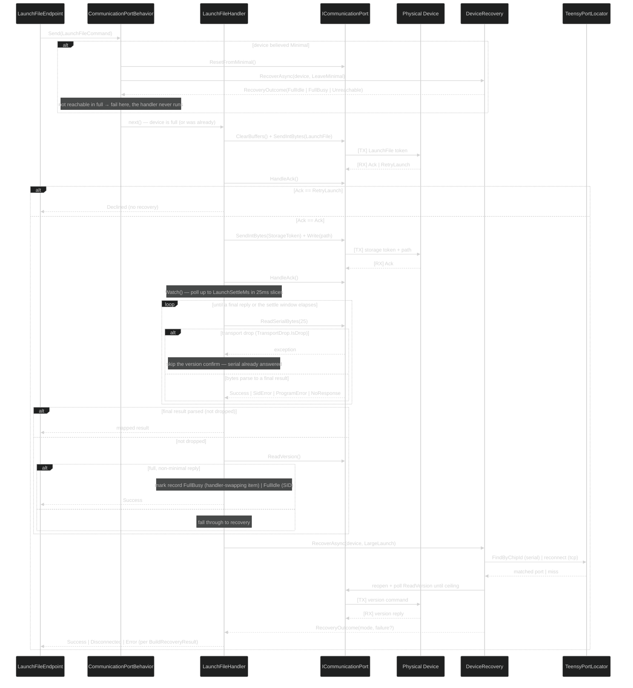
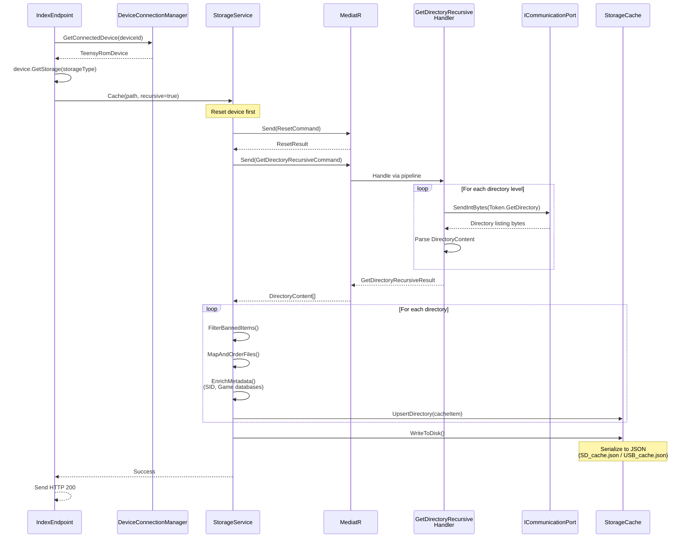

# TeensyROM Backend Architecture & Workflows

## Overview

The TeensyROM backend is a **layered .NET 9 Web API** designed to manage physical TeensyROM devices connected via serial ports, orchestrate file operations on their storage (SD/USB), and provide real-time communication with the frontend via SignalR. The architecture follows **Clean Architecture principles** with a **CQRS pattern** implemented via MediatR, emphasizing separation of concerns and testability.

### Core Responsibilities

- **Device Discovery & Connection Management**: Detect, connect, and monitor TeensyROM devices on available serial ports
- **Serial Protocol Communication**: Execute low-level serial commands with state management and error recovery
- **Storage Operations**: Index, search, cache, and manage files on device storage (SD/USB) 
- **File Launching**: Transfer and launch programs/music/games on Commodore 64 via TeensyROM cartridge
- **Real-time Streaming**: Push device logs and state changes to frontend via SignalR hubs
- **API Surface**: Expose RESTful endpoints via RadEndpoints with auto-generated OpenAPI specs

### Key Data/Control Flows

**Critical Pattern**: All device operations flow through MediatR with **pipeline behaviors** that handle locking, state transitions, logging, and exception handling before reaching handlers that execute serial/storage operations.

---

## System Architecture

```mermaid
graph TB
    subgraph "TeensyRom.Api"
        API[Program.cs<br/>ASP.NET Core Host]
        ENDPOINTS[RadEndpoints<br/>Files | Player | Serial]
        HUBS[SignalR Hubs<br/>LogsHub | AudioHub | TransferHub]
    end

    subgraph "TeensyRom.Core.Device"
        DCM[DeviceConnectionManager<br/>Multi-device orchestration]
        FINDER[CartFinder<br/>Port scanning & detection]
        DEVICE[TeensyRomDevice<br/>Device aggregate root]
    end

    subgraph "TeensyRom.Core.Serial"
        MEDIATOR[MediatR Pipeline<br/>LoggingBehavior<br/>ExceptionBehavior<br/>CommunicationPortBehavior]
        HANDLERS[Command Handlers<br/>LaunchFile | Ping | Reset<br/>GetDirectory | CopyFile]
        RECOVERY[DeviceRecovery<br/>Reacquire + poll version on drop]
        COMMPORT[ICommunicationPort<br/>SerialCommunicationPort | TcpCommunicationPort]
    end

    subgraph "TeensyRom.Core.Storage"
        STORAGE[StorageService<br/>CRUD + Enrichment]
        CACHE[StorageCache<br/>In-memory + disk persistence]
        TOOLS[Storage Tools<br/>D64 | Zip extraction]
    end

    subgraph "TeensyRom.Core"
        ENTITIES[Domain Entities<br/>FileItem | Cart | Settings]
        ABSTRACTIONS[Service Contracts<br/>IDeviceConnectionManager<br/>IStorageService | ICommunicationPort]
        LOGGING[Logging Service<br/>Queued channel logger]
    end

    subgraph "Frontend Integration"
        OPENAPI[OpenAPI Spec<br/>Auto-generated on build]
        APICLIENT[TypeScript Client<br/>Generated via openapi-generator-cli]
        INFRA[Infrastructure Layer<br/>DeviceService | StorageService]
    end

    API --> ENDPOINTS
    API --> HUBS
    ENDPOINTS --> MEDIATOR
    ENDPOINTS --> DCM
    
    DCM --> FINDER
    DCM --> DEVICE
    DEVICE --> COMMPORT
    DEVICE --> STORAGE
    
    MEDIATOR --> HANDLERS
    HANDLERS --> COMMPORT
    HANDLERS --> STORAGE
    MEDIATOR --> RECOVERY
    RECOVERY --> COMMPORT
    
    STORAGE --> CACHE
    STORAGE --> TOOLS
    STORAGE --> MEDIATOR
    
    HANDLERS --> ENTITIES
    STORAGE --> ENTITIES
    DCM --> LOGGING
    HANDLERS --> LOGGING
    
    API -.Generates.-> OPENAPI
    OPENAPI -.Generates.-> APICLIENT
    APICLIENT --> INFRA
    INFRA -.HTTP Calls.-> ENDPOINTS
    
    HUBS -.WebSocket.-> INFRA

    style MEDIATOR fill:#ff9999
    style DEVICE fill:#99ccff
    style RECOVERY fill:#99ff99
    style CACHE fill:#ffcc99
```

---

## Key Components & Links

### API Layer (#file:apps/api/src/TeensyRom.Api)

| Component | Purpose | Key Files |
|-----------|---------|-----------|
| **Program.cs** | Application entry point, DI container setup, middleware pipeline | #file:apps/api/src/TeensyRom.Api/Program.cs |
| **RadEndpoints** | Thin HTTP handlers that delegate to MediatR or services | #file:apps/api/src/TeensyRom.Api/Endpoints/Files/GetDirectory/GetDirectoryEndpoint.cs<br/>#file:apps/api/src/TeensyRom.Api/Endpoints/Serial/FindDevices/FindDevicesEndpoint.cs<br/>#file:apps/api/src/TeensyRom.Api/Endpoints/Player/LaunchFile/LaunchFileEndpoint.cs |
| **SignalR Hubs** | Real-time log stream for the frontend | #file:apps/api/src/TeensyRom.Api/Endpoints/Serial/Logs/LogsHub.cs |
| **Startup Extensions** | Service registration and configuration | #file:apps/api/src/TeensyRom.Api/Startup/ServiceStartupExtensions.cs<br/>#file:apps/api/src/TeensyRom.Api/Startup/MediatorStartupExtensions.cs<br/>#file:apps/api/src/TeensyRom.Api/Startup/ApiDocStartupExtensions.cs |

**Endpoint Pattern**: Each endpoint lives in `Endpoints/[Domain]/[Action]/[Action]Endpoint.cs` with explicit RadEndpoints configuration (routes, tags, descriptions) and delegates complex operations to MediatR.

### Device Management (#file:apps/api/src/TeensyRom.Core.Device)

| Component | Purpose | Key Files |
|-----------|---------|-----------|
| **DeviceConnectionManager** | Owns the three discovery occasions (start, Discover Devices, page load) and the confirmed device set, keyed by chip id | #file:apps/api/src/TeensyRom.Core.Device/DeviceConnectionManager.cs |
| **CartFinder** | Turns one confirmed endpoint into a listed device: resets minimal firmware back to full through recovery, probes storage, dedupes a chip found on both transports by `ConnectionOptions.PreferredTransport` | #file:apps/api/src/TeensyRom.Core.Device/CartFinder.cs |
| **SerialDiscoveryStrategy / TcpDiscoveryStrategy** | Probe every USB-descriptor-matched COM port / the local `/24` subnet with the version command; each yields one `DiscoveredEndpoint` per TeensyROM reply | #file:apps/api/src/TeensyRom.Core.Device/SerialDiscoveryStrategy.cs<br/>#file:apps/api/src/TeensyRom.Core.Device/TcpDiscoveryStrategy.cs |
| **ConnectionRecordCache** | Whole-file JSON cache of confirmed connection records (`Config/ConnectionRecords.json`), read by the start occasion and rewritten after any occasion that contacts a device | #file:apps/api/src/TeensyRom.Core.Device/ConnectionRecordCache.cs |
| **TeensyRomDevice** | Aggregate root representing a device: `Cart` metadata + `ICommunicationPort` + storage services | #file:apps/api/src/TeensyRom.Core/Entities/Device/TeensyRomDevice.cs |

**Critical Pattern**: `TeensyRomDevice` encapsulates:
- **Cart** metadata (device ID, name, firmware/hardware facts, storage info)
- **DeviceConnectionRecord** (known endpoints per transport, transport in use, `DeviceMode`, last-confirmed time — see *Connectivity Ring* below)
- **SdStorage/UsbStorage** (storage service instances)

This ensures all device operations are scoped to the correct physical device in multi-device scenarios.

### Serial Communication (#file:apps/api/src/TeensyRom.Core.Serial)

| Component | Purpose | Key Files |
|-----------|---------|-----------|
| **MediatR Commands** | Request/response wrappers for serial operations implementing `ITeensyCommand<T>` | #file:apps/api/src/TeensyRom.Core.Serial/Commands/LaunchFile/LaunchFileCommand.cs<br/>#file:apps/api/src/TeensyRom.Core.Serial/Commands/Ping/PingCommand.cs<br/>#file:apps/api/src/TeensyRom.Core.Serial/Commands/GetDirectoryRecursive/GetDirectoryRecursiveCommand.cs |
| **Command Handlers** | Execute serial protocol sequences, parse responses, let the gate/recovery handle drops | #file:apps/api/src/TeensyRom.Core.Serial/Commands/LaunchFile/LaunchFileHandler.cs<br/>#file:apps/api/src/TeensyRom.Core.Serial/Commands/GetFile/GetFileCommandHandler.cs |
| **Pipeline Behaviors** | Cross-cutting concerns applied to all commands | #file:apps/api/src/TeensyRom.Core.Serial/Commands/Behaviors/CommunicationPortBehavior.cs<br/>#file:apps/api/src/TeensyRom.Core.Serial/Commands/Behaviors/LoggingBehavior.cs<br/>#file:apps/api/src/TeensyRom.Core.Serial/Commands/Behaviors/ExceptionBehavior.cs |
| **DeviceRecovery** | Reacquires a device after any transport drop — on its own `ICommunicationPort` instance, never a new one — polling the version command to a per-transport, per-reason ceiling | #file:apps/api/src/TeensyRom.Core.Serial/Recovery/DeviceRecovery.cs |
| **TeensyPortLocator** | Finds a device's current serial port by chip id (VID/PID + serial-string), so recovery and discovery don't have to probe every port blind | #file:apps/api/src/TeensyRom.Core.Serial/Usb/TeensyPortLocator.cs |
| **ICommunicationPort** | Transport abstraction; `SerialCommunicationPort` wraps `System.IO.Ports`, `TcpCommunicationPort` wraps a `TcpClient` | #file:apps/api/src/TeensyRom.Core.Serial/SerialCommunicationPort.cs<br/>#file:apps/api/src/TeensyRom.Core.Serial/TcpCommunicationPort.cs |

**Device Modes** (`DeviceMode`, tracked per `DeviceConnectionRecord`, not by a state-machine object):
- **FullIdle**: full firmware, connected, accepts commands
- **FullBusy**: full firmware, but not answering commands — the device replied `Busy!`, or a handler-swapping launch (cart, PRG, image) left something other than the TeensyROM IO handler in charge. The gate resets a device believed busy before any non-launch command
- **Minimal**: minimal (recovery) firmware — the gate resets every command, launches included, back to full before it reaches a handler
- **Unreachable**: no correct-chip reply within the recovery ceiling; its endpoints and last-known facts are kept so the next discovery occasion can find it again

**Command Protocol**: Commands send token bytes (`TeensyToken.LaunchFile`, `TeensyToken.GetDirectory`) followed by parameters, then wait for `TeensyToken.Ack` (or, for a launch, `TeensyToken.RetryLaunch` — the device asking for a re-send, not a failure) and parse result data. See *Connectivity Ring* below for the gate that wraps every exchange and the recovery that follows a drop.

### Storage & Indexing (#file:apps/api/src/TeensyRom.Core.Storage)

| Component | Purpose | Key Files |
|-----------|---------|-----------|
| **StorageService** | High-level storage API: CRUD, indexing, search, favorites | #file:apps/api/src/TeensyRom.Core.Storage/StorageService.cs |
| **StorageCache** | In-memory cache + JSON file persistence of indexed directories/files | #file:apps/api/src/TeensyRom.Core.Storage/SimpleStorageCache.cs<br/>#file:apps/api/src/TeensyRom.Core.Storage/BaseStorageCache.cs |
| **Storage Factory** | Creates storage service instances bound to specific device/storage type | #file:apps/api/src/TeensyRom.Core.Storage/StorageFactory.cs |
| **Storage Tools** | D64 disk image and ZIP extraction utilities | #file:apps/api/src/TeensyRom.Core.Storage/Tools/D64/<br/>#file:apps/api/src/TeensyRom.Core.Storage/Tools/Zip/ |

**Indexing Flow**:
1. Client calls `IndexEndpoint` → triggers `StorageService.Cache(path)`
2. Sends `GetDirectoryRecursiveCommand` via MediatR → serial handler walks directory tree
3. For each directory: map files to domain types (SongItem, GameItem, etc.), enrich with metadata
4. Cache results in memory + serialize to disk (`*.cache.json` in app directory)
5. Search operates on in-memory cache with fuzzy matching and ranking

**Cache Strategies**:
- **Lazy Loading**: On-demand fetch if cache miss on `GetDirectory()`
- **Full Indexing**: Recursive walk triggered by user or on device connection
- **Favorites**: Special directory (`/TeensyROM/Favs`) with symbolic links managed via copy operations

### OpenAPI & Client Generation

| Component | Purpose | Key Files |
|-----------|---------|-----------|
| **OpenAPI Spec** | Auto-generated JSON spec on API build via `Microsoft.AspNetCore.OpenApi` | #file:apps/api/src/TeensyRom.Api/api-spec/TeensyRom.Api.json |
| **Scalar UI** | Interactive API documentation at `/scalar/v1` (replaces Swagger) | #file:apps/api/src/TeensyRom.Api/Startup/ApiDocStartupExtensions.cs |
| **Client Generator** | Node script (see `.claude/skills/api-client-generation/SKILL.md` for details) | #file:.claude/skills/api-client-generation/scripts/generate-client.js |
| **Generated Client** | TypeScript models + `*ApiService` classes consumed by infrastructure | #file:libs/data-access/api-client/src/lib/apis/<br/>#file:libs/data-access/api-client/src/lib/models/ |
| **Infrastructure Services** | Implement domain contracts, map DTOs Γåö models, handle errors | #file:libs/infrastructure/src/lib/device/device.service.ts<br/>#file:libs/infrastructure/src/lib/storage/storage.service.ts |

**Generation Pipeline**: See `.claude/skills/api-client-generation/SKILL.md` for detailed workflow.

```bash
pnpm run generate:api-client  # Regenerates TypeScript client from OpenAPI spec
```

**Frontend Integration**: Infrastructure layer injects generated `*ApiService` classes, calls async methods returning Promises, maps responses to domain models via `DomainMapper`, and exposes Observables to application/feature layers.

---

## Endpoint Architecture

### Organization

Endpoints are organized by domain under `Endpoints/[Domain]/[Action]/`:

```
Endpoints/
Γö£ΓöÇΓöÇ Assets/          # Static asset info (firmware, images)
Γö£ΓöÇΓöÇ Files/           # Storage operations
Γöé   Γö£ΓöÇΓöÇ GetDirectory/
Γöé   Γö£ΓöÇΓöÇ Index/
Γöé   Γö£ΓöÇΓöÇ Search/
Γöé   Γö£ΓöÇΓöÇ FavoriteFile/
Γöé   ΓööΓöÇΓöÇ ...
Γö£ΓöÇΓöÇ Player/          # Media playback
Γöé   Γö£ΓöÇΓöÇ LaunchFile/
Γöé   Γö£ΓöÇΓöÇ LaunchRandom/
Γöé   Γö£ΓöÇΓöÇ ToggleMusic/
Γöé   ΓööΓöÇΓöÇ ...
ΓööΓöÇΓöÇ Serial/          # Device management
    Γö£ΓöÇΓöÇ FindDevices/
    Γö£ΓöÇΓöÇ ConnectDevice/
    Γö£ΓöÇΓöÇ PingDevice/
    Γö£ΓöÇΓöÇ Logs/
    ΓööΓöÇΓöÇ DeviceEvents/
```

### Versioning & Validation

- **Versioning**: All endpoints under `/` (implicit v1). Future: add `/v2/` prefix when breaking changes occur
- **Validation**: RadEndpoints provides built-in model binding/validation via `[FromRoute]`, `[FromBody]` attributes
- **OpenAPI Tags**: Endpoints grouped by tags (`Files`, `Player`, `Devices`) in generated docs

### Typical Endpoint Flow

```csharp
public class GetDirectoryEndpoint(IDeviceConnectionManager deviceManager) 
    : RadEndpoint<GetDirectoryRequest, GetDirectoryResponse>
{
    public override void Configure()
    {
        Get("/devices/{deviceId}/storage/{storageType}/directories")
            .WithTags("Files")
            .Produces<GetDirectoryResponse>(200)
            .ProducesProblem(400);
    }

    public override async Task Handle(GetDirectoryRequest r, CancellationToken ct)
    {
        // 1. Resolve device from manager
        var device = deviceManager.GetConnectedDevice(r.DeviceId!);
        if (device is null) { SendNotFound(); return; }
        
        // 2. Get storage service for device
        var storage = device.GetStorage(r.StorageType);
        if (storage is null) { SendNotFound(); return; }
        
        // 3. Call storage service (may trigger MediatR commands internally)
        var result = await storage.GetDirectory(new DirectoryPath(r.Path!));
        
        // 4. Map to response DTO and send
        Response = new() { StorageItem = StorageCacheDto.FromCache(result) };
        Send();
    }
}
```

**Key Pattern**: Endpoints are **thin adapters** that:
1. Extract/validate request data
2. Resolve domain services (devices, storage)
3. Delegate to services/MediatR
4. Map results to DTOs
5. Send HTTP responses

---

## Connectivity Ring

The connectivity ring is the set of collaborators that find a device, keep the gate honest while a command runs, and reacquire the device after a transport drop — record · recovery · gate · discovery · manager · cache.



### Collaborators

| Component | Purpose | Key Files |
|-----------|---------|-----------|
| **DeviceConnectionRecord** | Per-device record: endpoints known per transport, transport in use, last-known `DeviceMode`, last-confirmed time. Survives across any single port. | #file:apps/api/src/TeensyRom.Core/Entities/Device/DeviceConnectionRecord.cs |
| **DeviceConnectionManager** | Owns the three occasions and the confirmed device set (`_byChip`), keyed by chip id | #file:apps/api/src/TeensyRom.Core.Device/DeviceConnectionManager.cs<br/>#file:apps/api/src/TeensyRom.Core/Abstractions/IDeviceConnnectionManager.cs |
| **ConnectionRecordCache** | Whole-file JSON cache of confirmed rows (`Config/ConnectionRecords.json`), loaded by the start occasion, replaced whole after start/FullScan | #file:apps/api/src/TeensyRom.Core.Device/ConnectionRecordCache.cs |
| **CartFinder** | Turns one confirmed endpoint into a listed device (`BuildDevice`); resets minimal firmware back to full through recovery, probes storage, dedupes a chip found on two transports by `ConnectionOptions.PreferredTransport` (default `Tcp`) | #file:apps/api/src/TeensyRom.Core.Device/CartFinder.cs |
| **SerialDiscoveryStrategy / TcpDiscoveryStrategy** | Probe USB-descriptor-matched COM ports / the local `/24` subnet with the version command | #file:apps/api/src/TeensyRom.Core.Device/SerialDiscoveryStrategy.cs<br/>#file:apps/api/src/TeensyRom.Core.Device/TcpDiscoveryStrategy.cs |
| **CommunicationPortBehavior** | The gate: the MediatR pipeline behavior every command passes through | #file:apps/api/src/TeensyRom.Core.Serial/Commands/Behaviors/CommunicationPortBehavior.cs |
| **DeviceRecovery** | Reacquires a device on its own port instance after a drop, or when leaving minimal firmware | #file:apps/api/src/TeensyRom.Core.Serial/Recovery/DeviceRecovery.cs<br/>#file:apps/api/src/TeensyRom.Core.Serial/Recovery/IDeviceRecovery.cs |
| **ConnectionOptions** | Tunables bound from the `Connection` config section: poll interval, per-transport ceilings, launch-settle and connect-timeout windows | #file:apps/api/src/TeensyRom.Core.Serial/Recovery/ConnectionOptions.cs |
| **TeensyPortLocator** | Lists/filters TeensyROM serial ports by VID/PID and finds one by chip id | #file:apps/api/src/TeensyRom.Core.Serial/Usb/TeensyPortLocator.cs<br/>#file:apps/api/src/TeensyRom.Core.Serial/Usb/ITeensyPortLocator.cs |
| **LaunchFileHandler** | The one handler that expects a drop mid-command (large-file reboot) and resolves it itself | #file:apps/api/src/TeensyRom.Core.Serial/Commands/LaunchFile/LaunchFileHandler.cs |

### Command Interface

All serial commands implement `ITeensyCommand<TResponse>`:

```csharp
public interface ITeensyCommand<T> : IRequest<T>
{
    string? DeviceId { get; set; }                       // For multi-device routing
    ICommunicationPort CommunicationPort { get; init; }   // The device's open port
}
```

### The Pipeline & the Gate

Every command runs `Logging → Exception → CommunicationPort`:

#### 1. LoggingBehavior
- **Purpose**: Logs command start/completion with timing and request/response details
- **Key File**: #file:apps/api/src/TeensyRom.Core.Serial/Commands/Behaviors/LoggingBehavior.cs
- **Operation**: Wraps command execution in `Stopwatch`, logs success/failure with deviceId context

#### 2. ExceptionBehavior
- **Purpose**: Converts exceptions to error responses, publishes alerts to frontend
- **Key File**: #file:apps/api/src/TeensyRom.Core.Serial/Commands/Behaviors/ExceptionBehavior.cs
- **Handles**:
  - `TeensyBusyException` → Returns `IsBusy = true` response
  - Port closed errors → "Disconnected from TeensyROM"
  - Generic exceptions → Wrapped error responses

#### 3. CommunicationPortBehavior — the gate
- **Purpose**: One command at a time per device, an open port for the exchange, and a reaction to what the exchange actually reports rather than a firmware probe up front
- **Key File**: #file:apps/api/src/TeensyRom.Core.Serial/Commands/Behaviors/CommunicationPortBehavior.cs
- **What it does**:
  1. Locks — acquires a per-device `SemaphoreSlim` keyed by `DeviceId` (stale locks over 5 minutes are swept)
  2. Opens the port if it is closed, else clears its buffers
  3. Reactive `Busy` once — a `TeensyBusyException` from the handler earns exactly one reset, never a loop; the retry only happens when the reset's own signal says the menu came back up, otherwise the command fails with a legible reason instead of retrying into a device that may still be mid-boot
  4. Drop → recovery — a transport drop (`TransportDrop.IsDrop`), whether at open or during the exchange, hands the device to `DeviceRecovery.RecoverAsync(..., RecoveryReason.Drop)` and rethrows
  5. Minimal → full, launches included — if the device is believed `Minimal`, resets it and recovers to full (`RecoveryReason.LeaveMinimal`) before letting *any* command through, a launch included; minimal firmware cannot run a file at all, and sending a launch to it left the device unreachable when the reboot-vs-jump outcome went wrong, so there is no exemption here
  6. Busy → idle for non-launch — if the device is believed `FullBusy` (a handler-swapping launch left a cart/PRG/image owning the firmware's IO handler, so every non-always-available command answers `Busy!`) and the command is not `LaunchFileCommand`, resets it and clears the buffers. No recovery routine and no sleep: a full-firmware reset keeps the port/socket open. When the reset's own signal says the menu came back up, the record is marked idle and the command proceeds; when it does not, the command fails with a legible reason instead of running against a device that may still be mid-boot — the same reset-outcome check the reactive-`Busy` retry below makes. A launch is again exempt — the firmware takes a launch directly, and reactive `Busy` is the backstop if it does not
- **What it does not do**: it never closes the port itself — only `DeviceRecovery` closes and reopens one, and only while reacquiring

### The Reset Primitive

Two functions in `TRStreamExtensions` are the **only** writers of the reset token (`0x64EE`), so the
guarantees below hold everywhere without a caller-side guard: `ResetDevice(port, log)` for a device
believed already in full firmware (the gate's busy branch and its reactive-`Busy` retry, the reset
command), and `ResetFromMinimal(port, log)` for a device believed already in minimal (the gate's minimal
branch, `CartFinder.BuildDevice`) — sent and forgotten, since the reboot drops the transport before any
reply could matter.

- **`ResetDevice` sends the reset token, then waits for the C64 menu to come back up and finish
  booting.** Every reset boots the TeensyROM menu, and the menu asks the firmware for its default SID
  unconditionally. The firmware answers on the command channel with `GoodSIDToken` (`0x9B81`) or
  `BadSIDToken` (`0x9B80`) roughly 650 ms after the reset text — long after the reply has gone quiet.
  Left on the wire, that token is read as the *next* command's Ack ("Received unexpected response from
  TR"). Only once that token is seen does it move on to waiting for the firmware's own `Boot: complete`
  flag: the menu still has its network time sync and item listing ahead of it, and a command sent in
  that window can be lost.
- **Waits on signals, not the clock.** `WaitForMenuBootToken` reads until it sees either SID token,
  bounded (3 s default), then clears the buffers; `WaitForBootComplete` polls the version command every
  `PollIntervalMs` until the reply's `Boot:` line reads `complete`, bounded (8 s default — covers the
  roughly 1-in-20 resets where the menu's network time sync stalls it). No fixed sleep either way.
- **A timeout at either wait is reported, not swallowed**: `ResetDevice` returns `false` and logs which
  wait failed. The reset command does not fail on it — the device was still reset — but the log says so.
- **`ResetFromMinimal` cannot wait at all**: the Teensy reboots immediately, so the transport drops
  before either signal could arrive. `DeviceRecovery`'s `LeaveMinimal` path does the equivalent wait once
  the device is reacquired (below).

### The Three Discovery Occasions

| Occasion | Trigger | What it touches |
|----------|---------|------------------|
| **Start** | API boot — `ApplicationBootstrapService` calls `DeviceConnectionManager.ConnectAtStartAsync` | Loads `ConnectionRecords.json`; opens each cached endpoint bounded by `ConnectTimeoutMs`, confirms it by chip id (serial via `TeensyPortLocator`, TCP via a direct connect), hands the confirmed endpoint to `CartFinder.BuildDevice`. Any miss, or an empty/missing cache, falls back to a full discovery sweep. |
| **Discover Devices** | `GET /api/devices/?FullScan=true` (`FindDevicesEndpoint`) | Disposes every currently open port, runs `SerialDiscoveryStrategy` and `TcpDiscoveryStrategy` in parallel via `CartFinder.FindDevices`, marks any chip missing from the new sweep `Unreachable`, replaces `ConnectionRecords.json` whole. |
| **Page load** | `GET /api/devices/` (`FullScan=false`, the default — this is also what the UI's own bootstrap call uses) | No device is contacted. Returns `GetAvailableDevices()` as already known; if a Start or Discover Devices occasion is in flight, it joins that occasion's result instead of returning an empty list, but starts nothing itself. |

### Device Recovery

`DeviceRecovery.RecoverAsync(device, reason, ct)` reacquires a device **on its own `ICommunicationPort` instance, never a new one** — so a `StorageService` already holding that port keeps talking to a live connection. The contract:

- **Reacquire in place**: serial finds the device's current port by chip id via `TeensyPortLocator` (falling back to probing every present COM port when the descriptor filter is unavailable); TCP closes and reconnects to the device's last-known endpoint
- **Poll version**: once reacquired, polls the version command every `ConnectionOptions.PollIntervalMs` (default 250 ms) until it answers with the reason's expected mode
- **Ceiling per transport**: bounded by `ConnectionOptions.Tcp`/`ConnectionOptions.Serial` (`ToMinimalMs`, `ToFullMs`), selected by `RecoveryReason` — `LargeLaunch` waits for `Minimal`, `LeaveMinimal` waits for full, `Drop` accepts either mode within `max(ToMinimalMs, ToFullMs)`. There is no reason for a launch sent while already `Minimal`: the gate resets every `Minimal` device to full before a launch (or any other command) reaches the handler, so a launch's own recovery only ever runs `LargeLaunch`
- **Unreachable on ceiling**: no correct-chip reply within the ceiling marks the device `Unreachable` and closes the port; its record is kept so the next discovery occasion can find it again
- **Menu-boot wait on `LeaveMinimal`**: the reset that started this recovery dropped the transport before it could consume the menu's boot SID token, so on serial the reacquire itself (`ReacquireCandidates`) listens for that token before asking a full candidate for its version at all — a request answered too early can make the Teensy miss a C64 bus cycle and corrupt the menu's copy of itself. Once reacquired, the version poll can still answer before the menu has finished booting (`Boot: in progress`); unless the reply already says `Boot: complete`, `MenuBootFailure` waits on `WaitForBootComplete` (same signal and bound as the reset primitive) before declaring the device full. A miss at either wait is recorded on `RecoveryOutcome.Failure` and logged as a warning rather than passed off as a clean recovery

`appsettings.json`'s `Connection` section binds `ConnectionOptions`:

```json
"Connection": {
  "PollIntervalMs": 250,
  "Tcp": { "ToMinimalMs": 8000, "ToFullMs": 15000 },
  "Serial": { "ToMinimalMs": 15000, "ToFullMs": 15000 },
  "LaunchSettleMs": 2000,
  "ConnectTimeoutMs": 2000
}
```

### Launch's Drop-Expecting Flow

`LaunchFileHandler` is the one handler written to expect a mid-command drop, because a large launch reboots the device. It never sees a `Minimal` device itself — the gate resets minimal to full before a launch reaches it, the same as every other command — so everything below runs from full:

1. Sends the `LaunchFile` token and clears buffers, then reads the ack. If the device replies `TeensyToken.RetryLaunch` — a request to re-send, not a failure — the handler returns `Declined` immediately, no recovery involved.
2. Sends the storage token and path, then **watches** the port for up to `ConnectionOptions.LaunchSettleMs`, reading in 25 ms slices. A recognizable final reply (success/SID error/program error) short-circuits the wait.
3. A read that throws an exception `TransportDrop` classifies as a drop skips straight to recovery — serial already gave a definitive answer. Silence through the whole window (ambiguous; a TCP drop never throws) instead confirms with one version-command read: a full, non-minimal reply is treated as success without invoking recovery, and the record is marked from the launched item's type — `FullBusy` for anything that swaps the IO handler (cart, PRG, image), `FullIdle` only for a SID. The type decides it rather than the port's echo because the firmware's "Loading IO handler:" text is USB-serial-only and never arrives over TCP.
4. Otherwise it calls `DeviceRecovery.RecoverAsync` with `RecoveryReason.LargeLaunch` — the only reason a launch ever needs, since a large file is the one thing that reboots the device mid-launch — and maps the outcome via `BuildRecoveryResult`: unreachable → `Disconnected`; ending in `Minimal` → success (the large file rebooted the device to receive it); any other reachable mode → `Error` ("the launch did not take: the device came back in full firmware").

### Serial Locator

`TeensyPortLocator` classifies every present COM port by USB vendor/product id (`TeensyUsbIds.Vendor = 0x16C0`) rather than opening each one to ask:

- **VID/PID**: `ProductFull = 0x0489` (the `usb=serialmidi` image) vs. `ProductMinimal = 0x0483` (the `usb=serial` image)
- **Serial-string chip id**: the full image's USB serial number carries a `TeensyROM-Serial-` prefix stripped before use as the chip id; the minimal image's serial number is the bare chip digits
- **Per-platform readers**: one `IUsbSerialDescriptorReader` per OS, the first whose `IsSupported` is true wins — `WindowsRegistryDescriptorReader`, `LinuxSysfsDescriptorReader`, `MacOsPortNameDescriptorReader`
- **Probe-all fallback**: when no reader supports the platform, or the reader throws, `FilterAvailable` comes back false and callers (discovery, recovery) fall back to version-probing every present COM port instead of trusting the filter

---

## MediatR Flow Diagrams

### Launch Sequence: Gate Reset → Ack → Watch → Drop → Recovery → Mode



### Storage Indexing Flow



---

## Storage & Indexing Deep Dive

### What is Stored

**Cache File Structure** (`*.cache.json`):
```json
{
  "version": "1.0",
  "deviceHash": "abc123",
  "directories": {
    "/Games/Action": {
      "path": "/Games/Action",
      "directories": [...],
      "files": [
        {
          "id": "hash-uuid",
          "path": "/Games/Action/Commando.prg",
          "name": "Commando",
          "size": 32768,
          "type": "Game",
          "isFavorite": false,
          "metadata": { "developer": "Elite", "year": 1985 }
        }
      ]
    }
  }
}
```

### Indexing Strategies

**Full Indexing** (`IndexAllEndpoint`):
- Walks entire directory tree from root (`/`)
- Can take 5-10 minutes for large SD cards (thousands of files)
- Progress reported via device logs (pushed to frontend via SignalR)
- Cache persisted to disk after completion

**Incremental Indexing** (`IndexEndpoint`):
- Index single directory path (non-recursive or recursive)
- Used for folder navigation when cache miss occurs
- Merges results into existing cache

**On-Demand Fetch** (`GetDirectory`):
- If cache hit: return immediately
- If cache miss: send `GetDirectoryRecursiveCommand`, cache result, return
- Balances responsiveness with completeness

### Read/Write Paths

**Read Path** (Search/GetDirectory):
1. Check in-memory cache via `StorageCache.GetByDirPath()`
2. If miss: fetch via serial, enrich, cache, return
3. If hit: return cached `IStorageCacheItem`

**Write Path** (FavoriteFile):
1. Send `FavoriteFileCommand` via MediatR → serial handler copies file to `/TeensyROM/Favs/`
2. Update cache: mark original file `IsFavorite = true`, add favorite copy to cache
3. Update siblings (multi-file games) with same favorite status
4. Persist cache to disk

### Metadata Enrichment

**SID Music Files**:
- Matched against HVSC database (80k+ entries) via `HvscDatabase`
- Enriches with composer, year, subtune count
- Fetches composer images from DeepSID API

**Game Files**:
- Matched against OneLoad64 database via `GameMetadataService`
- Enriches with developer, year, genre, screenshots

**Enrichment occurs during indexing**, not on-demand reads (performance optimization).

### Integration with Device/Serial

Storage operations are **tightly coupled** to serial commands:
- `GetFileCommand` → reads file bytes via serial
- `DeleteFileCommand` → deletes file via serial
- `CopyFileCommand` → copies file via serial (used for favorites)
- `GetDirectoryRecursiveCommand` → walks directory tree via serial

All commands flow through MediatR pipeline with serial behaviors.

## Dependencies

### Major Frameworks & Libraries

| Dependency | Purpose | Why Used |
|------------|---------|----------|
| **ASP.NET Core 9.0** | Web host, DI, middleware | Industry-standard .NET web framework |
| **RadEndpoints** | Endpoint routing library | Cleaner alternative to minimal APIs/controllers with fluent config |
| **MediatR** | CQRS mediator pattern | Decouples endpoints from handlers, enables pipeline behaviors |
| **System.IO.Ports** | Serial port communication | Direct access to COM ports for TeensyROM protocol |
| **System.Reactive (Rx)** | Reactive programming | Port polling, state transitions, event streams |
| **SignalR** | WebSocket abstraction | Real-time log/event streaming to frontend |
| **Microsoft.AspNetCore.OpenApi** | OpenAPI spec generation | Auto-generates docs from endpoint metadata |
| **Scalar.AspNetCore** | API documentation UI | Modern Swagger alternative with better UX |
| **System.Text.Json** | JSON serialization | Cache persistence, API responses |
| **CsvHelper** | CSV parsing | HVSC music database loading |
| **Ardalis.SmartEnum** | Type-safe enums | Strongly-typed file types, storage types |

### Testing Frameworks

| Dependency | Purpose | Projects |
|------------|---------|----------|
| **xUnit** | Unit test runner | TeensyRom.Tests.Unit |
| **FluentAssertions** | Assertion library | All test projects |
| **NSubstitute** | Mocking library | All test projects |
| **Microsoft.AspNetCore.Mvc.Testing** | Integration test host | TeensyRom.Api.Tests.Integration |

### Dependency Flow

```
TeensyRom.Api
Γö£ΓöÇΓöÇ TeensyRom.Core.Device
Γöé   Γö£ΓöÇΓöÇ TeensyRom.Core.Serial
Γöé   Γöé   ΓööΓöÇΓöÇ TeensyRom.Core
Γöé   ΓööΓöÇΓöÇ TeensyRom.Core.Storage
Γöé       Γö£ΓöÇΓöÇ TeensyRom.Core.Serial
Γöé       ΓööΓöÇΓöÇ TeensyRom.Core
ΓööΓöÇΓöÇ TeensyRom.Core
    Γö£ΓöÇΓöÇ MediatR
    Γö£ΓöÇΓöÇ System.Reactive
    ΓööΓöÇΓöÇ System.IO.Ports
```

**Core Project** is the foundation containing domain entities, abstractions, and shared utilities. All other projects reference it.

---

## Operational Concerns

### Configuration

**appsettings.json** (#file:apps/api/src/TeensyRom.Api/appsettings.json):
```json
{
  "Logging": {
    "LogLevel": {
      "Default": "Information",
      "Microsoft.AspNetCore.SignalR": "Debug"
    }
  },
  "AllowedHosts": "*",
  "Cors": {
    "AllowedOrigins": ["http://localhost:4200"]
  }
}
```

**Environment Variables**:
- `ASPNETCORE_ENVIRONMENT`: Development/Production (affects logging verbosity)
- `ASPNETCORE_URLS`: Bind address (default: `http://localhost:5000`)

**Settings Service** (#file:apps/api/src/TeensyRom.Core/Settings/SettingsService.cs):
- Manages user preferences (search weights, banned directories, last connected device)
- Persists to `settings.json` in app directory
- Exposed as reactive `IObservable<TeensySettings>` for subscribers

### Error Handling

**Layers of Error Handling**:

1. **ExceptionBehavior**: Catches exceptions in MediatR pipeline, converts to error responses
2. **ProblemDetails**: ASP.NET Core middleware maps unhandled exceptions to RFC 7807 responses
3. **Endpoint Validation**: RadEndpoints validates request models, returns 400 on failures
4. **Device Recovery**: The gate (`CommunicationPortBehavior`) hands any transport drop to `DeviceRecovery`, which reacquires the device in place and updates its `DeviceConnectionRecord` (see *Connectivity Ring*)

**Alert System**:
- `IAlertService` publishes error messages to frontend via SignalR
- Displayed as toast notifications in UI
- Critical errors logged to console + queued channel logger

### Retries & Timeouts

**Serial Command Timeouts**:
- Default read timeout: 200ms per operation
- Long operations (file transfers): 30s+ timeouts
- Recovery's own poll loop: `Connection.PollIntervalMs` (default 250ms) between version-command probes, bounded by a per-transport, per-reason ceiling — not a fixed retry count or delay (see *Connectivity Ring*)

**Health Checks**:
- No background polling task: a device's reachability is only re-checked when a command actually hits a transport drop, or when one of the three discovery occasions runs
- The gate (`CommunicationPortBehavior`) catches the drop and hands the device to `DeviceRecovery`, which reacquires it and updates its `DeviceConnectionRecord`
- A device that never answers within its recovery ceiling is marked `Unreachable` and drops out of `GetAvailableDevices()` until a discovery occasion finds it again

### Observability & Logging

**Logging Architecture**:
- **LoggingService**: Queued channel-based logger buffering messages
- **LogStream**: Pushes logs to SignalR `LogsHub` for real-time frontend display
- **Console Logging**: ASP.NET Core default logger for server-side debugging

**Log Levels**:
- `Internal`: Backend operations (serial commands, state transitions)
- `External`: Device responses, firmware messages
- `Success/Warning/Error`: Colored output in UI

**Device Event Streaming**:
- **DeviceEventStream**: Reactive pipeline subscribing to `DeviceConnectionManager.DeviceStateChanges`
- Pushes device state transitions (Connected, Busy, Disconnected) to SignalR `DeviceEventHub`
- Frontend updates device status badges in real-time

**Performance Metrics**:
- Command execution times logged by `LoggingBehavior`
- Indexing progress reported via logs (files processed, elapsed time)
- No formal APM integration (future: OpenTelemetry)

---

## Architecture Patterns & Anti-Patterns

### Patterns to Embrace

✅ **CQRS via MediatR**: Clear separation of commands/queries, testable in isolation  
✅ **Record-Based Connectivity**: `DeviceConnectionRecord` tracks mode/endpoints/last-confirmed per device; the gate and `DeviceRecovery` react to what the transport actually reports instead of driving a state machine  
✅ **Pipeline Behaviors**: Cross-cutting concerns (logging, locking) applied uniformly  
✅ **Dependency Injection**: All services injected, no `new` keyword in business logic  
✅ **Reacquire in Place**: `DeviceRecovery` always reopens the device's own `ICommunicationPort` instance, never a new one, so callers already holding a reference keep talking to a live connection  
✅ **Aggregate Roots**: `TeensyRomDevice` encapsulates all device state/operations  

### Anti-Patterns to Avoid

❌ **Direct Port Access Outside the Ring**: Always go through the gate (`CommunicationPortBehavior`) and `ICommunicationPort`; never open or close a port outside it  
❌ **Singleton State Mutation**: Singletons (DeviceConnectionManager) must be thread-safe  
❌ **Blocking Serial Reads**: Use timeouts, poll in loops, not infinite waits  
❌ **Cache Invalidation Bugs**: Ensure cache updates/deletes cascade to children/siblings  
❌ **Forgetting DeviceId**: Multi-device commands must set `DeviceId` so the gate finds the right lock and record  
❌ **Swallowing Exceptions**: Let ExceptionBehavior handle, don't catch/ignore in handlers  

---

## Integration Seams

### Frontend Γåö Backend

**HTTP Endpoints**: RESTful API for CRUD operations, endpoint-to-store data flow  
**SignalR Hubs**: Persistent WebSocket connections for real-time logs/events  
**OpenAPI Contract**: Generated TypeScript client ensures type safety across boundary  

### Backend Γåö Hardware

**Serial Protocol**: Proprietary token-based protocol (documented in firmware)  
**State Management**: The gate's per-device lock prevents concurrent access to a single-threaded port  
**Error Recovery**: `DeviceRecovery` reacquires the device on a transport drop (OS reassigns COM port on device reset)  

### Storage Γåö Serial

**Coupled Operations**: Storage service **sends serial commands** (no separate persistence layer)  
**Cache Strategy**: Cache acts as read-through/write-through cache backed by device storage  
**Consistency**: Cache invalidated on device disconnect, rebuilt on reconnection  

---

## Summary & Next Steps

### Architectural Highlights

- **Layered Design**: API → Device → Serial/Storage → Core (clear separation of concerns)
- **CQRS with MediatR**: Commands/queries flow through pipelines with behaviors
- **Connectivity Ring**: `DeviceConnectionRecord` + the gate (`CommunicationPortBehavior`) + `DeviceRecovery` track and reacquire devices without a state-machine object
- **Multi-Device Support**: Connection manager orchestrates multiple TeensyROMs concurrently
- **Real-Time Streaming**: SignalR hubs push logs/events to frontend


### Future Enhancements

- **Persistence Layer**: Migrate from JSON cache to SQLite for better query performance
- **OpenTelemetry**: Distributed tracing for command flows
- **Command Queuing**: Queue serial commands when device busy (currently fails fast)
- **File Watchers**: Live sync local file changes to device storage
- **Firmware Update API**: OTA firmware updates via serial protocol

### Related Documentation

- **Frontend Architecture**: `architecture-overview` skill
- **Testing Standards**: `testing-standards` skill
- **Clean Architecture Enforcement**: #file:docs/features/CLEAN_ARCHITECTURE.md

---

**Document Version**: 1.0  
**Last Updated**: 2025-11-08  
**Maintainer**: Backend Engineering Team
