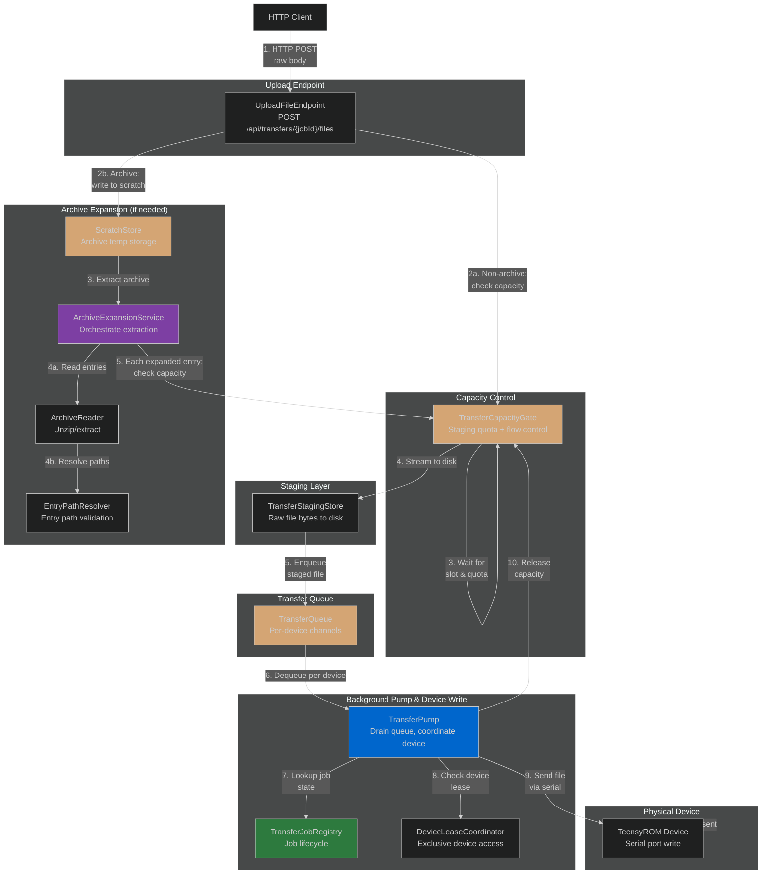
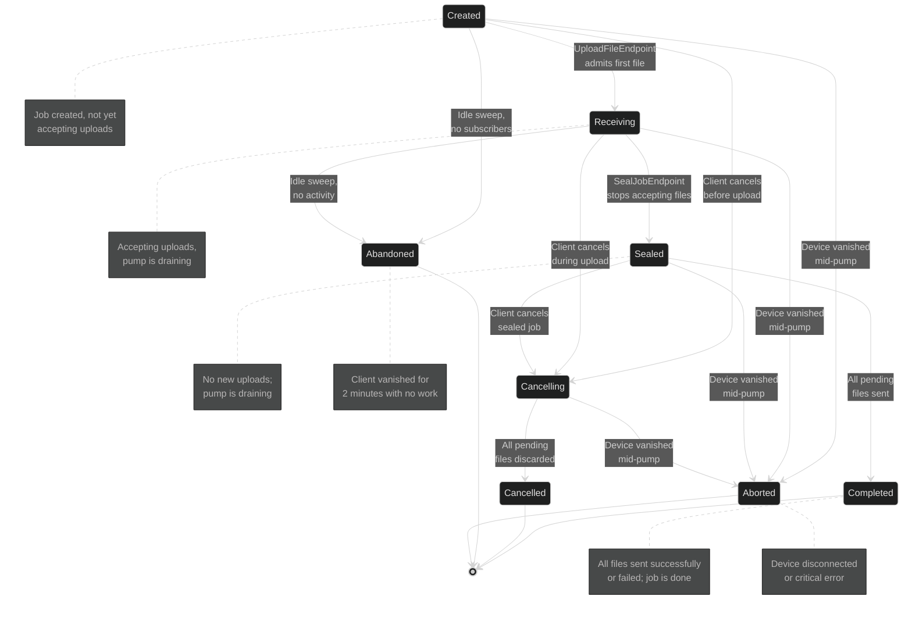

# File Transfer Architecture

## The Premise

File transfers to TeensyROM devices involve two inherently slow network hops: HTTP upload from the client to the backend staging area, and then serial write from staging to the device over a single shared COM port. The transfer subsystem overlaps these two hops — **while the device is writing one file, the next is uploading in parallel** — via a per-device queue fed by an upload endpoint and drained by a dedicated background pump. This overlap is why we cannot simply serialize files to device memory in the endpoint itself: the endpoint must return immediately after staging, not wait for the slow serial write.

Some files are archives and require expansion (unzipping, extraction) before writing to the device. The expansion stage runs after staging but before queueing, with the expanded children written as individual files to the queue. This order prevents expansion — a CPU and I/O intensive operation — from blocking the device-write loop, which is single-threaded per device and the only path that releases staging capacity. An expansion operation that waited on available queue space could deadlock: it would wait on capacity only its own thread could free.

---

## Component Chain

**Non-archive uploads** flow: **endpoint → capacity gate → staging → queue → pump → device**. **Archive uploads** flow: **endpoint → scratch → expansion → (expanded entries) → capacity gate → staging → queue → pump → device**. When the endpoint detects an archive, it bypasses the capacity gate and staging, writing the raw archive body directly to scratch. The expansion service then walks the archive tree; after all archives are expanded, every extracted entry (including those from nested archives) is admitted through the standard gate-and-staging pipeline, ensuring fair capacity accounting for expanded content.



---

## Job State Machine

A `TransferJob` is a mutable, thread-safe aggregate managing one logical transfer operation. Its state machine enforces what files can be accepted and when the pump can finalize it:



**Terminal states** (`Completed`, `Cancelled`, `Abandoned`, `Aborted`): job accepts no more transitions and is eligible for eviction after 5 minutes.

---

## Device Lease vs. Port Lock

The serial port is single-threaded and locked for the duration of each command via `CommunicationPortBehavior`'s static per-command semaphore. This semaphore **has a five-minute stale-lock disposal** — if a thread acquires it and never releases (e.g. crashes), the lock is recycled automatically to prevent deadlock.

A file transfer job must hold exclusive access to the device **across many serial commands** — reset, then multiple writes. Holding the semaphore itself across the entire job would violate the five-minute contract: the stale-lock cleanup could dispose the job's lock while work is still in progress.

The `DeviceLeaseCoordinator` solves this by being a **separate, timer-less construct** above the port lock:
- When a job starts (CreateJobEndpoint), it acquires a lease: `leaseCoordinator.TryAcquire(deviceId, jobId)`.
- `CreateJobEndpoint` is the sole exclusivity gate: at job-creation time, `TryAcquire` atomically claims the lease only if the device is unheld, rejecting a second job for an already-leased device with a `409 Conflict` carrying the holding job's id as the `activeJobId` extension. The pump and sweeper never recheck the lease while a job runs — they only call `Release` on it.
- When the job reaches a terminal state, the lease is released.
- No stale-lock cleanup: the lease is held in-memory and released explicitly by the pump.

This design allows long-running transfers to span multiple short-lived serial commands without risking lock disposal in the middle of work.

---

## The Capacity Gate's Three Roles

`TransferCapacityGate` looks simple at first — it's a semaphore for disk quota — but it serves three distinct purposes, and removing any one creates a correctness bug:

**1. Disk Quota**: The gate tracks staged bytes in use and blocks uploads when `bytesInUse >= MaxStagedBytes` (default 4 GB). Without it, a pathological client uploading faster than the device drains could fill the server's disk.

**2. Flow Control**: The gate paces uploads by making `UploadFileEndpoint.Handle()` await `gate.WaitForSlotAsync()`. This is the system's **only pacing mechanism** — there is no HTTP connection pooling, no back-pressure, no rejection. A slow device means uploads simply take longer to return; they never fail.

**3. Abandonment Bound**: The gate bounds the maximum time an abandoned job can monopolize device staging space. When a client vanishes mid-transfer, the `TransferJobSweeper` detects idle >= 2 minutes with no subscribers and transitions the job to `Abandoned`. The sweeper then purges the staging directory and releases the gate capacity. **Without the gate enforcing a quota, an abandoned job could stall forever**, because the pump would have nothing to drain (an abandoned job has no sealing endpoint call to transition it), and without the pump draining, `PendingCount` never reaches zero.

## Scratch Store Quota

The scratch store holds intermediate data during archive expansion and has its own separate quota: `MaxScratchBytes` (default 8 GB). Unlike the staging gate (which **waits** for capacity), the scratch store **refuses** expansion if it would exceed quota — it returns an error to the client rather than blocking. This separation is deliberate: the staging gate is released only when the pump writes to the device, but archive expansion runs on the upload thread. If expansion waited on the staging gate for space, and expansion was slow enough that it blocked the pump's ability to drain staging, a deadlock would occur: expansion would wait on capacity only the pump could release, and the pump couldn't run because it couldn't release staging without first writing an expanded file that expansion hasn't finished yet. By refusing rather than waiting, expansion fails fast and signals the client to retry later, avoiding the deadlock.

---

## Abandonment: The Idle Sweep

When a client connection drops before calling `SealJobEndpoint`, the job is left in `Receiving` with queued (but not yet sent) files. The `TransferJobSweeper` runs every 30 seconds and closes this gap:

- **Idle Detection**: A job in `Receiving` or `Created` with `PendingCount == 0` (no files in the pump's queue) and `LastActivityUtc > 2 minutes` ago is idle.
- **Subscriber Check**: If the job still has active SignalR subscribers (`TransferHub.Subscribe()` calls), the client may still be alive — the job is **not** abandoned.
- **Transition to Abandoned**: If idle and no subscribers, transition to `Abandoned`, release the lease and staging directory, notify clients.

Queued files are **delivered, not discarded**: the pump drains the queue normally, and as each file completes, the sweeper's condition (`PendingCount == 0`) triggers finalization. Only files still in the queue when the sweeper runs are lost, and this is rare — most jobs complete or the client reconnects with a subscriber.

---

## HTTP and SignalR Surface

### Routes

| Method | Route | Name | Purpose |
|--------|-------|------|---------|
| POST | `/api/devices/{deviceId}/storage/{storageType}/transfers` | CreateTransferJob | Start a new job; acquire lease |
| POST | `/api/transfers/{jobId}/files` | UploadTransferFile | Stream one file to staging |
| POST | `/api/transfers/{jobId}/seal` | SealTransferJob | Stop accepting uploads; let pump drain |
| GET | `/api/transfers/{jobId}` | GetTransferJob | Query job snapshot |
| GET | `/api/devices/{deviceId}/transfers/active` | GetActiveTransferJob | Get the job currently holding device lease |
| POST | `/api/transfers/{jobId}/cancel` | CancelTransferJob | Transition to Cancelling; pump discards remaining files |

### SignalR Hub: TransferHub

- **Subscribe(jobId)** → Joins the caller to the job's broadcast group, returns current snapshot. Active subscription counts as liveness for abandonment detection.
- **Unsubscribe(jobId)** → Removes the caller from the group.
- **OnDisconnectedAsync()** → Cleans up all subscriptions for the dropped connection.

**Events** (broadcast to job's group):
- **JobSnapshot** → Throttled (250ms) snapshot of job state, sent by pump as files complete and by sweeper on state transitions. The snapshot is authoritative and self-contained — there is no separate per-file event; per-file outcomes ride inside the snapshot's `recentCompletions`/`failures` lists.

**Snapshot Structure**: `TransferJobDto` is the single wire shape sent over both HTTP and SignalR:
```json
{
  "jobId": "abc123...",
  "deviceId": "device-id",
  "storageType": "SD",
  "destinationDirectory": "/music",
  "state": "Receiving",
  "filesReceived": 10,
  "filesSent": 5,
  "filesFailed": 0,
  "bytesSent": 52428800,
  "totalFiles": null,
  "currentFile": "track-03.sid",
  "startedUtc": "2026-08-04T10:30:00Z",
  "lastActivityUtc": "2026-08-04T10:31:45Z",
  "error": null,
  "expandingArchive": "album.zip",
  "expansionBytesWritten": 134217728,
  "expansionBytesDeclared": 268435456,
  "expandedFileCount": 42,
  "failures": [],
  "recentCompletions": [
    {
      "jobId": "abc123...",
      "relativePath": "track-05.sid",
      "targetPath": "/music/track-05.sid",
      "success": true,
      "error": null,
      "sizeBytes": 4096
    }
  ],
  "bytesPerSecond": 131072.0,
  "filesPerSecond": 2.5
}
```

`expandingArchive` (string, nullable) — the filename of the archive currently being expanded; `null` if none. `expansionBytesWritten` (long) — bytes written to scratch so far in the current expansion. `expansionBytesDeclared` (long) — total bytes the archive claims it will expand to; compared against `MaxScratchBytes` to pre-reject expansion. `expandedFileCount` (int, nullable) — count of files extracted from the archive; the browser may compose this into per-entry progress UI.

`failures` and `recentCompletions` are both bounded, most-recent-first lists of the same `TransferFileCompleted` shape — `failures` holds only failed files (oldest-evicted once `RetainedFailuresBound` is exceeded; `filesFailed` itself stays an unbounded lifetime counter), while `recentCompletions` holds the last `RecentCompletionsBound` outcomes of either kind, for a live feed. `bytesPerSecond`/`filesPerSecond` are a rolling rate over `RateWindow` while the job is active, falling back to a lifetime average once terminal and to zero after a quiet window.

**Snapshots are authoritative**, not incremental: each broadcast is a complete job state. The client never needs to merge or track deltas — the latest snapshot is the ground truth. This buys simplicity and resilience: late subscribers and disconnected clients that reconnect both get a correct state immediately without needing to replay events.

---

## Where Things Live

| Component | File Path |
|-----------|-----------|
| **Job & State** | `apps/api/src/TeensyRom.Api/Transfers/TransferJob.cs`<br/>`apps/api/src/TeensyRom.Core/Entities/Transfers/TransferJobState.cs`<br/>`apps/api/src/TeensyRom.Core/Entities/Transfers/TransferJobSnapshot.cs` |
| **Registry** | `apps/api/src/TeensyRom.Api/Transfers/TransferJobRegistry.cs` |
| **Capacity Gate** | `apps/api/src/TeensyRom.Api/Transfers/TransferCapacityGate.cs` |
| **Staging Store** | `apps/api/src/TeensyRom.Api/Transfers/TransferStagingStore.cs` |
| **Scratch Store** | `apps/api/src/TeensyRom.Api/Transfers/TransferScratchStore.cs` |
| **Archive Reader** | `apps/api/src/TeensyRom.Api/Transfers/Archives/SharpCompressArchiveReader.cs` |
| **Entry Path Resolver** | `apps/api/src/TeensyRom.Api/Transfers/Archives/ArchiveEntryPathResolver.cs` |
| **Expansion Service** | `apps/api/src/TeensyRom.Api/Transfers/Archives/ArchiveExpansionService.cs` |
| **Expansion Queue** | `apps/api/src/TeensyRom.Api/Transfers/Archives/ArchiveExpansionQueue.cs` |
| **Expansion Pump** | `apps/api/src/TeensyRom.Api/Transfers/Archives/ArchiveExpansionPump.cs` |
| **Queue** | `apps/api/src/TeensyRom.Api/Transfers/TransferQueue.cs` |
| **Pump** | `apps/api/src/TeensyRom.Api/Transfers/TransferPump.cs` |
| **Lease Coordinator** | `apps/api/src/TeensyRom.Api/Transfers/DeviceLeaseCoordinator.cs` |
| **Progress Notifier** | `apps/api/src/TeensyRom.Api/Transfers/TransferProgressNotifier.cs` |
| **Job Sweeper** | `apps/api/src/TeensyRom.Api/Transfers/TransferJobSweeper.cs` |
| **Endpoints** | `apps/api/src/TeensyRom.Api/Endpoints/Transfers/` |
| **SignalR Hub** | `apps/api/src/TeensyRom.Api/Endpoints/Transfers/Hub/TransferHub.cs` |
| **Serial Command** | `apps/api/src/TeensyRom.Core.Serial/Commands/TransferFiles/TransferFilesCommand.cs`<br/>`apps/api/src/TeensyRom.Core.Serial/Commands/TransferFiles/TransferFilesCommandHandler.cs` |
| **DTO** | `apps/api/src/TeensyRom.Api/Models/TransferJobDto.cs` |
| **Options** | `apps/api/src/TeensyRom.Api/Transfers/TransferOptions.cs` |

---

## Configuration & Tuning

All constants are centralized in `TransferOptions` (a singleton, settable for testing), bound at startup from the `Transfer` section of `appsettings.json` via `TransferOptionsBinder`, which clamps out-of-range values back to the compiled defaults:

| Setting | Default | Purpose |
|---------|---------|---------|
| `MaxStagedBytes` | 4 GB | Disk quota for staged files — the sole ceiling on staging disk usage; there is no separate file-count cap |
| `MaxScratchBytes` | 8 GB | Disk quota for archive expansion scratch storage; separate from staging to prevent expansion from blocking the pump's ability to drain staging |
| `MaxExpansionDepth` | 32 | Maximum nesting depth for archives within archives; prevents zip-bomb-style attacks and stack exhaustion |
| `MaxExpandedBytesPerArchive` | 2 GB | Maximum total size an archive is allowed to expand to; checked before expansion begins and rejected if exceeded |
| `BatchSize` | 25 | Number of staged files the pump batches into a single device write command |
| `RecentCompletionsBound` | 5 | Number of most-recent completed files (success or failure) a job retains for the live feed |
| `RetainedFailuresBound` | 50 | Number of most-recent failures a job retains; `FilesFailed` itself stays an unbounded lifetime counter |
| `RateWindow` | 10 seconds | Sliding window used to compute rolling transfer throughput |
| `IdleAbandonmentThreshold` | 2 minutes | Idle time before job is abandoned |
| `SweepInterval` | 30 seconds | How often sweeper checks for abandoned/evictable jobs |
| `SnapshotThrottle` | 250 ms | Min interval between progress broadcasts |
| `TerminalJobRetention` | 5 minutes | How long a completed job stays queryable |
| `DeviceChunkSize` | 16 KB | Chunk size for device write loop |
| `StagingRoot` | `{AppDir}/staging` | Directory for staged uploads |
| `ScratchRoot` | `{AppDir}/scratch` | Directory for archive expansion temporary storage |

---

**Maintainer**: Backend Engineering Team
