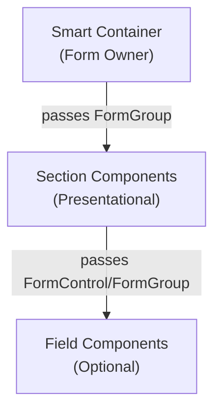

# Form Standards Skill

Standards and detailed pattern for building complex reactive forms in TeensyROM using a three-layer component hierarchy: **Smart Container → Section Components → Field Components**.

## When to Use This Skill

- Building a new complex form or decomposing an existing large form
- Reviewing form component architecture (container/section/field responsibilities)
- Implementing form validation display or debounced auto-save with a store
- Passing `FormGroup`/`FormControl` between parent and child form components
- Deciding where a form-related concern belongs (container vs. section vs. field)

## The Three-Layer Pattern

- **Smart Container** - owns the root `FormGroup`, injects services/store, handles submission, form-level validation, and auto-save
- **Section Components** - purely presentational; receive `FormGroup` via `input()`, render related controls, display validation errors inline
- **Field Components** (optional) - highly reusable controls implementing `ControlValueAccessor`, used standalone or within sections

## Key Conventions

- Pass `FormGroup` to children via `input()` signals; use the generic `FormGroup` type (not `FormGroup<T>`) to avoid FormBuilder inference mismatches
- Initialize form values from the store using `effect()` + `patchValue(data, { emitEvent: false })` to avoid circular updates
- Debounce `valueChanges` (500ms) for auto-save, filter by `form.valid`, and always use `takeUntilDestroyed()`
- Keep section/field components free of service injection and store access
- Validate at the appropriate layer: field-level format/range validators, section-level error display, container-level cross-field/submit validation

## Reference Documentation

See [references/FORM_STANDARDS.md](references/FORM_STANDARDS.md) for the full standards (data flow, validation layering, type safety, state management integration, testing approach) plus the detailed pattern write-up with container/section implementation examples, benefits, and testing strategy.

## Related Skills

- **`testing-standards`** - testing methodology for stores, facades, and feature components used alongside forms
