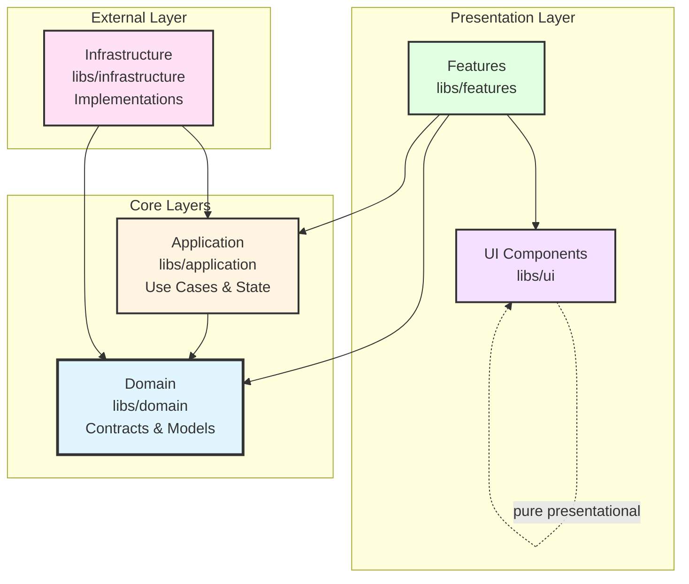

# TeensyROM Copilot Instructions

## Working Style

**Use TODO lists for visibility**: On complex or multi-step tasks, create and maintain a TODO list to track progress. This helps you stay organized and shows the user what's being worked on, especially during longer executions.

## Project Overview

**Hybrid .NET/Angular Application** for TeensyROM device management and media playback.

- **Backend**: .NET 9 Web API (`TeensyRom.Api`) with RadEndpoints, MediatR CQRS, SignalR real-time communication
- **Frontend**: Angular 19 Nx monorepo with Clean Architecture (`ui/teensyrom-nx`)
- **API Docs**: Available at `/scalar/v1` (not Swagger)

## Critical Architecture Patterns

### Clean Architecture Layers (Enforced by ESLint)

The frontend follows **strict Clean Architecture** with automated dependency constraint enforcement:



**Layer Rules** (ESLint will fail builds on violations):

- **Domain**: Pure TypeScript contracts/models in shared `models/` and `contracts/` folders - ZERO dependencies
- **Application**: NgRx Signal Stores, use cases - depends ONLY on domain + shared utilities
- **Infrastructure**: Service implementations, HTTP clients - **CAN depend on application layer + domain + shared + api-client** 
- **Features**: Smart components - depends on application + domain + shared UI (features CANNOT import each other)
- **UI**: Dumb components - depends ONLY on other UI components

**Key Insight**: Domain contracts/models are shared across layers via barrel exports from `contracts/` and `models/` folders. Each interface/enum is in its own file for tree-shaking.

### Dependency Injection Pattern

```typescript
// Domain contract with injection token (libs/domain/contracts/)
export interface IDeviceService {
  /* methods */
}
export const DEVICE_SERVICE = new InjectionToken<IDeviceService>('IDeviceService');

// Infrastructure implementation (libs/infrastructure/)
@Injectable()
export class DeviceService implements IDeviceService {
  constructor(private apiClient: DevicesApiService) {}
}

// Provider binding (libs/infrastructure/providers.ts)
export const DEVICE_PROVIDERS = [{ provide: DEVICE_SERVICE, useClass: DeviceService }];

// Application layer consumes via contract (libs/application/)
export class DeviceStore {
  private deviceService = inject(DEVICE_SERVICE); // Not DeviceService!
}
```

## Essential Developer Workflows

### Frontend Development

```bash
# From ClientApp/teensyrom-nx/
pnpm install                    # Install dependencies
pnpm start                      # Dev server (port 4200)
pnpm nx test <project>          # Vitest unit tests
pnpm nx lint                    # ESLint (enforces architecture)
pnpm run format                 # Prettier formatting
```

### Backend Development

```bash
# From TeensyRom.Api/
dotnet build                   # Build
dotnet run                     # Start API (port 5000)
dotnet test                    # Run tests
```

## Code Organization Patterns

### Nx Library Structure

```
libs/
├── domain/                           # Pure contracts & models (shared)
│   ├── models/                       # Shared domain models
│   │   ├── device.model.ts
│   │   ├── file-item.model.ts
│   │   └── index.ts                  # Barrel export
│   └── contracts/                    # Shared service contracts
│       ├── device.contract.ts        # IDeviceService + DEVICE_SERVICE token
│       └── index.ts                  # Barrel export
├── application/                      # Use cases & state
│   ├── device/device-store.ts        # NgRx Signal Store
│   └── storage/storage-store.ts
├── infrastructure/                   # External integrations
│   ├── device/device.service.ts      # Implements IDeviceService
│   ├── device/device.mapper.ts       # DTO ↔ Domain mapping
│   └── device/providers.ts           # DI bindings
├── features/                         # Smart UI components
│   ├── devices/                      # Device management feature
│   └── player/                       # Player feature
└── ui/components/                    # Dumb presentational components
```

### Backend Endpoint Pattern (RadEndpoints)

```
Endpoints/[Domain]/[Action]/
├── [Action]Endpoint.cs        # RadEndpoints with explicit configuration
└── [Action]Models.cs          # Request/response models
```

Example: `Endpoints/Files/GetDirectory/GetDirectoryEndpoint.cs`

## Angular 19 Modern Patterns

**Use these patterns consistently**:

```typescript
// ✅ Standalone components with modern APIs
@Component({
  standalone: true,
  imports: [CommonModule, MatButtonModule],
})
export class MyComponent {
  // ✅ Signal-based inputs/outputs
  data = input.required<string>();
  clicked = output<void>();

  // ✅ Modern control flow in templates
  // @if (condition) { } @else { }
  // @for (item of items; track item.id) { }
  // @switch (value) { @case ('a') { } }
}

// ❌ Don't use old patterns
@Input() data: string;           // Use input()
@Output() clicked = new EventEmitter();  // Use output()
*ngIf, *ngFor, *ngSwitch         // Use @if, @for, @switch
```

## Testing Strategy by Layer

| Layer          | Approach                               | Mock Boundary        |
| -------------- | -------------------------------------- | -------------------- |
| Domain         | Don't test contracts - use as mocks    | N/A                  |
| Infrastructure | Unit test with mocked API clients      | Mock `*ApiService`   |
| Application    | Behavioral test - real stores/services | Mock infrastructure  |
| Features       | Unit test with mocked application      | Mock stores/services |
| UI             | Unit test presentational logic         | Minimal mocking      |

**Key Pattern**: Mock only at infrastructure boundaries. Application and features tests use real stores/services integrating together.

```typescript
// Application layer test - behavioral testing
TestBed.configureTestingModule({
  providers: [
    DeviceStore, // Real store
    { provide: DEVICE_SERVICE, useValue: mockDeviceService }, // Mock infrastructure
  ],
});
```

## Common Pitfalls to Avoid

1. **Cross-Feature Imports**: Features CANNOT import each other - ESLint will fail

   ```typescript
   // ❌ Don't do this
   import { PlayerComponent } from '@teensyrom-nx/player'; // From devices feature

   // ✅ Share via application layer
   import { DeviceStore } from '@teensyrom-nx/application';
   ```

2. **API Client Direct Usage**: Never import API clients outside infrastructure - use domain contracts instead

3. **Forgetting Mappers**: Always map between API DTOs and domain models in infrastructure layer

## UI Component System

**Reusable components**: `libs/ui/components` - consult `docs/COMPONENT_LIBRARY.md` before creating new ones

**Key components**:

- Layout: `lib-card-layout`, `lib-compact-card-layout`
- Animated: `lib-scaling-card`, `lib-scaling-container`, `lib-sliding-container`
- Forms: `lib-input-field`, `lib-action-button`, `lib-icon-button`
- Display: `lib-icon-label`, `lib-styled-icon`, `lib-scrolling-marquee`

**Global styles**: `docs/STYLE_GUIDE.md` - utility classes like `.glassy`, `.dimmed`, `.selectable-item` mixin

## SignalR Integration

Real-time communication via SignalR hubs:

- Device logs: `/logHub`
- Device events: `/deviceEventHub`

Infrastructure services manage hub lifecycle and reconnection logic.

## Documentation Standards

**Markdown Diagrams**: Use Mermaid syntax in planning docs (not ASCII). ASCII only in chat responses.

**Mermaid Dark Mode Colors** (from design system):
```
%%{init: {'theme': 'dark', 'primaryColor': '#5a2c6b', 'primaryBorderColor': '#7d3fa3', 'primaryTextColor': '#fff', 'secondaryColor': '#0066cc', 'secondaryBorderColor': '#0052a3', 'tertiaryColor': '#2d7a3e', 'tertiaryBorderColor': '#1f5a2e', 'lineColor': '#b3b3b3', 'tertiaryTextColor': '#fff'}}%%
```

**Color Palette with Text Contrast**:

| Use | Color | Text Color | Purpose |
|-----|-------|-----------|----------|
| `fill:#5a2c6b` | Dark Purple | White | Primary nodes, main containers |
| `fill:#7d3fa3` | Medium Purple | White | Emphasis, secondary importance |
| `fill:#0066cc` | Dark Blue | White | Important flows, service boundaries |
| `fill:#2d7a3e` | Dark Green | White | Success, positive states |
| `fill:#d4a574` | Tan/Gold | Black | Data storage, resources |
| `fill:#cc3333` | Dark Red | White | Errors, critical paths |
| `stroke:#b3b3b3` | Light Gray | - | Edges, borders (good contrast on dark background) |
| `stroke:#7d3fa3` | Medium Purple | - | Component borders |

**Critical Rules for Readability**:
1. **Always specify text color** with `color:#fff` (white) for dark backgrounds or `color:#000` (black) for light backgrounds
2. **Test contrast** - white text must be readable on background color (WCAG AA minimum ratio: 4.5:1)
3. **Avoid light backgrounds** on dark theme - use dark blues, purples, greens instead
4. **Use stroke borders** (2px minimum) to separate nodes from background
5. **Example style rule**: `style NODE fill:#0066cc,color:#fff,stroke:#0052a3,stroke-width:2px`

## References

- **Architecture Deep Dive**: `docs/OVERVIEW_CONTEXT.md`
- **Testing Approach**: `docs/TESTING_STANDARDS.md`
- **Component Catalog**: `docs/COMPONENT_LIBRARY.md`
- **Style System**: `docs/STYLE_GUIDE.md`
- **Quick Start**: `AGENTS.md`, `CLAUDE.md`

## Pro Tips

- Run `pnpm nx graph` to visualize project dependencies
- ESLint catches architecture violations at build time - respect the red squiggles
- Use Nx Console VS Code extension for generator UI
- Theme service manages dark/light mode - use CSS variables from style guide
- Barrel exports (`index.ts`) maintain clean public APIs - import from package root
