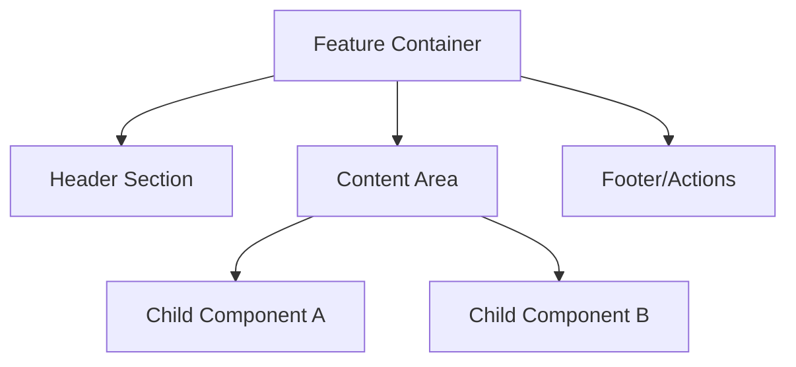
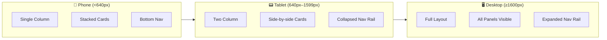
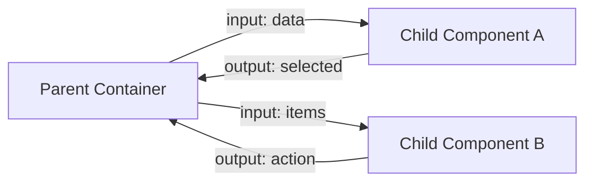

# Design Document: [Feature Name]

> **Project**: `<PROJECT-NAME>`
> **Created by**: Designer Agent
> **Date**: [YYYY-MM-DD]
> **Status**: Draft | In Review | Approved

---

## 🎨 Design Overview

[2-3 paragraphs describing the design vision for this feature. What does it look like? How does it feel? What existing design patterns does it extend or evolve?]

**Design Goals:**
- [Primary visual/UX goal]
- [Secondary goal — e.g., responsive behavior, accessibility]
- [Tertiary goal — e.g., consistency with existing patterns]

---

## 🖼️ Visual References & Screenshots

> Screenshots captured during design analysis. Embed images using relative paths from the project's `design/` folder.
> Use the Chrome DevTools MCP skill to capture screenshots of existing UI for reference.

### Current State (Before)

> Screenshots of the existing UI in the area where changes will be made. Captures the baseline for comparison.

<!-- Example:

*Caption: Current player view at desktop breakpoint (1920x1080)*
-->

### Proposed Design

> Sketches, wireframes, or annotated screenshots showing the intended design direction.

<!-- Example:

*Caption: Proposed layout showing new component placement at desktop breakpoint*
-->

### Design Iterations

> Track design evolution. Add screenshots as designs are refined during review.

<!-- Example:
| Version | Screenshot | Notes |
|---------|-----------|-------|
| v1 |  | Initial concept |
| v2 |  | Revised after feedback — reduced padding |
-->

---

## 📐 Layout & Structure

### Component Hierarchy

> Mermaid diagram showing the component tree for this feature's UI.

### Layout Strategy

| Breakpoint | Layout Description | Key Changes |
|------------|-------------------|-------------|
| **Phone** (<640px) | [Description of phone layout] | [What changes from tablet] |
| **Tablet** (640px–1599px) | [Description of tablet layout] | [What changes from desktop] |
| **Desktop** (≥1600px) | [Description of full desktop layout] | [Full layout with all features] |

### Responsive Flow Diagram

> Show how the layout transforms across breakpoints.

---

## 🎭 Design Tokens & Styling

### Spacing

> Reference tokens from `STYLE_GUIDE.md`. List the specific tokens used in this design.

| Element | Token | Value | Purpose |
|---------|-------|-------|---------|
| Container padding | `--spacing-card-padding` | 12px | Internal card padding |
| Section gap | `--spacing-section-gap` | 16px | Gap between sibling cards |
| Content gap | `--spacing-content-gap` | 12px | Gap between elements within a card |
| Page gutter | `--spacing-page-gutter` | 24px (desktop) / 16px (tablet/phone) | Viewport-to-content distance |

### Typography

| Element | Size Token | Weight Token | Purpose |
|---------|-----------|-------------|---------|
| [Heading] | `--font-size-xl` | `--font-weight-bold` | [Purpose] |
| [Body text] | `--font-size-md` | `--font-weight-normal` | [Purpose] |
| [Caption/label] | `--font-size-sm` | `--font-weight-medium` | [Purpose] |

### Colors

| Element | Variable | Purpose |
|---------|----------|---------|
| [Primary action] | `--color-primary` | [Purpose] |
| [Success state] | `--color-success` | [Purpose] |
| [Dimmed text] | `--color-dimmed` | [Purpose] |
| [Accent/highlight] | `--color-highlight` | [Purpose] |

### Effects

| Element | Effect | Details |
|---------|--------|---------|
| [Card container] | Glassy | `glassyIntensity: 'dark'` (default) |
| [Overlay] | Glassy | `glassyIntensity: 'strong'` |

---

## 🧩 Component Reuse Analysis

> Identify which existing UI library components should be used. Reference `pnpm component-docs list` (`component-library` skill).

### Existing Components to Use

| Component | Selector | Purpose in This Design |
|-----------|----------|----------------------|
| [Component Name] | `lib-xxx` | [How it's used] |
| [Component Name] | `lib-xxx` | [How it's used] |

### New Components Required

| Component | Proposed Selector | Purpose | Library Location |
|-----------|------------------|---------|-----------------|
| [Component Name] | `lib-xxx` | [Purpose] | `libs/ui/components/src/lib/xxx/` |

### Component Interaction Patterns

> Describe how components communicate (inputs, outputs, shared state).

---

## 🎬 Animation & Transitions

> Describe any animations or transitions. Reference existing animation components via `pnpm component-docs list` and the `Systems/Animation Chaining` entry (`component-library` skill).

| Trigger | Animation | Component/Approach | Duration |
|---------|-----------|-------------------|----------|
| [Component entry] | Scale + fade | `lib-scaling-card` | Default (800ms) |
| [State change] | Slide | `lib-sliding-container` | Default |
| [User action] | [Custom] | [CSS transition / Angular animation] | [Duration] |

---

## ♿ Accessibility Considerations

- [ ] Keyboard navigation flow defined
- [ ] ARIA labels for interactive elements specified
- [ ] Color contrast meets WCAG AA (4.5:1 minimum)
- [ ] Focus indicators visible on all interactive elements
- [ ] Screen reader flow tested conceptually

---

## 🔗 Integration with Existing UI

### Where This Lives

> Describe where this feature fits in the application's navigation and layout hierarchy.

- **Route**: `/[route-path]`
- **Parent Component**: `[parent-component-selector]`
- **Adjacent Components**: [What exists next to / around this feature]

### Design Consistency Check

> Verify alignment with existing UI patterns in the target area.

- [ ] Matches card styling patterns used in adjacent views
- [ ] Spacing consistent with sibling components
- [ ] Typography hierarchy matches existing headings/labels
- [ ] Animation style consistent with surrounding components
- [ ] Glassy effects match neighboring cards

---

## 📝 Design Decisions & Rationale

> Document key design choices and their reasoning. This helps implementers understand intent.

| Decision | Choice | Rationale |
|----------|--------|-----------|
| [Decision area] | [What was chosen] | [Why this approach] |
| [Decision area] | [What was chosen] | [Why this approach] |

---

## 📋 Design Review Checklist

- [ ] All breakpoints (phone, tablet, desktop) have defined layouts
- [ ] Spacing uses design tokens exclusively (no hardcoded pixels)
- [ ] Colors use semantic variables (no hardcoded hex values)
- [ ] Typography uses font size/weight tokens
- [ ] Existing UI components are reused where possible
- [ ] New components follow naming conventions (`lib-` prefix)
- [ ] Animations use existing animation components where applicable
- [ ] Accessibility requirements addressed
- [ ] Screenshots captured for reference (before/after where applicable)
- [ ] Design is consistent with adjacent views/components
- [ ] Responsive flow verified at all three breakpoints

---

## 🔗 References

- [STYLE_GUIDE.md](../../docs/STYLE_GUIDE.md) — Design tokens, spacing, breakpoints, utility classes
- `pnpm component-docs list` / `pnpm component-docs get --component-name <name>` — Reusable UI components catalog (`component-library` skill)
- [Theme styles](../../libs/ui/styles/src/lib/theme/styles.scss) — CSS custom properties and theme definitions
- [Breakpoint mixins](../../libs/ui/styles/src/lib/theme/_mixins.scss) — SCSS responsive mixins
- [Master Plan](./PROJECT-NAME-MASTER-PLAN.md) — Feature overview and phases

---

_Template Version: 1.0 - TeensyROM Design System_
