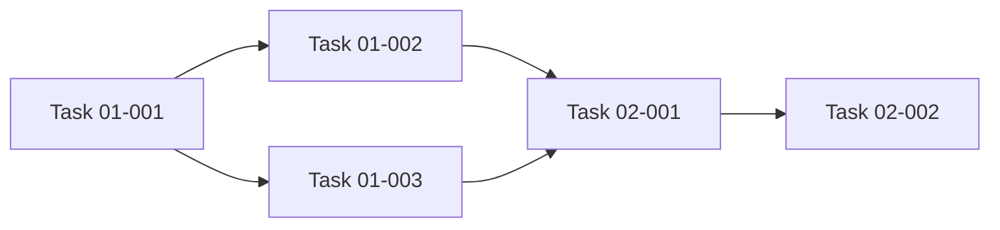

# High-Level Feature Planning Template

**Project Overview**: [One paragraph describing the feature being planned and its purpose]

---

## 📝 Planning Document Guidelines

**Purpose**: This template creates non-technical, behavior-focused planning documents that describe **what** we're building and **why**, not **how**.

### Writing Principles

**Keep It High-Level:**

- Focus on user behaviors, system behaviors, and business outcomes
- Avoid technical implementation details (no specific function names, file paths, or code snippets)
- Refer to concepts generically (e.g., "state management", "UI components", "navigation controls")
- Think about what the user experiences, not what the code does

**Examples of Good vs Bad Descriptions:**

✅ **Good** (High-level, behavior-focused):

- "Create a view component that displays a filterable list of user notifications"
- "Add controls for marking notifications as read, unread, or dismissed"
- "Track notification delivery across all channels with timestamps and read status"

❌ **Bad** (Too technical, implementation-focused):

- "Create NotificationListComponent.ts with NotificationItem[] array and @Input() userId"
- "Implement markAsRead() method in NotificationStore using updateState()"
- "Add notifications: NotificationEntry[] to UserPreferencesState interface"

**Generic Concept Language:**

- State structure, state management, data structure
- View components, UI components, display components
- Actions, operations, behaviors
- Selectors, queries, data retrieval
- Navigation controls, user controls, interaction elements
- Integration points, coordination, communication

**Focus Areas:**

- **User Value**: What benefit does this provide to users?
- **Behaviors**: What happens when users interact with the feature?
- **States**: What different modes or conditions exist?
- **Integration**: How does this work with existing features?
- **Flows**: What are the step-by-step user journeys?

### Document Structure

Each planning document should include:

1. **Project Objective**: Clear statement of user value and feature purpose
2. **Implementation Phases**: Break complex work into independently valuable phases
3. **Architecture Overview**: High-level design decisions and integration points
4. **Testing Strategy**: Categories of tests needed (unit, integration, E2E)
5. **Given-When-Then Scenarios**: Comprehensive behavioral scenarios
6. **Success Criteria**: Measurable outcomes that define completion
7. **Open Questions**: Decisions to be made during implementation (organized by phase)

### Phase Structure Best Practices

**Independent Value:**

- Each phase should deliver something demonstrable and valuable on its own
- Phases build on each other without requiring future phases to be useful
- Early phases validate core concepts before adding complexity

**Phase Components:**

- **Objective**: What this phase achieves
- **Key Deliverables**: Specific outcomes (checkbox format for tracking)
- **High-Level Tasks**: Major activities needed to complete the phase
- **Open Questions**: Decisions specific to this phase that need resolution

---

## 🎯 Project Objective

[2-3 paragraphs describing what this feature aims to achieve]

**First Paragraph**: What is the feature and what problem does it solve?

**Second Paragraph**: How will users interact with it and what value do they get?

**Third Paragraph** (optional): Any broader system benefits or architectural improvements.

**Example:**

> Build a notification center that aggregates alerts from multiple sources (system events, user mentions, scheduled reminders) into a unified inbox. The notification center supports filtering by category and read status, with batch actions for managing large volumes. Users can configure per-channel delivery preferences to control which notifications they receive.
>
> **User Value**: Users stay informed about relevant activity without leaving their current workflow. The unified inbox reduces context-switching, while filtering and preferences ensure users see what matters most to them.

---

## 📋 Implementation Phases

<details open>
<summary><h3>Phase 1: [Descriptive Phase Title]</h3></summary>

### Objective

[2-3 sentences describing what this phase delivers and why it's valuable on its own]

### Key Deliverables

- [ ] Deliverable A (specific, measurable outcome)
- [ ] Deliverable B (specific, measurable outcome)
- [ ] Deliverable C (specific, measurable outcome)
- [ ] Deliverable D (specific, measurable outcome)

</details>

---

<details open>
<summary><h3>Phase 2: [Descriptive Phase Title]</h3></summary>

### Objective

[2-3 sentences describing what this phase delivers and how it builds on Phase 1]

### Key Deliverables

- [ ] Deliverable A
- [ ] Deliverable B
- [ ] Deliverable C
- [ ] Deliverable D

</details>

---

<details open>
<summary><h3>Phase N: [Final Phase Title]</h3></summary>

### Objective

[2-3 sentences describing final integration and polish]

### Key Deliverables

- [ ] Deliverable A
- [ ] Deliverable B
- [ ] Deliverable C

</details>

---

<details open>
<summary><h2>🏗️ Architecture Overview</h2></summary>

### Key Design Decisions

- **Decision Name**: Explanation of the approach and rationale (2-3 sentences describing the "why" behind the decision)
- **Decision Name**: Explanation of the approach and rationale
- **Decision Name**: Explanation of the approach and rationale
- **Decision Name**: Explanation of the approach and rationale

**Example:**

> - **Pull Model**: Users pull notifications on demand rather than receiving push interruptions, reducing cognitive load while keeping information accessible
> - **Category-Based Filtering**: Organize notifications by source category (system, mentions, reminders) to let users focus on what's relevant to their current task

### Integration Points

- **System/Component Name**: How this feature integrates with the existing system, what it depends on, and how they communicate
- **System/Component Name**: How this feature integrates with the existing system
- **System/Component Name**: How this feature integrates with the existing system
- **System/Component Name**: How this feature integrates with the existing system

**Example:**

> - **User Settings Service**: Notification preferences integrate with the existing user settings system, storing per-channel delivery configuration
> - **Event Bus**: The notification center subscribes to the application event bus to receive real-time updates from multiple source systems
> - **Badge Component**: Unread counts surface in the global navigation header, coordinating with the notification center's read/unread state

### Dependency Graph (Optional)

> For projects with 10+ tasks, a visual dependency map helps identify the critical path and parallelization opportunities.



</details>

---

<details open>
<summary><h2>✅ Success Criteria</h2></summary>

- [ ] Primary outcome A achieved
- [ ] Primary outcome B achieved
- [ ] Primary outcome C achieved
- [ ] User experience goal D met
- [ ] Integration goal E completed
- [ ] Performance or quality goal F satisfied
- [ ] All unit, integration, and E2E tests pass successfully
- [ ] Feature ready for production deployment

**Example:**

> - [ ] Notifications from all configured sources appear in the unified inbox with correct categorization
> - [ ] Users can filter, mark as read, and dismiss notifications individually or in batch
> - [ ] Preference changes take effect immediately and persist across sessions

</details>

---

<details open>
<summary><h2>🎭 User Scenarios</h2></summary>

> **Format Instructions**: Use collapsible `<details>` blocks with Gherkin code blocks for clean, readable scenarios. Each Given-When-Then statement should be on its own line within a code fence.

### [Scenario Category 1: Core Behavior Area]

<details open>
<summary><strong>Scenario 1: [Descriptive Scenario Name]</strong></summary>

```gherkin
Given [initial state or context]
When [user action or system event]
Then [expected outcome or behavior]
```

</details>

<details open>
<summary><strong>Scenario 2: [Descriptive Scenario Name]</strong></summary>

```gherkin
Given [initial state or context]
When [user action or system event]
Then [expected outcome or behavior]
```

</details>

<details open>
<summary><strong>Scenario 3: [Descriptive Scenario Name]</strong></summary>

```gherkin
Given [initial state or context]
When [user action or system event]
Then [expected outcome or behavior]
```

</details>

---

### [Scenario Category 2: Another Behavior Area]

<details open>
<summary><strong>Scenario 4: [Descriptive Scenario Name]</strong></summary>

```gherkin
Given [initial state or context]
When [user action or system event]
Then [expected outcome or behavior]
```

</details>

<details open>
<summary><strong>Scenario 5: [Descriptive Scenario Name]</strong></summary>

```gherkin
Given [initial state or context]
When [user action or system event]
Then [expected outcome or behavior]
```

</details>

---

### [Scenario Category 3: Edge Cases and Error Handling]

<details open>
<summary><strong>Scenario N: [Descriptive Scenario Name]</strong></summary>

```gherkin
Given [initial state or context]
When [user action or system event]
Then [expected outcome or behavior]
```

</details>

---

**Example of Complete Scenarios Section:**

<details>
<summary>Click to expand example scenarios</summary>

### Notification Delivery Scenarios

<details open>
<summary><strong>Scenario 1: View New Notification in Inbox</strong></summary>

```gherkin
Given a user has unread notifications
When the user opens the notification center
Then unread notifications are displayed with a visual indicator and sorted by most recent
```

</details>

<details open>
<summary><strong>Scenario 2: Mark Notification as Read</strong></summary>

```gherkin
Given a user is viewing the notification center
When the user clicks on an unread notification
Then the notification is marked as read and the unread badge count decreases by one
```

</details>

</details>

---

**Tips for Writing Scenarios:**

- Use `<details open>` blocks with `<summary>` for collapsible, scannable scenarios
- Wrap Given-When-Then in ` ```gherkin ` code blocks for syntax highlighting and visual boundaries
- Stack Given, When, Then vertically (one per line) for easy reading
- Group related scenarios under category headings with horizontal rules (`---`) between categories
- Cover happy path, alternative flows, and edge cases
- Focus on observable user behaviors and outcomes
- Include multi-device scenarios if relevant
- Include error handling and empty state scenarios
- Use specific, concrete examples

</details>

---

<details open>
<summary><h2>📚 Related Documentation</h2></summary>

- **Project Standards**: See `docs/` for applicable coding, testing, and architecture standards
- **Architecture Overview**: [OVERVIEW_CONTEXT.md](../../docs/OVERVIEW_CONTEXT.md)
- **Coding Standards**: [CODING_STANDARDS.md](../../docs/CODING_STANDARDS.md)
- **Testing Standards**: [TESTING_STANDARDS.md](../../docs/TESTING_STANDARDS.md)

</details>

---

<details open>
<summary><h2>📝 Notes</h2></summary>

### Design Considerations

- **Consideration 1**: Important design factor to keep in mind
- **Consideration 2**: Technical constraint or limitation
- **Consideration 3**: User experience factor
- **Consideration 4**: Performance or scalability consideration

**Example:**

> - **Inbox Size Limits**: Consider implementing a maximum notification count (e.g., 500 entries) to prevent unbounded state growth over long usage periods
> - **Notification Persistence**: Current design stores notifications in memory only; future enhancement could persist read/unread state to a backend service for cross-session continuity

### Future Enhancement Ideas

- **Enhancement 1**: Potential future feature or improvement
- **Enhancement 2**: Additional capability that could be added later
- **Enhancement 3**: Integration with future features

**Example:**

> - **Notification Search**: Allow users to search notification content by keyword or date range
> - **Snooze/Remind Later**: Let users defer a notification and have it resurface at a chosen time
> - **Analytics Dashboard**: Show notification volume trends and response-time metrics

### Summary of Open Questions

[Consolidate all open questions from each phase for easy reference]

**Phase 1:**

- Question from Phase 1
- Question from Phase 1

**Phase 2:**

- Question from Phase 2

**Phase N:**

- Question from Phase N

</details>

---

## 💡 Tips for Using This Template

**Before Writing:**

1. Review the existing codebase to understand current behavior patterns
2. Identify similar features to use as behavior models
3. Understand user workflows and pain points
4. Consider how the feature fits into the broader architecture

**While Writing:**

1. Focus on behaviors users will see, not code structures
2. Use generic concept names instead of specific artifact names
3. Break work into phases that each deliver independent value
4. Include comprehensive Given-When-Then scenarios
5. Identify open questions that need resolution during implementation
6. Keep language non-technical and accessible

**After Writing:**

1. Verify each phase can stand alone and deliver value
2. Ensure scenarios cover happy path, alternatives, and edge cases
3. Check that success criteria are measurable and specific
4. Confirm open questions are organized by relevant phase
5. Review for any overly technical language that should be generalized

**Remember:** This document guides implementation without constraining it. The goal is to clearly communicate intent, user value, and expected behaviors - not to prescribe implementation details.
