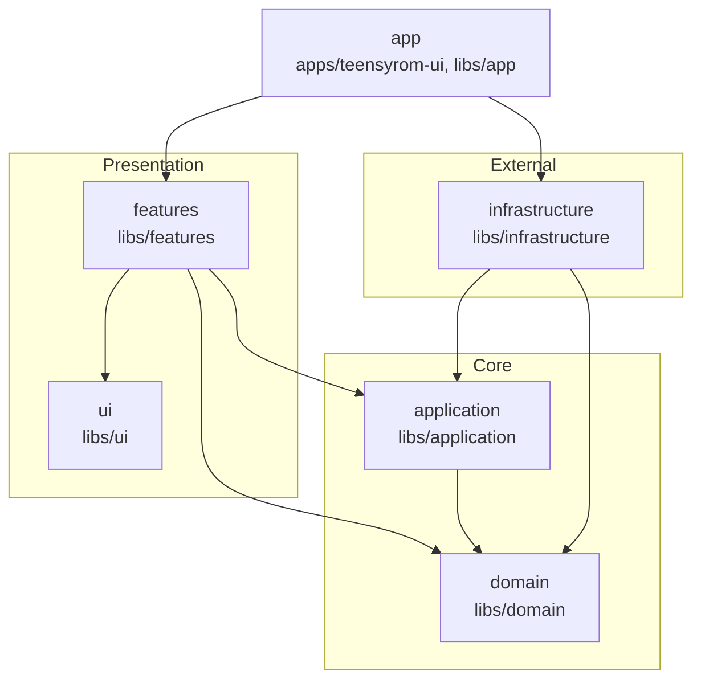

# Repository Guidelines

## Project Overview

Hybrid **.NET 9 Web API + Angular 19 (Nx monorepo)** application for TeensyROM device management and media playback. This directory (`src/`) is the Nx workspace root.

- Frontend app: `apps/teensyrom-ui` (source in `src/`, assets in `public/`). Cypress e2e: `apps/teensyrom-ui-e2e`.
- Backend solution: `apps/api/TeensyRom.Ui.sln`. API project: `apps/api/src/TeensyRom.Api` (RadEndpoints, MediatR, SignalR), Scalar docs at `/scalar/v1`.

## Architecture

### Backend (.NET)

- `TeensyRom.Api` — Web API endpoints, SignalR hubs, OpenAPI/Scalar docs
- `TeensyRom.Core` — domain models, commands/queries, business logic
- `TeensyRom.Core.Device` — device connection and lifecycle management
- `TeensyRom.Core.Serial` — serial communication with TeensyROM hardware
- `TeensyRom.Core.Storage` — file system and storage operations
- `TeensyRom.Core.Audio` — audio/SID playback concerns
- Each Core project has matching `*.Tests.Unit` / `*.Tests.Integration` projects

### Frontend (Angular/Nx) — Clean Architecture, enforced by ESLint



- **domain** (`libs/domain`) — pure contracts/models, zero dependencies
- **application** (`libs/application`) — NgRx Signal Stores, use cases; depends only on domain + `libs/utils`
- **infrastructure** (`libs/infrastructure`) — service implementations, HTTP/SignalR clients; depends on application + domain + `libs/data-access/api-client`
- **features** (`libs/features/{devices,player,settings}`) — smart components; depend on application + domain + ui. **Features cannot import each other.**
- **ui** (`libs/ui/{components,styles}`) — dumb presentational components; depend only on other ui components
- **app** (`libs/app`, `apps/teensyrom-ui`) — composition root: bootstrap, navigation, shell
- **data-access** (`libs/data-access/api-client`) — generated OpenAPI client
- **utils** (`libs/utils`) — shared utilities

ESLint `scope:*` / `feature:*` tags (see `eslint.config.mjs`) fail the build on boundary violations — run `pnpm nx lint` before committing, `pnpm nx graph` to visualize the dependency graph.

Dependency injection pattern — domain defines the contract/token, infrastructure implements it, application consumes the token (never the concrete class):

```typescript
// libs/domain/contracts/
export interface IDeviceService { /* methods */ }
export const DEVICE_SERVICE = new InjectionToken<IDeviceService>('IDeviceService');

// libs/infrastructure/device/
@Injectable()
export class DeviceService implements IDeviceService {
  constructor(private apiClient: DevicesApiService) {}
}
export const DEVICE_PROVIDERS = [{ provide: DEVICE_SERVICE, useClass: DeviceService }];

// libs/application/device/
export class DeviceStore {
  private deviceService = inject(DEVICE_SERVICE); // not DeviceService
}
```

## Build, Test, and Development Commands

- Install: `pnpm install`
- Serve frontend: `pnpm start` (`nx run teensyrom-ui:serve`, port 4200)
- Build frontend: `pnpm nx build teensyrom-ui`; static preview: `pnpm nx run teensyrom-ui:serve-static`
- Unit tests (Vitest): `pnpm nx test <project>`
- Lint/format: `pnpm nx lint`; `pnpm run format`
- Backend: `dotnet build` / `dotnet run` / `dotnet test` from `apps/api/src/TeensyRom.Api` (or the solution `apps/api/TeensyRom.Ui.sln`)
- Regenerate OpenAPI spec: `dotnet build apps/api/src/TeensyRom.Api/TeensyRom.Api.csproj` (generated in `apps/api/src/TeensyRom.Api/api-spec/TeensyRom.Api.json`), then regenerate the TypeScript client and update Angular services/state
- Dev fixture page: `/dev/transfer-states` — renders every file-transfer modal/dropzone state (including hard-to-trigger ones like `device-busy`, `draining`, `aborted`) with no backend or device needed. Not linked from nav; source in `libs/features/file-transfer/src/lib/dev-transfer-fixtures/`.

## Code Organization Patterns

### Backend endpoints

- Location: `Endpoints/[Domain]/[Action]/`
- Structure: `[Action]Endpoint.cs` + `[Action]Models.cs`
- Example: `apps/api/src/TeensyRom.Api/Endpoints/Files/GetDirectory/GetDirectoryEndpoint.cs`

### Frontend libraries

- Domain services/state: `libs/domain/*/contracts`, `libs/domain/*/models`
- Application state: `libs/application/[domain]/*-store.ts` — NgRx Signal Stores
- Infrastructure: `libs/infrastructure/[domain]/*.service.ts` (implements domain contract) + `*.mapper.ts` (DTO ↔ domain model) + `providers.ts` (DI bindings)
- Feature components: `libs/features/[feature]/`
- Shared UI: `libs/ui/components/` — consult the component library before adding new ones

## Angular Standards & Style

- EditorConfig: 2 spaces, trim whitespace; Prettier: single quotes, width 100, trailing commas `es5`.
- Angular 19 conventions: standalone components, `input()`/`output()` (not `@Input`/`@Output`), `@if`/`@for`/`@switch` (not `*ngIf`/`*ngFor`/`*ngSwitch`).
- Favor NgRx Signal Store, SCSS modules, and Angular Material primitives.
- Kebab-case files, PascalCase classes; maintain clean imports through barrel exports (`index.ts`).

## Testing Guidelines

| Layer          | Approach                               | Mock Boundary         |
| -------------- | --------------------------------------- | ---------------------- |
| Domain         | Don't test contracts — use as mocks     | N/A                     |
| Infrastructure | Unit test with mocked API clients       | Mock `*ApiService`      |
| Application    | Behavioral test — real stores/services  | Mock infrastructure     |
| Features       | Unit test with mocked application       | Mock stores/services    |
| UI             | Unit test presentational logic          | Minimal mocking         |

Mock only at infrastructure boundaries — application and features tests should use real stores/services integrating together.

- Unit: colocate `*.spec.ts`, prefer MSW for HTTP mocking.
- E2E: Cypress specs under `apps/teensyrom-ui-e2e/src`.
- Backend: `dotnet test` for API/Core projects (`*.Tests.Unit`, `*.Tests.Integration`).

## Development Workflow

### API changes

1. Modify endpoint or models in `Endpoints/` or `Models/`.
2. Update the Core layer if business logic changes.
3. Run the API to regenerate the OpenAPI spec.
4. Regenerate the TypeScript client.
5. Update Angular services and state as needed.

### Frontend changes

1. Work within the appropriate Nx library boundary.
2. Update domain services for API interactions.
3. Update signal stores for state changes.
4. Create/modify feature components for UI.
5. Run `pnpm nx lint` and `pnpm run format` before committing.

## Common Pitfalls

1. **Cross-feature imports** — features cannot import each other; share via the application layer instead.
2. **API client outside infrastructure** — never import generated API clients directly in features/application; go through domain contracts.
3. **Forgetting mappers** — always map between API DTOs and domain models in the infrastructure layer.

## Real-Time Communication (SignalR)

- Device logs: `/logHub`; device events: `/deviceEventHub`.
- Infrastructure services own hub lifecycle and reconnection logic.

## Backend Notes

- CORS is configured for the Angular dev server via the `UiCors` extension.
- Rate limiting is opt-in per endpoint via a named policy (currently used only by the device discovery endpoint).
- Assets are automatically unpacked on startup.

## UI & Styling Resources

- Presentation components stay logic-free and compose application stores.

## Documentation Standards

- Use Mermaid syntax for diagrams in planning docs (not ASCII); ASCII is fine in chat responses only.
- Dark-mode Mermaid init string: `%%{init: {'theme': 'dark', 'primaryColor': '#5a2c6b', 'primaryBorderColor': '#7d3fa3', 'primaryTextColor': '#fff', 'secondaryColor': '#0066cc', 'secondaryBorderColor': '#0052a3', 'tertiaryColor': '#2d7a3e', 'tertiaryBorderColor': '#1f5a2e', 'lineColor': '#b3b3b3', 'tertiaryTextColor': '#fff'}}%%`
- Color palette: dark purple `#5a2c6b` (primary/white text), medium purple `#7d3fa3` (emphasis/white), dark blue `#0066cc` (flows/white), dark green `#2d7a3e` (success/white), tan `#d4a574` (storage/black text), dark red `#cc3333` (errors/white), light gray stroke `#b3b3b3` (edges). Always pair a fill with an explicit `color:` for contrast, e.g. `style NODE fill:#0066cc,color:#fff,stroke:#0052a3,stroke-width:2px`.

## Commit & Pull Request Guidelines

- Use Conventional Commits (`feat`, `fix`, `refactor`, `docs`, `chore`, optional scopes like `feat(player): ...`).
- PRs need intent, linked issues, UI screenshots when relevant, and breaking-change notes.
- Run `pnpm nx lint` and `pnpm nx test -w`; confirm module-boundary linting stays green.

## Working Style

- On complex or multi-step tasks, create and maintain a TODO list to track progress and show what's being worked on.

## Security & Configuration Tips

- Keep secrets out of the repo; prefer backend configuration or environment-specific providers.

<!-- nx configuration start-->
<!-- Leave the start & end comments to automatically receive updates. -->

# General Guidelines for working with Nx

- When running tasks (for example build, lint, test, e2e, etc.), always prefer running the task through `nx` (i.e. `nx run`, `nx run-many`, `nx affected`) instead of using the underlying tooling directly
- You have access to the Nx MCP server and its tools, use them to help the user
- When answering questions about the repository, use the `nx_workspace` tool first to gain an understanding of the workspace architecture where applicable.
- When working in individual projects, use the `nx_project_details` mcp tool to analyze and understand the specific project structure and dependencies
- For questions around nx configuration, best practices or if you're unsure, use the `nx_docs` tool to get relevant, up-to-date docs. Always use this instead of assuming things about nx configuration
- If the user needs help with an Nx configuration or project graph error, use the `nx_workspace` tool to get any errors


<!-- nx configuration end-->
