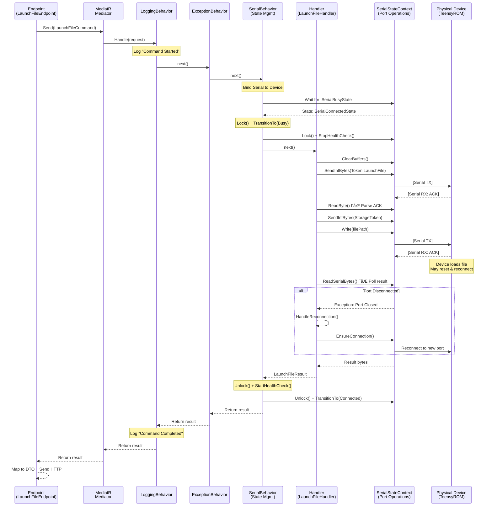
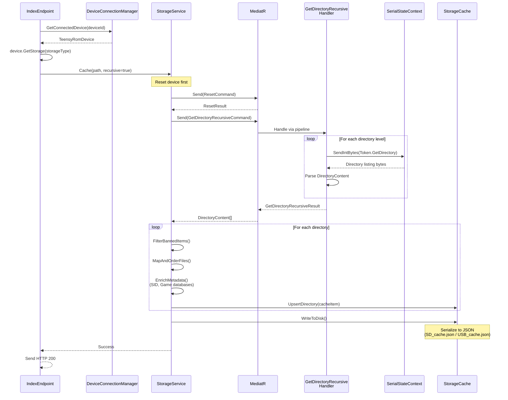

# TeensyROM Backend Architecture & Workflows

## Overview

The TeensyROM backend is a **layered .NET 9 Web API** designed to manage physical TeensyROM devices connected via serial ports, orchestrate file operations on their storage (SD/USB), and provide real-time communication with the frontend via SignalR. The architecture follows **Clean Architecture principles** with a **CQRS pattern** implemented via MediatR, emphasizing separation of concerns and testability.

### Core Responsibilities

- **Device Discovery & Connection Management**: Detect, connect, and monitor TeensyROM devices on available serial ports
- **Serial Protocol Communication**: Execute low-level serial commands with state management and error recovery
- **Storage Operations**: Index, search, cache, and manage files on device storage (SD/USB) 
- **File Launching**: Transfer and launch programs/music/games on Commodore 64 via TeensyROM cartridge
- **Real-time Streaming**: Push device logs and state changes to frontend via SignalR hubs
- **API Surface**: Expose RESTful endpoints via RadEndpoints with auto-generated OpenAPI specs

### Key Data/Control Flows

**Critical Pattern**: All device operations flow through MediatR with **pipeline behaviors** that handle locking, state transitions, logging, and exception handling before reaching handlers that execute serial/storage operations.

---

## System Architecture

```mermaid
graph TB
    subgraph "TeensyRom.Api"
        API[Program.cs<br/>ASP.NET Core Host]
        ENDPOINTS[RadEndpoints<br/>Files | Player | Serial]
        HUBS[SignalR Hubs<br/>LogsHub | DeviceEventHub]
    end

    subgraph "TeensyRom.Core.Device"
        DCM[DeviceConnectionManager<br/>Multi-device orchestration]
        FINDER[CartFinder<br/>Port scanning & detection]
        DEVICE[TeensyRomDevice<br/>Device aggregate root]
    end

    subgraph "TeensyRom.Core.Serial"
        MEDIATOR[MediatR Pipeline<br/>LoggingBehavior<br/>ExceptionBehavior<br/>SerialBehavior]
        HANDLERS[Command Handlers<br/>LaunchFile | Ping | Reset<br/>GetDirectory | CopyFile]
        SERIALSTATE[SerialStateContext<br/>State Machine + Port Abstraction]
        OBSPORT[ObservableSerialPort<br/>System.IO.Ports wrapper]
    end

    subgraph "TeensyRom.Core.Storage"
        STORAGE[StorageService<br/>CRUD + Enrichment]
        CACHE[StorageCache<br/>In-memory + disk persistence]
        TOOLS[Storage Tools<br/>D64 | Zip extraction]
    end

    subgraph "TeensyRom.Core"
        ENTITIES[Domain Entities<br/>FileItem | Cart | Settings]
        ABSTRACTIONS[Service Contracts<br/>IDeviceConnectionManager<br/>IStorageService | ISerialStateContext]
        LOGGING[Logging Service<br/>Queued channel logger]
    end

    subgraph "Frontend Integration"
        OPENAPI[OpenAPI Spec<br/>Auto-generated on build]
        APICLIENT[TypeScript Client<br/>Generated via openapi-generator-cli]
        INFRA[Infrastructure Layer<br/>DeviceService | StorageService]
    end

    API --> ENDPOINTS
    API --> HUBS
    ENDPOINTS --> MEDIATOR
    ENDPOINTS --> DCM
    
    DCM --> FINDER
    DCM --> DEVICE
    DEVICE --> SERIALSTATE
    DEVICE --> STORAGE
    
    MEDIATOR --> HANDLERS
    HANDLERS --> SERIALSTATE
    HANDLERS --> STORAGE
    
    SERIALSTATE --> OBSPORT
    
    STORAGE --> CACHE
    STORAGE --> TOOLS
    STORAGE --> MEDIATOR
    
    HANDLERS --> ENTITIES
    STORAGE --> ENTITIES
    DCM --> LOGGING
    HANDLERS --> LOGGING
    
    API -.Generates.-> OPENAPI
    OPENAPI -.Generates.-> APICLIENT
    APICLIENT --> INFRA
    INFRA -.HTTP Calls.-> ENDPOINTS
    
    HUBS -.WebSocket.-> INFRA

    style MEDIATOR fill:#ff9999
    style DEVICE fill:#99ccff
    style SERIALSTATE fill:#99ff99
    style CACHE fill:#ffcc99
```

---

## Key Components & Links

### API Layer (#file:apps/api/src/TeensyRom.Api)

| Component | Purpose | Key Files |
|-----------|---------|-----------|
| **Program.cs** | Application entry point, DI container setup, middleware pipeline | #file:apps/api/src/TeensyRom.Api/Program.cs |
| **RadEndpoints** | Thin HTTP handlers that delegate to MediatR or services | #file:apps/api/src/TeensyRom.Api/Endpoints/Files/GetDirectory/GetDirectoryEndpoint.cs<br/>#file:apps/api/src/TeensyRom.Api/Endpoints/Serial/ConnectDevice/ConnectDeviceEndpoint.cs<br/>#file:apps/api/src/TeensyRom.Api/Endpoints/Player/LaunchFile/LaunchFileEndpoint.cs |
| **SignalR Hubs** | Real-time streams for logs and device events | #file:apps/api/src/TeensyRom.Api/Endpoints/Serial/Logs/LogsHub.cs<br/>#file:apps/api/src/TeensyRom.Api/Endpoints/Serial/DeviceEvents/DeviceEventHub.cs |
| **Startup Extensions** | Service registration and configuration | #file:apps/api/src/TeensyRom.Api/Startup/ServiceStartupExtensions.cs<br/>#file:apps/api/src/TeensyRom.Api/Startup/MediatorStartupExtensions.cs<br/>#file:apps/api/src/TeensyRom.Api/Startup/ApiDocStartupExtensions.cs |

**Endpoint Pattern**: Each endpoint lives in `Endpoints/[Domain]/[Action]/[Action]Endpoint.cs` with explicit RadEndpoints configuration (routes, tags, descriptions) and delegates complex operations to MediatR.

### Device Management (#file:apps/api/src/TeensyRom.Core.Device)

| Component | Purpose | Key Files |
|-----------|---------|-----------|
| **DeviceConnectionManager** | Singleton orchestrator managing multiple TeensyROM devices, health checks, reconnection logic | #file:apps/api/src/TeensyRom.Core.Device/DeviceConnectionManager.cs |
| **TeensyRomDevice** | Aggregate root representing a connected device with serial state + storage services | #file:apps/api/src/TeensyRom.Core/Entities/Device/TeensyRomDevice.cs |
| **CartFinder** | Scans available serial ports, validates firmware versions, creates device instances | #file:apps/api/src/TeensyRom.Core.Device/CartFinder.cs |
| **CartTagger** | Tags devices with metadata (name, type, storage availability) | #file:apps/api/src/TeensyRom.Core.Device/CartTagger.cs |

**Critical Pattern**: `TeensyRomDevice` encapsulates:
- **Cart** metadata (device ID, name, COM port, storage info)
- **SerialState** (state machine + port operations)
- **SdStorage/UsbStorage** (storage service instances)

This ensures all device operations are scoped to the correct physical device in multi-device scenarios.

### Serial Communication (#file:apps/api/src/TeensyRom.Core.Serial)

| Component | Purpose | Key Files |
|-----------|---------|-----------|
| **MediatR Commands** | Request/response wrappers for serial operations implementing `ITeensyCommand<T>` | #file:apps/api/src/TeensyRom.Core.Serial/Commands/LaunchFile/LaunchFileCommand.cs<br/>#file:apps/api/src/TeensyRom.Core.Serial/Commands/Ping/PingCommand.cs<br/>#file:apps/api/src/TeensyRom.Core.Serial/Commands/GetDirectoryRecursive/GetDirectoryRecursiveCommand.cs |
| **Command Handlers** | Execute serial protocol sequences, parse responses, handle retries | #file:apps/api/src/TeensyRom.Core.Serial/Commands/LaunchFile/LaunchFileHandler.cs<br/>#file:apps/api/src/TeensyRom.Core.Serial/Commands/GetFile/GetFileCommandHandler.cs |
| **Pipeline Behaviors** | Cross-cutting concerns applied to all commands | #file:apps/api/src/TeensyRom.Core.Serial/Commands/Behaviors/SerialBehavior.cs<br/>#file:apps/api/src/TeensyRom.Core.Serial/Commands/Behaviors/LoggingBehavior.cs<br/>#file:apps/api/src/TeensyRom.Core.Serial/Commands/Behaviors/ExceptionBehavior.cs |
| **SerialStateContext** | State machine managing connection lifecycle with reactive state transitions | #file:apps/api/src/TeensyRom.Core.Serial/State/SerialStateContext.cs |
| **ObservableSerialPort** | Wrapper around `System.IO.Ports.SerialPort` with Rx extensions | #file:apps/api/src/TeensyRom.Core.Serial/ObservableSerialPort.cs |

**State Machine States**:
- **SerialStartState**: Initial state, ports not yet discovered
- **SerialConnectableState**: Ports available, not connected
- **SerialConnectedState**: Connected and idle (accepts commands)
- **SerialBusyState**: Locked during command execution
- **SerialConnectionLostState**: Recovery state, triggers reconnection

**Command Protocol**: Commands send token bytes (`TeensyToken.LaunchFile`, `TeensyToken.GetDirectory`) followed by parameters, then wait for ACK/NAK responses and parse result data.

### Storage & Indexing (#file:apps/api/src/TeensyRom.Core.Storage)

| Component | Purpose | Key Files |
|-----------|---------|-----------|
| **StorageService** | High-level storage API: CRUD, indexing, search, favorites | #file:apps/api/src/TeensyRom.Core.Storage/StorageService.cs |
| **StorageCache** | In-memory cache + JSON file persistence of indexed directories/files | #file:apps/api/src/TeensyRom.Core.Storage/StorageCache.cs<br/>#file:apps/api/src/TeensyRom.Core.Storage/BaseStorageCache.cs |
| **Storage Factory** | Creates storage service instances bound to specific device/storage type | #file:apps/api/src/TeensyRom.Core.Storage/StorageFactory.cs |
| **File Watchers** | Monitors local file changes (future enhancement for live sync) | #file:apps/api/src/TeensyRom.Core.Storage/FileWatchService.cs |
| **Storage Tools** | D64 disk image and ZIP extraction utilities | #file:apps/api/src/TeensyRom.Core.Storage/Tools/D64/<br/>#file:apps/api/src/TeensyRom.Core.Storage/Tools/Zip/ |

**Indexing Flow**:
1. Client calls `IndexEndpoint` → triggers `StorageService.Cache(path)`
2. Sends `GetDirectoryRecursiveCommand` via MediatR → serial handler walks directory tree
3. For each directory: map files to domain types (SongItem, GameItem, etc.), enrich with metadata
4. Cache results in memory + serialize to disk (`*.cache.json` in app directory)
5. Search operates on in-memory cache with fuzzy matching and ranking

**Cache Strategies**:
- **Lazy Loading**: On-demand fetch if cache miss on `GetDirectory()`
- **Full Indexing**: Recursive walk triggered by user or on device connection
- **Favorites**: Special directory (`/TeensyROM/Favs`) with symbolic links managed via copy operations

### OpenAPI & Client Generation

| Component | Purpose | Key Files |
|-----------|---------|-----------|
| **OpenAPI Spec** | Auto-generated JSON spec on API build via `Microsoft.AspNetCore.OpenApi` | #file:apps/api/src/TeensyRom.Api/api-spec/TeensyRom.Api.json |
| **Scalar UI** | Interactive API documentation at `/scalar/v1` (replaces Swagger) | #file:apps/api/src/TeensyRom.Api/Startup/ApiDocStartupExtensions.cs |
| **Client Generator** | Node script (see `.claude/skills/api-client-generation/SKILL.md` for details) | #file:.claude/skills/api-client-generation/scripts/generate-client.js |
| **Generated Client** | TypeScript models + `*ApiService` classes consumed by infrastructure | #file:libs/data-access/api-client/src/lib/apis/<br/>#file:libs/data-access/api-client/src/lib/models/ |
| **Infrastructure Services** | Implement domain contracts, map DTOs Γåö models, handle errors | #file:libs/infrastructure/src/lib/device/device.service.ts<br/>#file:libs/infrastructure/src/lib/storage/storage.service.ts |

**Generation Pipeline**: See `.claude/skills/api-client-generation/SKILL.md` for detailed workflow.

```bash
pnpm run generate:api-client  # Regenerates TypeScript client from OpenAPI spec
```

**Frontend Integration**: Infrastructure layer injects generated `*ApiService` classes, calls async methods returning Promises, maps responses to domain models via `DomainMapper`, and exposes Observables to application/feature layers.

---

## Endpoint Architecture

### Organization

Endpoints are organized by domain under `Endpoints/[Domain]/[Action]/`:

```
Endpoints/
Γö£ΓöÇΓöÇ Assets/          # Static asset info (firmware, images)
Γö£ΓöÇΓöÇ Files/           # Storage operations
Γöé   Γö£ΓöÇΓöÇ GetDirectory/
Γöé   Γö£ΓöÇΓöÇ Index/
Γöé   Γö£ΓöÇΓöÇ Search/
Γöé   Γö£ΓöÇΓöÇ FavoriteFile/
Γöé   ΓööΓöÇΓöÇ ...
Γö£ΓöÇΓöÇ Player/          # Media playback
Γöé   Γö£ΓöÇΓöÇ LaunchFile/
Γöé   Γö£ΓöÇΓöÇ LaunchRandom/
Γöé   Γö£ΓöÇΓöÇ ToggleMusic/
Γöé   ΓööΓöÇΓöÇ ...
ΓööΓöÇΓöÇ Serial/          # Device management
    Γö£ΓöÇΓöÇ FindDevices/
    Γö£ΓöÇΓöÇ ConnectDevice/
    Γö£ΓöÇΓöÇ PingDevice/
    Γö£ΓöÇΓöÇ Logs/
    ΓööΓöÇΓöÇ DeviceEvents/
```

### Versioning & Validation

- **Versioning**: All endpoints under `/` (implicit v1). Future: add `/v2/` prefix when breaking changes occur
- **Validation**: RadEndpoints provides built-in model binding/validation via `[FromRoute]`, `[FromBody]` attributes
- **OpenAPI Tags**: Endpoints grouped by tags (`Files`, `Player`, `Devices`) in generated docs

### Typical Endpoint Flow

```csharp
public class GetDirectoryEndpoint(IDeviceConnectionManager deviceManager) 
    : RadEndpoint<GetDirectoryRequest, GetDirectoryResponse>
{
    public override void Configure()
    {
        Get("/devices/{deviceId}/storage/{storageType}/directories")
            .WithTags("Files")
            .Produces<GetDirectoryResponse>(200)
            .ProducesProblem(400);
    }

    public override async Task Handle(GetDirectoryRequest r, CancellationToken ct)
    {
        // 1. Resolve device from manager
        var device = deviceManager.GetConnectedDevice(r.DeviceId!);
        if (device is null) { SendNotFound(); return; }
        
        // 2. Get storage service for device
        var storage = device.GetStorage(r.StorageType);
        if (storage is null) { SendNotFound(); return; }
        
        // 3. Call storage service (may trigger MediatR commands internally)
        var result = await storage.GetDirectory(new DirectoryPath(r.Path!));
        
        // 4. Map to response DTO and send
        Response = new() { StorageItem = StorageCacheDto.FromCache(result) };
        Send();
    }
}
```

**Key Pattern**: Endpoints are **thin adapters** that:
1. Extract/validate request data
2. Resolve domain services (devices, storage)
3. Delegate to services/MediatR
4. Map results to DTOs
5. Send HTTP responses

---

## Serial Behaviors & Command Flow

### Command Interface

All serial commands implement `ITeensyCommand<TResponse>`:

```csharp
public interface ITeensyCommand<T> : IRequest<T> 
{
    string? DeviceId { get; set; }           // For multi-device routing
    ISerialStateContext Serial { get; set; } // Bound by SerialBehavior
}
```

### Pipeline Behaviors (Executed in Order)

#### 1. LoggingBehavior
- **Purpose**: Logs command start/completion with timing and request/response details
- **Key File**: #file:apps/api/src/TeensyRom.Core.Serial/Commands/Behaviors/LoggingBehavior.cs
- **Operation**: Wraps command execution in `Stopwatch`, logs success/failure with deviceId context

#### 2. ExceptionBehavior
- **Purpose**: Converts exceptions to error responses, publishes alerts to frontend
- **Key File**: #file:apps/api/src/TeensyRom.Core.Serial/Commands/Behaviors/ExceptionBehavior.cs
- **Handles**:
  - `TeensyBusyException` → Returns `IsBusy = true` response
  - Port closed errors → "Disconnected from TeensyROM"
  - Generic exceptions → Wrapped error responses

#### 3. SerialBehavior
- **Purpose**: Manages serial port locking and state transitions during command execution
- **Key File**: #file:apps/api/src/TeensyRom.Core.Serial/Commands/Behaviors/SerialBehavior.cs
- **Operation**:
  1. Binds correct `ISerialStateContext` to command based on `DeviceId`
  2. Waits for serial to exit `SerialBusyState` (reactive wait via Rx)
  3. Locks serial, transitions to `SerialBusyState`
  4. Executes handler
  5. Unlocks serial, restarts health check

### Error Handling & Retries

**Reconnection Logic** (LaunchFileHandler example):
- Large file launches may cause device reset → port disconnect
- Handler detects port closed exception
- Polls available ports, validates firmware version
- Reconnects to new COM port assigned by OS
- Retries launch command

**ACK/NAK Protocol**:
```
Client: TeensyToken.LaunchFile (2 bytes)
Device: TeensyToken.Ack / TeensyToken.Nak
Client: Storage token (1 byte) + File path (null-terminated string)
Device: TeensyToken.Ack + execution result (parsed by handler)
```

**State Recovery**: If serial state becomes `SerialConnectionLostState`, health check background task attempts reconnection every 2 seconds until successful or device removed.

---

## MediatR Flow Diagrams

### Request/Command Flow for Serial Command



### Storage Indexing Flow



---

## Storage & Indexing Deep Dive

### What is Stored

**Cache File Structure** (`*.cache.json`):
```json
{
  "version": "1.0",
  "deviceHash": "abc123",
  "directories": {
    "/Games/Action": {
      "path": "/Games/Action",
      "directories": [...],
      "files": [
        {
          "id": "hash-uuid",
          "path": "/Games/Action/Commando.prg",
          "name": "Commando",
          "size": 32768,
          "type": "Game",
          "isFavorite": false,
          "metadata": { "developer": "Elite", "year": 1985 }
        }
      ]
    }
  }
}
```

### Indexing Strategies

**Full Indexing** (`IndexAllEndpoint`):
- Walks entire directory tree from root (`/`)
- Can take 5-10 minutes for large SD cards (thousands of files)
- Progress reported via device logs (pushed to frontend via SignalR)
- Cache persisted to disk after completion

**Incremental Indexing** (`IndexEndpoint`):
- Index single directory path (non-recursive or recursive)
- Used for folder navigation when cache miss occurs
- Merges results into existing cache

**On-Demand Fetch** (`GetDirectory`):
- If cache hit: return immediately
- If cache miss: send `GetDirectoryRecursiveCommand`, cache result, return
- Balances responsiveness with completeness

### Read/Write Paths

**Read Path** (Search/GetDirectory):
1. Check in-memory cache via `StorageCache.GetByDirPath()`
2. If miss: fetch via serial, enrich, cache, return
3. If hit: return cached `IStorageCacheItem`

**Write Path** (FavoriteFile):
1. Send `FavoriteFileCommand` via MediatR → serial handler copies file to `/TeensyROM/Favs/`
2. Update cache: mark original file `IsFavorite = true`, add favorite copy to cache
3. Update siblings (multi-file games) with same favorite status
4. Persist cache to disk

### Metadata Enrichment

**SID Music Files**:
- Matched against HVSC database (80k+ entries) via `HvscDatabase`
- Enriches with composer, year, subtune count
- Fetches composer images from DeepSID API

**Game Files**:
- Matched against OneLoad64 database via `GameMetadataService`
- Enriches with developer, year, genre, screenshots

**Enrichment occurs during indexing**, not on-demand reads (performance optimization).

### Integration with Device/Serial

Storage operations are **tightly coupled** to serial commands:
- `GetFileCommand` → reads file bytes via serial
- `DeleteFileCommand` → deletes file via serial
- `CopyFileCommand` → copies file via serial (used for favorites)
- `GetDirectoryRecursiveCommand` → walks directory tree via serial

All commands flow through MediatR pipeline with serial behaviors.

## Dependencies

### Major Frameworks & Libraries

| Dependency | Purpose | Why Used |
|------------|---------|----------|
| **ASP.NET Core 9.0** | Web host, DI, middleware | Industry-standard .NET web framework |
| **RadEndpoints** | Endpoint routing library | Cleaner alternative to minimal APIs/controllers with fluent config |
| **MediatR** | CQRS mediator pattern | Decouples endpoints from handlers, enables pipeline behaviors |
| **System.IO.Ports** | Serial port communication | Direct access to COM ports for TeensyROM protocol |
| **System.Reactive (Rx)** | Reactive programming | Port polling, state transitions, event streams |
| **SignalR** | WebSocket abstraction | Real-time log/event streaming to frontend |
| **Microsoft.AspNetCore.OpenApi** | OpenAPI spec generation | Auto-generates docs from endpoint metadata |
| **Scalar.AspNetCore** | API documentation UI | Modern Swagger alternative with better UX |
| **System.Text.Json** | JSON serialization | Cache persistence, API responses |
| **CsvHelper** | CSV parsing | HVSC music database loading |
| **Ardalis.SmartEnum** | Type-safe enums | Strongly-typed file types, storage types |

### Testing Frameworks

| Dependency | Purpose | Projects |
|------------|---------|----------|
| **xUnit** | Unit test runner | TeensyRom.Tests.Unit |
| **FluentAssertions** | Assertion library | All test projects |
| **NSubstitute** | Mocking library | All test projects |
| **Microsoft.AspNetCore.Mvc.Testing** | Integration test host | TeensyRom.Api.Tests.Integration |

### Dependency Flow

```
TeensyRom.Api
Γö£ΓöÇΓöÇ TeensyRom.Core.Device
Γöé   Γö£ΓöÇΓöÇ TeensyRom.Core.Serial
Γöé   Γöé   ΓööΓöÇΓöÇ TeensyRom.Core
Γöé   ΓööΓöÇΓöÇ TeensyRom.Core.Storage
Γöé       Γö£ΓöÇΓöÇ TeensyRom.Core.Serial
Γöé       ΓööΓöÇΓöÇ TeensyRom.Core
ΓööΓöÇΓöÇ TeensyRom.Core
    Γö£ΓöÇΓöÇ MediatR
    Γö£ΓöÇΓöÇ System.Reactive
    ΓööΓöÇΓöÇ System.IO.Ports
```

**Core Project** is the foundation containing domain entities, abstractions, and shared utilities. All other projects reference it.

---

## Operational Concerns

### Configuration

**appsettings.json** (#file:apps/api/src/TeensyRom.Api/appsettings.json):
```json
{
  "Logging": {
    "LogLevel": {
      "Default": "Information",
      "Microsoft.AspNetCore.SignalR": "Debug"
    }
  },
  "AllowedHosts": "*",
  "Cors": {
    "AllowedOrigins": ["http://localhost:4200"]
  }
}
```

**Environment Variables**:
- `ASPNETCORE_ENVIRONMENT`: Development/Production (affects logging verbosity)
- `ASPNETCORE_URLS`: Bind address (default: `http://localhost:5000`)

**Settings Service** (#file:apps/api/src/TeensyRom.Core/Settings/SettingsService.cs):
- Manages user preferences (search weights, banned directories, last connected device)
- Persists to `settings.json` in app directory
- Exposed as reactive `IObservable<TeensySettings>` for subscribers

### Error Handling

**Layers of Error Handling**:

1. **ExceptionBehavior**: Catches exceptions in MediatR pipeline, converts to error responses
2. **ProblemDetails**: ASP.NET Core middleware maps unhandled exceptions to RFC 7807 responses
3. **Endpoint Validation**: RadEndpoints validates request models, returns 400 on failures
4. **Serial Reconnection**: Automatic retry logic for port disconnections in handlers

**Alert System**:
- `IAlertService` publishes error messages to frontend via SignalR
- Displayed as toast notifications in UI
- Critical errors logged to console + queued channel logger

### Retries & Timeouts

**Serial Command Timeouts**:
- Default read timeout: 200ms per operation
- Long operations (file transfers): 30s+ timeouts
- Reconnection attempts: 3 retries with 4s delay between

**Health Checks**:
- Background task polls connected devices every 2s
- Detects port closures, triggers reconnection
- Removes stale devices from connection manager

### Observability & Logging

**Logging Architecture**:
- **LoggingService**: Queued channel-based logger buffering messages
- **LogStream**: Pushes logs to SignalR `LogsHub` for real-time frontend display
- **Console Logging**: ASP.NET Core default logger for server-side debugging

**Log Levels**:
- `Internal`: Backend operations (serial commands, state transitions)
- `External`: Device responses, firmware messages
- `Success/Warning/Error`: Colored output in UI

**Device Event Streaming**:
- **DeviceEventStream**: Reactive pipeline subscribing to `DeviceConnectionManager.DeviceStateChanges`
- Pushes device state transitions (Connected, Busy, Disconnected) to SignalR `DeviceEventHub`
- Frontend updates device status badges in real-time

**Performance Metrics**:
- Command execution times logged by `LoggingBehavior`
- Indexing progress reported via logs (files processed, elapsed time)
- No formal APM integration (future: OpenTelemetry)

---

## Architecture Patterns & Anti-Patterns

### Patterns to Embrace

✅ **CQRS via MediatR**: Clear separation of commands/queries, testable in isolation  
✅ **State Machine for Serial**: Explicit state transitions prevent race conditions  
✅ **Pipeline Behaviors**: Cross-cutting concerns (logging, locking) applied uniformly  
✅ **Dependency Injection**: All services injected, no `new` keyword in business logic  
✅ **Reactive Extensions**: Port polling, event streaming handled declaratively  
✅ **Aggregate Roots**: `TeensyRomDevice` encapsulates all device state/operations  

### Anti-Patterns to Avoid

❌ **Direct SerialPort Access**: Always use `ISerialStateContext`, never bypass state machine  
❌ **Singleton State Mutation**: Singletons (DeviceConnectionManager) must be thread-safe  
❌ **Blocking Serial Reads**: Use timeouts, poll in loops, not infinite waits  
❌ **Cache Invalidation Bugs**: Ensure cache updates/deletes cascade to children/siblings  
❌ **Forgetting DeviceId**: Multi-device commands must bind correct serial context  
❌ **Swallowing Exceptions**: Let ExceptionBehavior handle, don't catch/ignore in handlers  

---

## Integration Seams

### Frontend Γåö Backend

**HTTP Endpoints**: RESTful API for CRUD operations, endpoint-to-store data flow  
**SignalR Hubs**: Persistent WebSocket connections for real-time logs/events  
**OpenAPI Contract**: Generated TypeScript client ensures type safety across boundary  

### Backend Γåö Hardware

**Serial Protocol**: Proprietary token-based protocol (documented in firmware)  
**State Management**: State machine prevents concurrent access to single-threaded serial ports  
**Error Recovery**: Automatic reconnection on port disconnect (OS reassigns COM port on device reset)  

### Storage Γåö Serial

**Coupled Operations**: Storage service **sends serial commands** (no separate persistence layer)  
**Cache Strategy**: Cache acts as read-through/write-through cache backed by device storage  
**Consistency**: Cache invalidated on device disconnect, rebuilt on reconnection  

---

## Summary & Next Steps

### Architectural Highlights

- **Layered Design**: API → Device → Serial/Storage → Core (clear separation of concerns)
- **CQRS with MediatR**: Commands/queries flow through pipelines with behaviors
- **State Machine**: Reactive serial state transitions with Rx observables
- **Multi-Device Support**: Connection manager orchestrates multiple TeensyROMs concurrently
- **Real-Time Streaming**: SignalR hubs push logs/events to frontend


### Future Enhancements

- **Persistence Layer**: Migrate from JSON cache to SQLite for better query performance
- **OpenTelemetry**: Distributed tracing for command flows
- **Command Queuing**: Queue serial commands when device busy (currently fails fast)
- **File Watchers**: Live sync local file changes to device storage
- **Firmware Update API**: OTA firmware updates via serial protocol

### Related Documentation

- **Frontend Architecture**: #file:docs/OVERVIEW_CONTEXT.md
- **Testing Standards**: #file:docs/TESTING_STANDARDS.md
- **Clean Architecture Enforcement**: #file:docs/features/CLEAN_ARCHITECTURE.md

---

**Document Version**: 1.0  
**Last Updated**: 2025-11-08  
**Maintainer**: Backend Engineering Team
