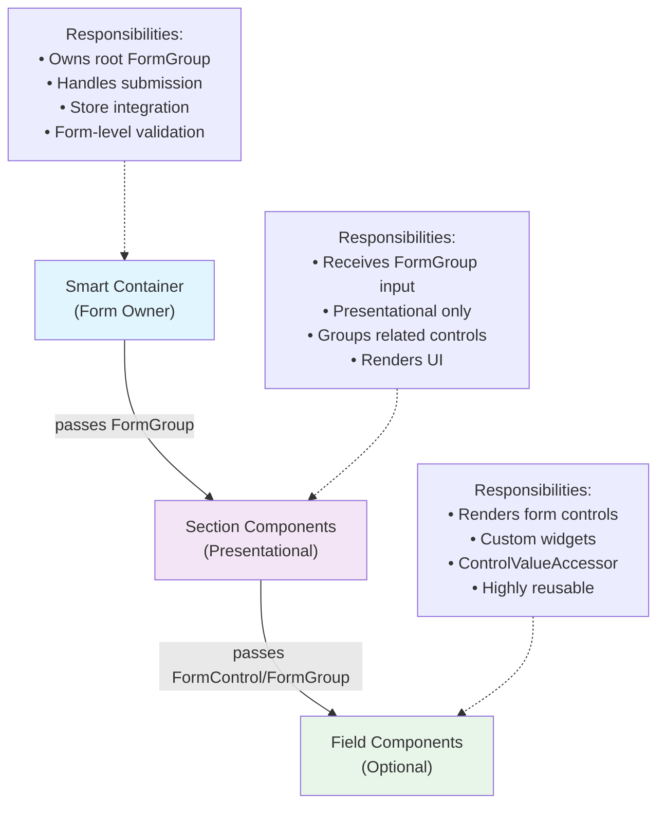

# Form Standards for TeensyROM

This document defines how complex forms are built in TeensyROM using a hierarchical component architecture combined with reactive forms patterns. Our approach balances maintainability, reusability, and scalability.

---

## Form Architecture Overview

TeensyROM uses a three-layer component hierarchy to decompose complex forms into focused, testable units with clear responsibilities. This pattern promotes unidirectional data flow and separation of concerns.

---

## Layer Responsibilities

### Layer 1: Smart Container (Form Owner)

The smart container owns the complete reactive form structure and manages form-level concerns.

**Core Responsibilities:**
- Creates and owns the root `FormGroup`
- Injects domain services and store
- Handles form submission and validation
- Manages form state (dirty, auto-save, undo/redo)
- Passes section `FormGroup`s to child components

**Characteristics:**
- Business logic aware
- Integrates with store/state management
- Handles form subscriptions (valueChanges, statusChanges)
- Uses `debounceTime` for auto-save patterns
- Manages lifecycle cleanup with `takeUntilDestroyed`

---

### Layer 2: Section Components (Presentational)

Section components manage logical form sections and receive form state via inputs.

**Core Responsibilities:**
- Receive `FormGroup` or `FormControl` via `input()` signals
- Render related form fields as a cohesive section
- Display validation errors inline
- Pass controls to field components or form controls directly

**Characteristics:**
- Purely presentational (no service injection)
- No direct store access
- Reusable across different parent forms
- Stateless and focused on rendering
- Accept form state as inputs only

---

### Layer 3: Field Components (Optional)

Field components handle individual form controls or complex custom widgets.

**Core Responsibilities:**
- Render form controls with consistent styling
- Implement `ControlValueAccessor` for custom inputs
- Display control-level validation messages
- Handle user interactions (blur, change events)

**Characteristics:**
- Highly reusable across multiple sections
- Can be used standalone in forms
- Implement custom form control protocol
- Focused on single responsibility (e.g., date picker, multi-select)

---

## Data Flow Patterns

### Initialization and Loading

Forms are initialized when the container component loads data from the store.

**Process:**
1. Container detects store changes via signals or observables
2. Container builds or updates FormGroup structure
3. Container patches initial values with `patchValue()` using `{ emitEvent: false }`
4. Child components receive FormGroup input and render current state

**Pattern Details:**
- Use `emitEvent: false` to prevent circular updates from valueChanges subscriptions
- Initialize before subscription to valueChanges to avoid auto-save on load
- Use `effect()` for reactive updates when store data changes

### User Interaction and Updates

Changes flow from child components up through the reactive forms system to the store.

**Process:**
1. User interacts with form control (types, selects, etc.)
2. FormControl value updates automatically
3. FormGroup valueChanges observable emits new value
4. Container debounces and validates changes
5. Container dispatches update to store
6. Store persists to backend

**Debounce Strategy:**
- Use 500ms debounce for text inputs and most controls
- Validate before saving: filter by `form.valid`
- Always use `takeUntilDestroyed()` to prevent memory leaks

---

## Validation Patterns

### Validation Layer Distribution

Validation rules are applied at form building time but displayed at the appropriate layer.

**Container Layer:**
- Form-level validators (cross-field validation)
- Overall form validity state
- Submit button enable/disable logic

**Section Layer:**
- Section-specific error message rendering
- Validation styling (error states, helper text)
- Visual feedback to user

**Field Layer:**
- Control-specific validators (format, length, range)
- Custom validator implementation
- Field-level error conditions

### Error Display Strategy

Display validation errors at the point of entry with clear, actionable messages.

**Best Practices:**
- Show errors after blur or submit, not during typing
- Display inline below or beside the control
- Use Material Design error patterns (red text, error icons)
- Provide clear, context-specific messages
- Match frontend validators to backend validation rules
  - Ask the user for a backend validator file reference if needed 

---

## Type Safety and Composition

### FormGroup Typing

Use generic `FormGroup` type for component inputs to avoid type compatibility issues with FormBuilder inference.

**Pattern:**
- Container: builds form with `FormBuilder` (type inference preferred)
- Section/Field Components: accept `FormGroup` type (not typed FormGroup)
- Template: pass section/control using property access (e.g., `form.get('sectionName')`)

### Control Access

Access form controls using standard reactive forms methods consistently across layers.

**Methods:**
- Use `formGroup.get('controlName')` for optional access
- Use `formControlName` directive for template binding
- Use optional chaining for safe property access

---

## State Management Integration

### Store Connection Pattern

Smart containers integrate with store through a predictable pattern.

**Load Phase:**
- Inject store service
- Use `effect()` to react to store signal changes
- Patch form with initial values

**Save Phase:**
- Subscribe to `form.valueChanges`
- Apply debounce and validation filters
- Dispatch save action to store
- Let store handle backend persistence

**Cleanup:**
- Always use `takeUntilDestroyed()` on subscriptions
- Use `DestroyRef` for cleanup coordination
- Prevent memory leaks from form observables

---

## Testing Approach

### Container Testing

Test form structure, state management, and integration.

**Coverage:**
- Form initialization from store
- Form submission logic
- Auto-save and debounce behavior
- Store integration and dispatching
- Validation state propagation

**Setup:**
- Mock store with test data
- Use real FormGroups (not mocked)
- Shallow render child components

### Section Component Testing

Test presentation and user interaction without store dependencies.

**Coverage:**
- Rendering form controls correctly
- Validation error display
- User input handling
- FormGroup input reactivity

**Setup:**
- Pass mocked FormGroup as input
- No store injection required
- Test with different validation states
- Test empty/error/success scenarios

### Integration Testing

Test complete form hierarchy and data flow.

**Coverage:**
- Parent-to-child FormGroup passing
- Validation propagation through layers
- User interaction flow
- Store integration end-to-end

**Setup:**
- Use real FormGroups
- Render full component tree
- Test with realistic data

---

## Best Practices and Patterns

### Key Principles

**✅ DO:**
- Pass `FormGroup` to children via `input()` signals
- Keep section components presentation-only
- Use `formControlName` directive for bindings
- Validate at appropriate layer (field → section → container)
- Use `{ emitEvent: false }` when patching from external source
- Handle form subscriptions with `takeUntilDestroyed()`

**❌ DON'T:**
- Pass entire form to deeply nested components (pass only needed sections)
- Inject services in presentational section components
- Access parent form directly from child components
- Skip frontend validation in favor of backend-only checks
- Forget to unsubscribe from `valueChanges` observables
- Mutate FormGroup structure in child components

### Reusability Strategies

**Section Component Reuse:**
- Accept FormGroup via input
- Don't couple to specific parent
- Use generic section names (e.g., "Player Settings Section")
- Compose multiple sections in different containers

**Field Component Reuse:**
- Implement `ControlValueAccessor` for custom inputs
- Accept FormControl as input
- Make completely presentational
- Use in any section or form

---

## Related Documentation

- [CODING_STANDARDS.md](./CODING_STANDARDS.md) - General coding patterns and conventions
- [SMART_COMPONENT_TESTING.md](./SMART_COMPONENT_TESTING.md) - Detailed component testing strategies
- [STATE_STANDARDS.md](./STATE_STANDARDS.md) - Store and state management patterns
- [Angular Reactive Forms](https://angular.io/guide/reactive-forms) - Official Angular documentation
