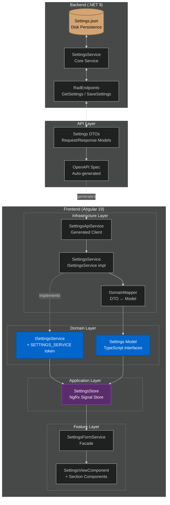

# Settings Flow Overview

This document describes how settings flow through the TeensyROM hybrid application, from backend persistence to frontend UI, following Clean Architecture principles.

## Architecture Diagram



---

## File Tree

```
apps/api/src/
├── TeensyRom.Api/Endpoints/Settings/
│   ├── GetSettings/GetSettingsEndpoint.cs    # GET /settings
│   ├── SaveSettings/SaveSettingsEndpoint.cs  # POST /settings
│   └── SettingsModels.cs                     # DTOs for all settings sections
└── TeensyRom.Core/Settings/
    ├── TeensySettings.cs           # Root settings container
    ├── SettingsService.cs          # Core service (persistence + Rx observables)
    ├── ISettingsService.cs         # Backend contract
    ├── ConnectionSettings.cs       # Device connectivity
    ├── PlayerSettings.cs           # Playback behavior
    ├── VideoSettings.cs            # Video capture toggle
    ├── FileTransferSettings.cs     # Watch folder + auto-copy
    ├── SearchSettings.cs           # Search weights + exclusions
    ├── SearchWeights.cs            # Field weight configuration
    └── AppSettings.cs              # Application lifecycle state

libs/domain/src/lib/
├── models/settings.model.ts        # TypeScript interfaces for all settings
└── contracts/settings.contract.ts  # ISettingsService + injection token

libs/infrastructure/src/lib/settings/
├── settings.service.ts             # Implements ISettingsService
└── providers.ts                    # DI binding (SETTINGS_SERVICE → SettingsService)

libs/application/src/lib/settings/
├── settings-store.ts               # NgRx Signal Store
├── settings-state.interface.ts     # Store state shape + history
├── actions/                        # loadSettings, saveSettings, undo, redo
└── selectors/                      # getSettings, enableVideo, canUndo, etc.

libs/features/settings/src/lib/settings-view/
├── settings-view.component.ts      # Main settings page
├── settings-form.service.ts        # Form facade (reactive forms + auto-save)
├── connection-settings-section/    # Connection type toggle
├── player-settings-section/        # Player behavior toggles
├── video-settings-section/         # Video capture toggle
├── file-transfer-settings-section/ # Watch folder settings
└── search-settings-section/        # Search weights + exclusions
```

---

## Data Flow

### Load Settings (App Startup)

1. **SettingsStore.loadSettings()** dispatched on app bootstrap
2. **SettingsService** (infrastructure) calls `SettingsApiService.getSettings()`
3. **Backend** reads from `Settings.json` (or creates defaults)
4. **DomainMapper.toSettings()** transforms DTO → domain model
5. **Store** updates state with settings + initializes history

### Save Settings (User Edits)

1. **SettingsFormService** detects form value changes (debounced 1s)
2. Converts form values → `Settings` model via `formValueToSettings()`
3. **SettingsStore.updateSettings()** adds to history stack
4. **SettingsStore.saveSettings()** triggers persistence
5. **DomainMapper.toSettingsDto()** transforms model → DTO
6. **Backend** writes to `Settings.json` + emits via Rx observable

---

## Settings Categories

| Category | Backend Record | Frontend Interface | Description |
|----------|---------------|-------------------|-------------|
| **Connection** | `ConnectionSettings` | `ConnectionSettings` | Serial/TCP connection type, auto-connect toggle |
| **Player** | `PlayerSettings` | `PlayerSettings` | Repeat mode, play timer, mute options, startup filter |
| **Video** | `VideoSettings` | `VideoSettings` | Enable video capture component visibility |
| **File Transfer** | `FileTransferSettings` | `FileTransferSettings` | Watch folder, auto-copy, sync settings |
| **Search** | `SearchSettings` | `SearchSettings` | Field weights, stop words, banned dirs/files |
| **App** | `AppSettings` | `AppSettings` | First-time setup flag |

---

## Settings Usage in Codebase

### ✅ Actively Used Settings

These settings are actively affecting business logic in the application:

#### **Connection Settings (Backend)**
| Setting | Where Used | Business Logic Impact |
|---------|-----------|----------------------|
| `connectionSettings.autoConnectEnabled` | [ApplicationBootstrapService.cs](../apps/api/src/TeensyRom.Api/Services/ApplicationBootstrapService.cs) | Controls whether devices auto-connect when the API starts; if false, skips `deviceManager.FindDevices()` |
| `connectionSettings.autoConnectEnabled` | [FindDevicesEndpoint.cs](../apps/api/src/TeensyRom.Api/Endpoints/Serial/FindDevices/FindDevicesEndpoint.cs) | Passed to `deviceManager.FindDevices(autoConnect)` to control whether discovered devices should auto-connect |

#### **Player Behavior (Frontend)**
| Setting | Where Used | Business Logic Impact |
|---------|-----------|----------------------|
| `playerSettings.startupFilter` | [player-context.service.ts](../libs/application/src/lib/player/player-context.service.ts#L50) | Sets default file type filter (All/Games/Music/Images/Hex) when initializing player state for a device |
| `playerSettings.playTimerEnabled` | [player-context.service.ts](../libs/application/src/lib/player/player-context.service.ts#L51) | Enables/disables custom play timer when initializing player state for a device |
| `playerSettings.startupLaunchEnabled` | [player-route.resolver.ts](../libs/app/navigation/src/lib/player-route.resolver.ts#L174) | Controls whether files auto-launch when navigating to player route (enables startup launch behavior) |
| `playerSettings.startupLaunchRandom` | [player-route.resolver.ts](../libs/app/navigation/src/lib/player-route.resolver.ts#L191) | If true, launches random file on startup; if false, launches last played file from saved state |
| `videoSettings.enableVideo` | [player-device-container.component.html](../libs/features/player/src/lib/player-view/player-device-container/player-device-container.component.html#L11) | Conditionally renders video capture component in player UI (`@if (enableVideo())`) |

### ⏳ Infrastructure Ready, Not Yet Wired

These settings have defined infrastructure but aren't consumed by their intended services:

#### **Search Settings**
| Setting | Intended Purpose | Current Status |
|---------|-----------------|----------------|
| `searchSettings.searchWeights.*` | Weight search results by title, filename, creator, path, description | `BaseStorageCache.Search()` accepts weights param, but `StorageService.Search()` hardcodes defaults instead of reading from settings |
| `searchSettings.searchStopWords` | Filter common words from search queries | Same as above - hardcoded in `StorageService.Search()` |
| `searchSettings.bannedDirectories` | Exclude directories from indexing | `StorageSettings.BannedDirectories` exists but is initialized empty in `StorageFactory`; not wired to `SearchSettings` |
| `searchSettings.bannedFiles` | Exclude files from indexing | Same as above - infrastructure exists but not wired to settings provider |

> **Technical Note**: `ISearchSettingsProvider` is registered in DI but never injected. `StorageFactory` creates `StorageSettings` with empty lists instead of consuming `SearchSettings` values.

### ❌ Not Yet Implemented

These settings exist in the model but have no implementation:

#### **Connection Settings**
| Setting | Intended Purpose | Status |
|---------|-----------------|--------|
| `connectionSettings.connectionType` | Toggle between Serial/TCP communication | TCP support not implemented; always uses Serial |

#### **Player Settings**
| Setting | Intended Purpose | Status |
|---------|-----------------|--------|
| `playerSettings.repeatModeOnStartup` | Initialize player repeat mode on app launch | Not consumed during player initialization |
| `playerSettings.muteFastForward` | Mute audio during fast forward operations | Fast forward feature not implemented |
| `playerSettings.muteRandomSeek` | Mute audio during random seek operations | Random seek feature not implemented |

#### **File Transfer Settings**
| Setting | Intended Purpose | Status |
|---------|-----------------|--------|
| `fileTransferSettings.*` | Monitor watch folder and auto-copy files to device | FileWatchService commented out in backend; feature inactive |

#### **App Settings**
| Setting | Intended Purpose | Status |
|---------|-----------------|--------|
| `appSettings.setupCompleted` | Flag for first-time setup wizard completion | Persisted but no setup wizard exists

---

## Key Implementation Details

### Backend Persistence

Settings are persisted to `Settings.json` in the API's bin folder:

```csharp
// TeensyRom.Core/Settings/SettingsService.cs
public bool SaveSettings(TeensySettings settings)
{
    lock (_lock)
    {
        _settings.OnNext(settings);  // Emit via Rx observable
        WriteSettings(settings);      // Persist to disk
        _currentSettings = settings;
        return true;
    }
}
```

The backend exposes reactive observables for each settings section, allowing services to subscribe to changes:

```csharp
public IObservable<SearchSettings> SearchSettings => 
    _settings.Select(s => s.SearchSettings).DistinctUntilChanged();
```

### Frontend Store Pattern

The `SettingsStore` uses NgRx Signal Store with history support for undo/redo:

```typescript
// libs/application/src/lib/settings/settings-state.interface.ts
interface SettingsState {
  settings: Settings | null;
  history: Settings[];           // Max 50 entries
  historyPosition: number;       // -1 = current, 0+ = historical
  storedCurrent: Settings | null; // Preserved "real" current during undo
  isLoading: boolean;
  isSaving: boolean;
  error: string | null;
}
```

### Auto-Save Pattern

The `SettingsFormService` implements debounced auto-save:

```typescript
// libs/features/settings/src/lib/settings-view/settings-form.service.ts
form.valueChanges.pipe(
  debounceTime(1000),
  filter(() => form.valid),
  filter(() => this.autoSaveEnabled()),
).subscribe(() => this.saveSettings());
```

---

## Related Documentation

- [Backend Architecture](./BACKEND_ARCHITECTURE.md) - API layer patterns
- [State Standards](./STATE_STANDARDS.md) - NgRx Signal Store patterns
- [Testing Standards](./TESTING_STANDARDS.md) - Testing settings components

---

**Document Version**: 1.1  
**Last Updated**: 2025-01-27
