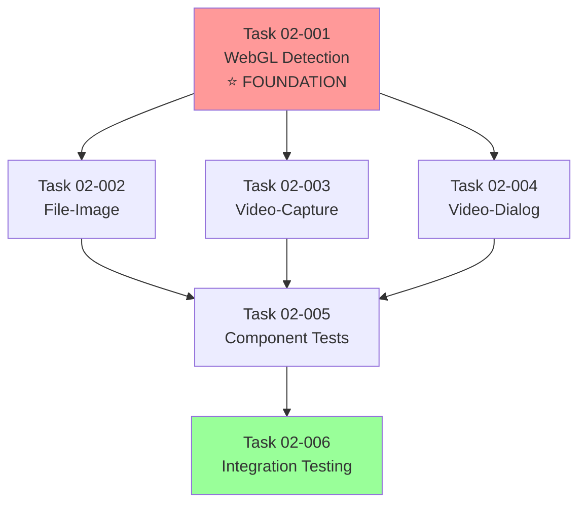

# Phase 2 Task Handoff Summary

**Project**: CRT-PRESET-SIMPLIFICATION  
**Phase**: Phase 2 - Component Implementation  
**Date**: December 13, 2025  
**Created By**: UI Wizard (Orchestrator Mode)

---

## 📋 Phase 1 Review Summary

**Status**: ✅ COMPLETE

Phase 1 successfully refactored the preset structure from 6 context-based variants to 4 size-based variants:

**Completed Tasks**:
1. **TASK-01-001**: Domain preset keys updated (SMALL_CSS, SMALL_WEBGL, LARGE_CSS, LARGE_WEBGL)
2. **TASK-01-002**: UI preset definitions refactored with new keys and inherited values
3. **TASK-01-003**: Preset labels updated for dropdown display
4. **TASK-01-004**: CRT_CONFIGS simplified to small/large variants
5. **TASK-01-005**: Default settings updated to LARGE_WEBGL
6. **TASK-01-006**: Type exports cleaned up and verified

**Key Achievements**:
- ✅ All tests passing (100% pass rate)
- ✅ Domain layer updated with new structure
- ✅ UI layer aligned with domain changes
- ✅ Type safety maintained throughout
- ✅ No breaking changes to external APIs

**Foundation Established**: Phase 1 provides the structural foundation (preset definitions, configs) that Phase 2 will consume in components.

---

## 📦 Phase 2 Task Handoffs Created

**6 task handoff documents created** for Phase 2 implementation:

### Task 02-001: Create WebGL Detection Utility ⭐ FOUNDATION
**File**: `CRT-PRESET-SIMPLIFICATION-TASK-02-001-WEBGL-DETECTION.md`  
**Priority**: High (blocks other tasks)  
**Size**: Small (1-2 files)  
**Purpose**: Create reusable utility function to detect WebGL support for intelligent preset selection

**Key Deliverables**:
- `detectWebGLSupport()` function in infrastructure/utils
- SSR-compatible (returns false server-side)
- Exception-safe (returns false on any error)
- Comprehensive unit tests

**Dependencies**: None (pure function)

---

### Task 02-002: Update File-Image Component
**File**: `CRT-PRESET-SIMPLIFICATION-TASK-02-002-FILE-IMAGE.md`  
**Priority**: High  
**Size**: Medium (3-4 files)  
**Purpose**: Refactor file-image to use SMALL preset, remove component-specific overrides

**Key Deliverables**:
- Remove `fileImageDefaultSettings` constant (override logic)
- Remove forced curvature override on saved settings load
- Implement WebGL detection for first-time users
- Use SMALL_WEBGL or SMALL_CSS based on detection
- Update component tests

**Dependencies**: Task 02-001 (WebGL detection)

---

### Task 02-003: Update Video-Capture Component
**File**: `CRT-PRESET-SIMPLIFICATION-TASK-02-003-VIDEO-CAPTURE.md`  
**Priority**: High  
**Size**: Medium (3-4 files)  
**Purpose**: Refactor video-capture to use SMALL preset with detection

**Key Deliverables**:
- Replace hardcoded IMAGE_WEBGL with detection logic
- Implement WebGL detection for first-time users
- Verify CRT_CONFIGS.small (already correct)
- Update component tests

**Dependencies**: Task 02-001 (WebGL detection), Task 02-002 (pattern reference)

---

### Task 02-004: Update Video-Dialog Component
**File**: `CRT-PRESET-SIMPLIFICATION-TASK-02-004-VIDEO-DIALOG.md`  
**Priority**: High  
**Size**: Medium (3-4 files)  
**Purpose**: Refactor video-dialog to use LARGE preset, remove hardcoded settings

**Key Deliverables**:
- Update crtConfig from `CRT_CONFIGS.full` to `CRT_CONFIGS.large`
- Remove hardcoded `crtSettings` signal with inline values
- Implement WebGL detection for first-time users
- Use LARGE_WEBGL or LARGE_CSS based on detection
- Update component tests

**Dependencies**: Task 02-001 (WebGL detection), Task 02-002 (pattern reference)

---

### Task 02-005: Update Component Tests
**File**: `CRT-PRESET-SIMPLIFICATION-TASK-02-005-COMPONENT-TESTS.md`  
**Priority**: High  
**Size**: Medium (3-4 test files)  
**Purpose**: Comprehensive test updates for all three components

**Key Deliverables**:
- Update all preset key expectations (OLD → NEW keys)
- Mock `detectWebGLSupport()` in all component tests
- Test three scenarios: saved settings, WebGL true, WebGL false
- Remove override-related tests
- Verify storage key backward compatibility
- Ensure all tests passing

**Dependencies**: Tasks 02-002, 02-003, 02-004 (implementations complete)

---

### Task 02-006: Integration Testing
**File**: `CRT-PRESET-SIMPLIFICATION-TASK-02-006-INTEGRATION-TESTING.md`  
**Priority**: Medium  
**Size**: Small (manual testing)  
**Purpose**: Manual and automated integration testing of complete system

**Key Deliverables**:
- Visual testing of all three components
- First-time user experience testing (WebGL detection)
- Settings persistence testing
- Preset system testing (dropdown, custom presets)
- Regression testing
- Issue documentation and recommendations

**Dependencies**: All Phase 2 implementation tasks complete

---

## 🔄 Execution Order & Dependencies

**Recommended Execution Order**:
1. **Task 02-001** (WebGL Detection) - MUST complete first (foundation)
2. **Tasks 02-002, 02-003, 02-004** (Components) - Can be done sequentially or in parallel after 02-001
3. **Task 02-005** (Component Tests) - After all component implementations complete
4. **Task 02-006** (Integration Testing) - After all implementation and testing complete

**Parallel Execution Opportunity**:
- Tasks 02-002, 02-003, 02-004 can be executed in parallel (no file conflicts)
- Each component operates on separate files
- Shared dependency (02-001) completed first

---

## 📊 Handoff Document Quality Checklist

All task handoffs include:

✅ **Task Identity**: ID, name, agent assignment, priority, size  
✅ **Clear Objective**: What, why, success criteria  
✅ **Complete Context**: Prerequisites, dependencies, constraints  
✅ **File Scope**: Create, modify, review lists  
✅ **Implementation Guidance**: Standards, patterns, anti-patterns  
✅ **Testing Requirements**: Behavioral tests, coverage expectations  
✅ **Reference Materials**: Related docs, tasks, reports  
✅ **Output Specification**: Report location, template reference  
✅ **Implementation Notes**: Design rationale, integration context  

**Code Detail Level**: ✅ Architectural guidance only (not full implementations)
- Class/method/interface names provided
- Key signatures shown (1-5 lines)
- Patterns described, not prescribed
- Worker agent trusted to implement

---

## 🎯 Phase 2 Success Criteria

**Functional Requirements**:
- [ ] WebGL detection utility created and exported
- [ ] All three components use appropriate presets (Small/Large)
- [ ] Component-specific overrides removed
- [ ] First-time users get WebGL-based defaults
- [ ] Saved settings always override detection

**Testing Requirements**:
- [ ] All component unit tests updated and passing
- [ ] WebGL detection tested (true/false scenarios)
- [ ] Initialization scenarios tested (saved/new user)
- [ ] Integration testing complete (manual validation)

**Quality Requirements**:
- [ ] No TypeScript errors or warnings
- [ ] Linting passes (`pnpm nx lint`)
- [ ] No console errors when running application
- [ ] Visual quality of CRT effects maintained

**Architecture Requirements**:
- [ ] Storage keys unchanged (backward compatibility)
- [ ] Clean Architecture boundaries respected
- [ ] Infrastructure utility properly tree-shakable
- [ ] Components follow consistent initialization pattern

---

## 📝 Next Steps for Worker Agents

**Immediate Action**: Begin with Task 02-001 (WebGL Detection)

**Task 02-001 Entry Point**:
1. Read task handoff: `docs/projects/CRT-PRESET-SIMPLIFICATION/tasks/CRT-PRESET-SIMPLIFICATION-TASK-02-001-WEBGL-DETECTION.md`
2. Create `libs/infrastructure/src/lib/utils/webgl-detector.ts`
3. Implement `detectWebGLSupport()` function
4. Write comprehensive unit tests
5. Export from infrastructure barrel
6. Create completion report: `docs/projects/CRT-PRESET-SIMPLIFICATION/reports/CRT-PRESET-SIMPLIFICATION-TASK-02-001-REPORT.md`

**After 02-001 Complete**:
- Proceed to component updates (02-002, 02-003, 02-004)
- Follow same pattern for each: implement → test → report
- Complete with component test updates (02-005)
- Finish with integration testing (02-006)

---

## 📚 Reference Documentation

**Project Documentation**:
- [Master Plan](../CRT-PRESET-SIMPLIFICATION-MASTER-PLAN.md) - Complete project overview
- [Phase 2 Plan](../phases/CRT-PRESET-SIMPLIFICATION-PHASE-02-COMPONENT-IMPLEMENTATION.md) - Detailed phase plan

**Standards & Guidelines**:
- [Coding Standards](../../../CODING_STANDARDS.md)
- [Testing Standards](../../../TESTING_STANDARDS.md)
- [Smart Component Testing](../../../SMART_COMPONENT_TESTING.md)
- [Component Library](../../../COMPONENT_LIBRARY.md)

**Subagent System**:
- [Orchestrator Guide](../../../subagent-planning/SUBAGENT_ORCHESTRATOR_GUIDE.md) - Planning methodology
- [Handoff Protocol](../../../subagent-planning/SUBAGENT_HANDOFF.md) - Task handoff structure
- [Report Template](../../../subagent-planning/SUBAGENT_REPORT.md) - Completion report format
- [File Conventions](../../../subagent-planning/SUBAGENT_FILE_CONVENTIONS.md) - Naming rules

---

## 💡 Key Insights from Phase 1

**What Worked Well**:
- Clear task decomposition with focused scope
- Comprehensive test coverage (9 tests, 100% pass)
- Progressive marking of checkboxes (visibility into progress)
- Thorough completion reports with test results

**Lessons Learned**:
- Domain layer changes are safest (no dependencies)
- Type safety catches issues early (TypeScript strict mode)
- Small, focused tasks easier to verify and test
- Clear success criteria prevent scope creep

**Applied to Phase 2**:
- Task 02-001 is foundation (same pattern as 01-001)
- Component tasks are focused (one component per task)
- Testing task separate from implementation (clear separation)
- Integration testing validates everything together

---

**Phase 2 Ready for Execution** ✅

All 6 task handoff documents created and ready for worker agents. Tasks are properly sequenced with clear dependencies and success criteria. Phase 1 foundation successfully established. Ready to begin Phase 2 implementation starting with Task 02-001.
