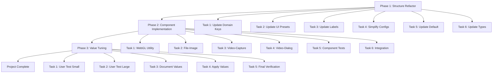

# CRT Preset Simplification - Project Summary

## 📋 Project Structure

```
docs/projects/CRT-PRESET-SIMPLIFICATION/
├── CRT-PRESET-SIMPLIFICATION-MASTER-PLAN.md        ✅ Created
├── phases/
│   ├── CRT-PRESET-SIMPLIFICATION-PHASE-01-STRUCTURE-REFACTOR.md      ✅ Created
│   ├── CRT-PRESET-SIMPLIFICATION-PHASE-02-COMPONENT-IMPLEMENTATION.md ✅ Created
│   └── CRT-PRESET-SIMPLIFICATION-PHASE-03-VALUE-TUNING.md            ✅ Created
├── tasks/
│   └── (Task handoffs will be created as phases are executed)
└── reports/
    └── (Worker reports will be generated here during execution)
```

---

## 🎯 Project Overview

**Goal**: Simplify CRT effect preset system from 6 variants (Fullscreen/Dialog/Image × CSS/WebGL) to 4 variants (Small/Large × CSS/WebGL) with intelligent WebGL detection and user-tuned default values.

**Complexity**: Medium  
**Total Phases**: 3  
**Dependencies**: None (self-contained refactoring)

---

## 📊 Phase Breakdown

### Phase 1: Preset Structure Refactoring
**Status**: 🟡 Ready to Start  
**Objective**: Refactor domain and UI layer preset definitions from 6 to 4 variants  
**Tasks**: 6 tasks  
**Files Modified**: 4 files (domain constants, UI presets, configs, tests)

**Key Deliverables:**
- ✅ `CRT_PRESET_KEYS` updated to SMALL_CSS, SMALL_WEBGL, LARGE_CSS, LARGE_WEBGL
- ✅ `CRT_PRESETS` object updated with new keys and inherited values
- ✅ `CRT_CONFIGS` simplified to small/large/none
- ✅ `CRT_PRESET_LABELS` updated for dropdown display
- ✅ All tests passing

**Estimated Duration**: 1-2 hours (pure refactoring, no component changes)

---

### Phase 2: Component Implementation
**Status**: ⚪ Blocked by Phase 1  
**Objective**: Update all three components to use new presets with WebGL detection  
**Tasks**: 6 tasks  
**Files Modified**: 7 files (3 components + 3 test files + 1 new utility)

**Key Deliverables:**
- ✅ WebGL detection utility created in infrastructure
- ✅ file-image component uses SMALL preset, removes overrides
- ✅ video-capture component uses SMALL preset with detection
- ✅ video-dialog component uses LARGE preset with detection
- ✅ Component tests updated and passing
- ✅ Integration testing complete

**Estimated Duration**: 2-3 hours (includes testing)

---

### Phase 3: Default Value Tuning
**Status**: ⚪ Blocked by Phase 2  
**Objective**: User tunes defaults in real-world scenarios, values hardcoded as production defaults  
**Tasks**: 5 tasks  
**Files Modified**: 1 file (preset values)

**Key Deliverables:**
- ✅ User-tested SMALL_CSS values
- ✅ User-tested SMALL_WEBGL values
- ✅ User-tested LARGE_CSS values
- ✅ User-tested LARGE_WEBGL values
- ✅ Tuned values applied to presets
- ✅ Final verification testing complete

**Estimated Duration**: User-dependent (1-3 hours testing, 30 minutes implementation)

---

## 🔄 Execution Flow



---

## 🎬 First Task to Execute

**Task ID**: CRT-PRESET-SIMPLIFICATION-TASK-01-001-DOMAIN-PRESET-KEYS  
**Task Name**: Update Domain Preset Keys  
**Phase**: Phase 1  
**File**: `libs/domain/src/lib/models/crt-preset-names.const.ts`

**Action**: Modify `CRT_PRESET_KEYS` constant from 6 keys to 4 keys:
- Remove: FULLSCREEN_CSS, FULLSCREEN_WEBGL, DIALOG_CSS, DIALOG_WEBGL, IMAGE_CSS, IMAGE_WEBGL
- Add: SMALL_CSS, SMALL_WEBGL, LARGE_CSS, LARGE_WEBGL

**Why Start Here**: Domain layer is the foundation. All other code references these constants via imports, so updating the source of truth first ensures type safety catches all usages that need updating.

---

## 📁 Key Files Impacted

### Domain Layer
- `libs/domain/src/lib/models/crt-preset-names.const.ts` - Preset key constants (Phase 1, Task 1)

### UI Layer
- `libs/ui/components/src/lib/crt-effect-wrapper/crt-settings.defaults.ts` - Preset definitions, configs, labels (Phase 1, Tasks 2-5; Phase 3, Task 4)
- `libs/ui/components/src/lib/crt-effect-wrapper/crt-settings.interface.ts` - Type exports (Phase 1, Task 6)

### Infrastructure Layer
- `libs/infrastructure/src/lib/utils/webgl-detector.ts` - NEW FILE - WebGL detection utility (Phase 2, Task 1)

### Feature Layer (Components)
- `libs/features/player/src/lib/player-view/player-device-container/file-image/file-image.component.ts` (Phase 2, Task 2)
- `libs/features/player/src/lib/player-view/player-device-container/video-capture/video-capture.component.ts` (Phase 2, Task 3)
- `libs/features/player/src/lib/player-view/player-device-container/video-capture/video-dialog/video-dialog.component.ts` (Phase 2, Task 4)

### Tests
- Component test files (Phase 2, Task 5)
- UI component tests (Phase 1, various tasks)

---

## ✅ Success Metrics

**Phase 1 Success**:
- ✅ 6 preset keys reduced to 4
- ✅ CRT_CONFIGS simplified from 4 to 3
- ✅ All tests passing
- ✅ TypeScript compilation succeeds (components will have errors - expected)

**Phase 2 Success**:
- ✅ All three components use new preset structure
- ✅ WebGL detection works for first-time users
- ✅ Saved settings preserved and override detection
- ✅ No component-specific overrides remain
- ✅ All tests passing

**Phase 3 Success**:
- ✅ User has tuned all four presets
- ✅ Production values applied to preset objects
- ✅ Visual quality verified across all components
- ✅ Performance maintained (60fps video, smooth interactions)
- ✅ First-time and existing user experiences both excellent

**Project Complete**:
- ✅ Simplified preset system deployed
- ✅ Clear size-based naming (Small/Large)
- ✅ Intelligent WebGL defaults
- ✅ Optimized real-world values
- ✅ No breaking changes for existing users

---

## 🚀 Next Steps

### For Orchestrator Agent:
1. Read Phase 1 document carefully
2. Create individual task handoff documents for Phase 1 tasks (if detailed handoffs desired)
3. Assign first task (CRT-PRESET-SIMPLIFICATION-TASK-01-001) to UI Wizard
4. Monitor progress through completion reports
5. Update phase plan checkboxes as tasks complete
6. Move to Phase 2 when Phase 1 complete

### For UI Wizard (Worker):
1. Read Phase 1 document thoroughly
2. Check all "Required Reading" boxes
3. Execute tasks sequentially (Task 1 → Task 2 → ... → Task 6)
4. Mark subtask checkboxes as you complete each one
5. Run tests after each task
6. Create completion report when phase done

### For User:
1. Wait for Phase 2 completion
2. Launch application and clear saved settings (optional)
3. Test each component and tune CRT settings
4. Document final values in prescribed format
5. Provide values to agent for Phase 3 implementation
6. Verify final result and approve for production

---

## 📝 Notes

**File Naming Reminder**: All files follow UPPER-KEBAB-CASE convention from [SUBAGENT_FILE_CONVENTIONS.md](../../subagent-planning/SUBAGENT_FILE_CONVENTIONS.md).

**Agent Assignment**: Phase 1 and 2 are for **UI Wizard** (frontend specialist). Phase 3 is user-driven with brief UI Wizard implementation at end.

**No Breaking Changes**: Existing user settings preserved throughout. Storage keys unchanged. Migration-free refactoring.

**Visual Quality Priority**: Phase 3 ensures defaults look great in real usage, not just theoretically correct.

---

## 📚 Reference Documentation

- **Master Plan**: [CRT-PRESET-SIMPLIFICATION-MASTER-PLAN.md](./CRT-PRESET-SIMPLIFICATION-MASTER-PLAN.md)
- **Phase 1**: [CRT-PRESET-SIMPLIFICATION-PHASE-01-STRUCTURE-REFACTOR.md](./phases/CRT-PRESET-SIMPLIFICATION-PHASE-01-STRUCTURE-REFACTOR.md)
- **Phase 2**: [CRT-PRESET-SIMPLIFICATION-PHASE-02-COMPONENT-IMPLEMENTATION.md](./phases/CRT-PRESET-SIMPLIFICATION-PHASE-02-COMPONENT-IMPLEMENTATION.md)
- **Phase 3**: [CRT-PRESET-SIMPLIFICATION-PHASE-03-VALUE-TUNING.md](./phases/CRT-PRESET-SIMPLIFICATION-PHASE-03-VALUE-TUNING.md)
- **File Conventions**: [SUBAGENT_FILE_CONVENTIONS.md](../../subagent-planning/SUBAGENT_FILE_CONVENTIONS.md)
- **Orchestrator Guide**: [SUBAGENT_ORCHESTRATOR_GUIDE.md](../../subagent-planning/SUBAGENT_ORCHESTRATOR_GUIDE.md)

---

**Project Created**: December 13, 2025  
**Status**: Ready for Phase 1 execution  
**Next Action**: Assign Phase 1 to UI Wizard agent
