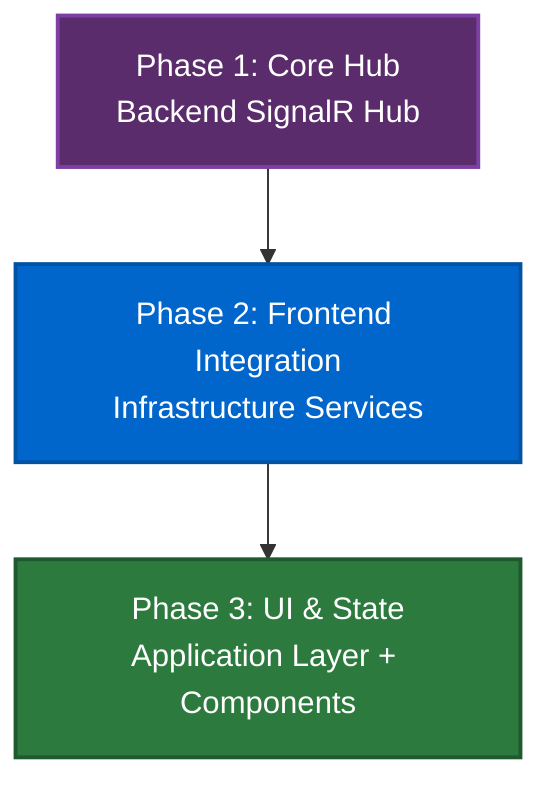

# DJ SignalR Hub Feature - Master Plan

**Project Overview**: This project implements a low-latency, real-time command hub for DJ features in the TeensyROM application, enabling instant audio manipulation commands from the Angular frontend to the backend via SignalR.

**Standards Documentation**:

- **Backend Architecture**: [BACKEND_ARCHITECTURE.md](../../BACKEND_ARCHITECTURE.md)
- **Coding Standards**: [CODING_STANDARDS.md](../../CODING_STANDARDS.md)
- **Testing Standards**: [TESTING_STANDARDS.md](../../TESTING_STANDARDS.md)
- **API Client Generation**: [API_CLIENT_GENERATION.md](../../API_CLIENT_GENERATION.md)

---

## 🎯 Project Objective

The DJ SignalR Hub provides a real-time, low-latency communication channel for DJ-style audio manipulation features. Unlike REST endpoints which have higher latency due to request/response overhead, SignalR maintains persistent WebSocket connections enabling near-instantaneous command execution. This is critical for DJ features where timing and responsiveness are paramount.

The first command implemented will be SID voice muting/unmuting, allowing users to toggle individual SID chip voices (Voice 1, Voice 2, Voice 3) in real-time during playback. This creates a live mixing experience where users can isolate instrument tracks, create remixes, or analyze individual voices in SID music files.

**User Value**: DJs and music enthusiasts gain real-time control over SID playback with near-zero latency, enabling creative mixing, track isolation, and live performance capabilities. The SignalR architecture establishes a foundation for future DJ features like tempo control, filters, and effects that all require ultra-low latency.

---

## 📋 Implementation Phases

<details open>
<summary><h3>Phase 1: Core Hub Infrastructure</h3></summary>

### Objective

Create the foundational SignalR hub infrastructure in the backend, implementing the DJHub with SID voice muting as the first command. This phase establishes the architectural pattern for all future DJ commands while delivering immediate value through voice muting functionality.

### Key Deliverables

- [ ] DJHub created in `Endpoints/DJ/` following SignalR hub patterns
- [ ] MuteSidVoices command integration with proper device routing
- [ ] Hub registration in Program.cs with endpoint mapping
- [ ] Unit tests for hub command invocation and MediatR integration
- [ ] Integration tests verifying end-to-end command flow

### High-Level Tasks

1. **Create DJHub**: Implement SignalR hub class with MuteSidVoices method
2. **Device Routing**: Implement device ID resolution and SerialStateContext binding
3. **MediatR Integration**: Wire hub method to existing MuteSidVoicesCommand handler
4. **Error Handling**: Implement proper exception handling and error responses
5. **Hub Registration**: Register hub in DI container and map endpoint route
6. **Unit Testing**: Test hub method invocation, parameter validation, MediatR dispatch
7. **Integration Testing**: Test complete flow from hub call to serial command execution

### Open Questions for Phase 1

- **Error Response Format**: Should we use standard SignalR exceptions or custom error DTOs for command failures?
- **Device Selection**: Should the hub accept deviceId as a method parameter, or should it use a connection-based device context?
- **Command Acknowledgment**: Should the hub method return success/failure synchronously, or should we use separate event callbacks?

</details>

---

<details open>
<summary><h3>Phase 2: Frontend Infrastructure (DjService)</h3></summary>

### Objective

Create infrastructure layer service that connects to the SignalR DJHub, enabling frontend components to invoke DJ commands through a clean domain contract. This phase establishes the bridge between the backend hub and frontend application layer.

### Key Deliverables

- [ ] IDjService domain contract with voice muting method signature
- [ ] DjService implementation in infrastructure layer using SignalR HubConnection
- [ ] Hub connection lifecycle management (connect, disconnect, reconnect)
- [ ] Error handling via alert service for user-visible failures
- [ ] Dependency injection providers binding contract to implementation
- [ ] Unit tests for DjService with >90% coverage

### High-Level Tasks

1. **Domain Contract**: Define IDjService interface in libs/domain/contracts with injection token
2. **Infrastructure Service**: Implement DjService in libs/infrastructure/lib/dj with SignalR client
3. **Connection Management**: Handle hub connection lifecycle with automatic reconnection
4. **Error Handling**: Catch SignalR errors and display via ALERT_SERVICE
5. **Provider Configuration**: Create providers.ts to bind IDjService to DjService implementation
6. **Testing**: Unit test service with mocked SignalR HubConnection

### Open Questions for Phase 2

- **Connection Strategy**: Lazy connection on first invocation (recommended - follows device-events pattern)
- **State Synchronization**: Frontend tracks voice state locally, no backend query needed (stateless hub)

</details>

---

<details open>
<summary><h3>Phase 3: UI Integration (DJ Toolbar)</h3></summary>

### Objective

Create a DJ toolbar component positioned above the existing player toolbar, containing 3 checkboxes for controlling SID voice muting. This phase delivers the user-facing controls for the DJ feature.

### Key Deliverables

- [ ] DJ toolbar component using same card styling as player-toolbar
- [ ] 3 checkboxes for Voice 1, Voice 2, Voice 3 (checked = enabled, unchecked = disabled)
- [ ] Integration with PlayerContextService for file launch detection
- [ ] Automatic checkbox reset when new file loads (without triggering DJ service call)
- [ ] Checkbox state change triggers DJ service voice muting command
- [ ] Component positioned above existing player-toolbar in player-device-container
- [ ] Unit tests for component behaviors

### High-Level Tasks

1. **Create Component**: Build DJ toolbar component with 3 voice checkboxes
2. **Styling**: Apply same ScalingCompactCardComponent styling as player-toolbar
3. **PlayerContextService Integration**: Inject service to detect file launches
4. **File Launch Detection**: Reset checkboxes to enabled when getCurrentFile signal changes
5. **DJ Service Integration**: Call DJ service when user toggles checkbox
6. **Parent Container**: Add DJ toolbar above player-toolbar in player-device-container
7. **Testing**: Unit test checkbox toggling, file launch reset, DJ service invocation

### Open Questions for Phase 3

- **Default Voice State**: All voices enabled by default on file load (standard SID behavior)
- **Reset Logic**: Use effect() to watch currentFile signal, reset checkboxes without calling service
- **Visual Feedback**: Standard checkbox appearance, no special "muted" styling needed initially

</details>

---

<details open>
<summary><h2>🏗️ Architecture Overview</h2></summary>

### Key Design Decisions

- **SignalR Over REST**: Using SignalR instead of REST endpoints for ultra-low latency (sub-50ms vs 100-300ms). SignalR maintains persistent WebSocket connections eliminating handshake overhead on every command.

- **Existing MediatR Integration**: The hub invokes the existing `MuteSidVoicesCommand` through MediatR, reusing all existing pipeline behaviors (logging, exception handling, serial state management). This ensures consistency with other serial commands.

- **Hub Method Pattern**: Each DJ command is a hub method (e.g., `MuteSidVoices(deviceId, voice1, voice2, voice3)`). The hub acts as a thin adapter translating SignalR calls to MediatR commands, following the same pattern as REST endpoints.

- **Device Routing**: Hub methods accept `deviceId` as a parameter to support multi-device scenarios. The hub resolves the correct `ISerialStateContext` and binds it to the MediatR command before dispatch.

### Integration Points

- **MediatR Pipeline**: Hub integrates with existing MediatR CQRS pipeline, leveraging all behaviors (SerialBehavior, LoggingBehavior, ExceptionBehavior) without duplication.

- **DeviceConnectionManager**: Hub uses the singleton `IDeviceConnectionManager` to resolve connected devices and their serial contexts, ensuring commands target the correct physical device.

- **SignalR Infrastructure**: Hub registered in `Program.cs` alongside existing LogsHub and DeviceEventHub, following established SignalR patterns in the codebase.

- **Frontend Infrastructure**: Angular infrastructure layer creates a `DJService` implementing `IDJService` contract, managing hub connection lifecycle and translating calls to domain operations.

</details>

---

<details open>
<summary><h2>🧪 Testing Strategy</h2></summary>

### Unit Tests

- [ ] DJHub method invocation with valid parameters
- [ ] Device ID resolution and validation
- [ ] MediatR command dispatch with correct parameters
- [ ] Error handling for invalid device ID
- [ ] Error handling for disconnected devices
- [ ] Parameter validation for voice states
- [ ] Infrastructure service hub connection management
- [ ] Infrastructure service error mapping

### Integration Tests

- [ ] Complete flow: Hub method → MediatR → SerialBehavior → Handler → Serial I/O
- [ ] Multi-device scenarios with correct device routing
- [ ] Concurrent command execution (multiple voice toggles)
- [ ] Hub reconnection scenarios
- [ ] Error propagation from serial layer to hub caller

### E2E Tests

- [ ] User clicks voice toggle in UI → command executes → audio changes
- [ ] Multi-voice muting combinations (all three voices)
- [ ] Voice unmuting and state persistence
- [ ] Error handling with user-visible feedback
- [ ] Performance validation (sub-100ms latency from UI click to device)

</details>

---

<details open>
<summary><h2>✅ Success Criteria</h2></summary>

- [ ] DJHub created and registered with `/api/djHub` endpoint
- [ ] SID voice muting command functional with all three voices
- [ ] Command latency under 100ms from frontend to device execution
- [ ] Proper device routing in multi-device scenarios
- [ ] All unit tests pass (hub, infrastructure, application)
- [ ] All integration tests pass (hub → MediatR → serial)
- [ ] E2E test demonstrates complete user flow
- [ ] Hub follows established SignalR patterns in codebase
- [ ] Frontend infrastructure layer properly abstracts hub communication
- [ ] Code follows all architectural and testing standards

</details>

---

<details open>
<summary><h2>🎭 User Scenarios</h2></summary>

### Core DJ Command Scenarios

<details open>
<summary><strong>Scenario 1: Mute Single SID Voice</strong></summary>

```gherkin
Given a SID music file is playing on a connected device
When the user clicks the "Mute Voice 1" toggle in the player controls
Then Voice 1 is muted on the device within 100ms
And the UI toggle shows Voice 1 as muted
And Voices 2 and 3 continue playing normally
```

</details>

<details open>
<summary><strong>Scenario 2: Mute Multiple Voices</strong></summary>

```gherkin
Given a SID music file is playing on a connected device
When the user mutes Voice 1 and Voice 2
Then both voices are muted on the device
And only Voice 3 continues playing
And the UI reflects both voices as muted
```

</details>

<details open>
<summary><strong>Scenario 3: Unmute Previously Muted Voice</strong></summary>

```gherkin
Given Voice 2 is currently muted during playback
When the user clicks the "Unmute Voice 2" toggle
Then Voice 2 resumes playing within 100ms
And the UI toggle shows Voice 2 as active
```

</details>

---

### Error Handling Scenarios

<details open>
<summary><strong>Scenario 4: Command During Device Disconnect</strong></summary>

```gherkin
Given a SID file is playing on a connected device
And the device becomes disconnected
When the user attempts to mute a voice
Then an error message is displayed: "Device disconnected"
And the voice toggle returns to its previous state
```

</details>

<details open>
<summary><strong>Scenario 5: Invalid Device ID</strong></summary>

```gherkin
Given the user interface has a stale device reference
When a voice muting command is sent for a non-existent device
Then the command fails gracefully
And an error is logged to the console
And the user sees a generic "command failed" notification
```

</details>

---

### Multi-Device Scenarios

<details open>
<summary><strong>Scenario 6: Multiple Devices Playing</strong></summary>

```gherkin
Given Device A and Device B are both playing SID files
When the user mutes Voice 1 on Device A
Then only Device A's Voice 1 is muted
And Device B's playback is unaffected
```

</details>

---

### Performance Scenarios

<details open>
<summary><strong>Scenario 7: Rapid Voice Toggling</strong></summary>

```gherkin
Given a SID file is playing
When the user rapidly toggles Voice 1 on and off multiple times
Then each command executes in order without race conditions
And the final voice state matches the last toggle action
And no commands are dropped or duplicated
```

</details>

</details>

---

<details open>
<summary><h2>📚 Related Documentation</h2></summary>

- **Backend Architecture**: [BACKEND_ARCHITECTURE.md](../../BACKEND_ARCHITECTURE.md) - MediatR patterns, SignalR hub architecture
- **MuteSidVoices Command**: [MuteSidVoicesCommand.cs](../../../apps/api/src/TeensyRom.Core.Serial/Commands/MuteSidVoices/MuteSidVoicesCommand.cs)
- **Existing SignalR Hubs**: 
  - [LogsHub.cs](../../../apps/api/src/TeensyRom.Api/Endpoints/Serial/Logs/LogsHub.cs)
  - [DeviceEventHub.cs](../../../apps/api/src/TeensyRom.Api/Endpoints/Serial/DeviceEvents/DeviceEventHub.cs)
- **Coding Standards**: [CODING_STANDARDS.md](../../CODING_STANDARDS.md)
- **Testing Standards**: [TESTING_STANDARDS.md](../../TESTING_STANDARDS.md)

</details>

---

<details open>
<summary><h2>📝 Notes</h2></summary>

### Design Considerations

- **Latency Requirement**: Sub-100ms latency is critical for DJ features to feel responsive. SignalR's persistent connection eliminates TCP handshake overhead on every command.

- **Serial State Safety**: All commands flow through MediatR's SerialBehavior which handles port locking and state transitions, preventing concurrent access issues.

- **Extensibility**: The hub pattern established here supports adding more DJ commands in future (tempo control, filters, effects) without architectural changes.

- **Error Recovery**: SignalR's built-in reconnection logic handles temporary network issues automatically. Frontend should implement retry logic for critical commands.

### Future Enhancement Ideas

- **Tempo Control**: Add commands for adjusting playback speed in real-time
- **Audio Filters**: Apply low-pass, high-pass, or other filters to SID output
- **Waveform Selection**: Change waveform types for individual voices dynamically
- **Recording**: Capture user's DJ session and export as audio file
- **Preset Patterns**: Save and recall voice muting patterns for different tracks

### Technical Debt Considerations

- **State Synchronization**: Currently, backend doesn't persist voice mute state. Future enhancement could add state tracking.
- **Connection Pooling**: For very high command throughput, consider connection pooling strategies.
- **Metrics**: Add telemetry to track command latency and success rates.

</details>

---

## 💡 Phase Breakdown Summary

### Phase 1: Core Hub Infrastructure (Backend Only)
**Files**: 3-5 files (Hub, tests, registration)  
**Complexity**: Medium  
**Duration**: ~4-6 hours  
**Dependencies**: None (uses existing MediatR command)

### Phase 2: Frontend Integration
**Files**: 4-6 files (contracts, services, tests)  
**Complexity**: Medium  
**Duration**: ~4-6 hours  
**Dependencies**: Phase 1 complete

### Phase 3: Application State & UI
**Files**: 5-7 files (store, actions, components, E2E tests)  
**Complexity**: Medium  
**Duration**: ~6-8 hours  
**Dependencies**: Phase 2 complete

**Total Estimated Duration**: 14-20 hours across 3 phases

---

## 🚀 Execution Order



**First Task**: [DJ-SIGNALR-HUB-TASK-01-001-CREATE-HUB](./tasks/DJ-SIGNALR-HUB-TASK-01-001-CREATE-HUB.md)

