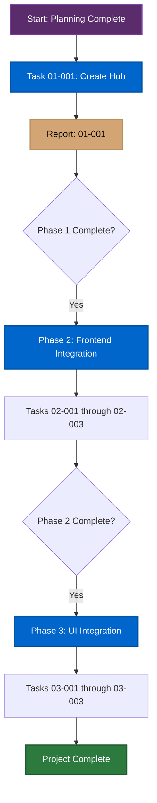

# DJ SignalR Hub - Project Planning Summary

**Date**: December 18, 2025  
**Project**: DJ-SIGNALR-HUB  
**Status**: Planning Complete - Ready for Execution

---

## 📊 Project Overview

**Purpose**: Implement low-latency, real-time SignalR hub for DJ audio manipulation features, starting with SID voice muting/unmuting commands.

**Why SignalR**: Achieves <100ms latency vs 100-300ms for REST endpoints through persistent WebSocket connections, critical for responsive live audio control.

**Architecture**: Hub acts as thin adapter translating SignalR calls to existing MediatR commands, reusing all pipeline behaviors (locking, logging, error handling).

---

## 📁 Project Structure Created

```
docs/projects/DJ-SIGNALR-HUB/
├── DJ-SIGNALR-HUB-MASTER-PLAN.md          ✅ Complete master plan
├── phases/
│   └── DJ-SIGNALR-HUB-PHASE-01-CORE-HUB.md ✅ Phase 1 detailed plan
├── tasks/
│   └── DJ-SIGNALR-HUB-TASK-01-001-CREATE-HUB.md ✅ First task handoff
└── reports/                                📁 Empty (for worker reports)
```

**All files follow naming conventions** from [SUBAGENT_FILE_CONVENTIONS.md](../../subagent-planning/SUBAGENT_FILE_CONVENTIONS.md):
- ✅ UPPER-KEBAB-CASE project name: `DJ-SIGNALR-HUB`
- ✅ Master plan: `<PROJECT>-MASTER-PLAN.md`
- ✅ Phase files: `<PROJECT>-PHASE-<##>-<NAME>.md`
- ✅ Task files: `<PROJECT>-TASK-<##>-<###>-<NAME>.md`

---

## 📋 Phase Breakdown

### Phase 1: Core Hub Infrastructure (Backend Only)
**Objective**: Create DJHub SignalR hub with MuteSidVoices command integration

**Key Deliverables**:
- [ ] DJHub class with MuteSidVoices method
- [ ] Device routing via IDeviceConnectionManager
- [ ] MediatR command integration
- [ ] Error handling with HubException
- [ ] Hub registration in Program.cs
- [ ] Unit tests (>90% coverage)
- [ ] Integration tests (optional)

**Files**: 3-5 files  
**Complexity**: Small-Medium  
**Duration**: 4-6 hours  

**Tasks**:
1. **DJ-SIGNALR-HUB-TASK-01-001-CREATE-HUB** - Create hub class, implement method, add tests

---

### Phase 2: Frontend Integration
**Objective**: Generate TypeScript client, create infrastructure services

**Key Deliverables**:
- [ ] SignalR client connection service
- [ ] IDJService domain contract
- [ ] DJService infrastructure implementation
- [ ] Hub lifecycle management
- [ ] Unit tests for infrastructure

**Files**: 4-6 files  
**Complexity**: Medium  
**Duration**: 4-6 hours  

**Tasks** (to be created when Phase 1 complete):
- DJ-SIGNALR-HUB-TASK-02-001-DOMAIN-CONTRACT
- DJ-SIGNALR-HUB-TASK-02-002-INFRASTRUCTURE-SERVICE
- DJ-SIGNALR-HUB-TASK-02-003-CONNECTION-MANAGEMENT

---

### Phase 3: Application State & UI Integration
**Objective**: Add state management and UI controls for voice muting

**Key Deliverables**:
- [ ] DJ store or player store extension
- [ ] Voice muting actions and selectors
- [ ] UI toggle controls in player
- [ ] Real-time state synchronization
- [ ] E2E tests for user flow

**Files**: 5-7 files  
**Complexity**: Medium  
**Duration**: 6-8 hours  

**Tasks** (to be created when Phase 2 complete):
- DJ-SIGNALR-HUB-TASK-03-001-STATE-MANAGEMENT
- DJ-SIGNALR-HUB-TASK-03-002-UI-CONTROLS
- DJ-SIGNALR-HUB-TASK-03-003-E2E-TESTS

---

## 🎯 Success Criteria (Overall)

- [ ] DJHub created and registered at `/api/djHub`
- [ ] SID voice muting functional for all three voices
- [ ] Command latency <100ms from UI to device
- [ ] Proper multi-device support
- [ ] All unit tests pass (backend + frontend)
- [ ] All integration tests pass
- [ ] E2E test demonstrates complete user flow
- [ ] Code follows architectural standards
- [ ] Frontend properly abstracts hub communication

---

## 🔄 Execution Flow



---

## 🚀 First Task to Execute

**Ready to start immediately**: [DJ-SIGNALR-HUB-TASK-01-001-CREATE-HUB.md](./tasks/DJ-SIGNALR-HUB-TASK-01-001-CREATE-HUB.md)

**Task Summary**:
- Create DJHub class in `Endpoints/DJ/DJHub.cs`
- Implement MuteSidVoices method with device routing
- Integrate with existing MuteSidVoicesCommand via MediatR
- Add unit tests achieving >90% coverage
- Register hub in Program.cs at `/api/djHub`

**Assigned To**: Backend Wizard  
**Estimated Effort**: 2-3 hours  
**Files**: 3 files (hub, tests, Program.cs modification)

---

## 📚 Key Reference Documents

**Planning Documents**:
- [Master Plan](./DJ-SIGNALR-HUB-MASTER-PLAN.md) - Complete feature overview
- [Phase 1 Plan](./phases/DJ-SIGNALR-HUB-PHASE-01-CORE-HUB.md) - Detailed implementation guide
- [Task 01-001](./tasks/DJ-SIGNALR-HUB-TASK-01-001-CREATE-HUB.md) - First task handoff

**Architecture Documentation**:
- [Backend Architecture](../../BACKEND_ARCHITECTURE.md) - MediatR, SignalR patterns
- [Coding Standards](../../CODING_STANDARDS.md) - C# conventions
- [Testing Standards](../../TESTING_STANDARDS.md) - Testing approach

**Reference Code**:
- [LogsHub.cs](../../../apps/api/src/TeensyRom.Api/Endpoints/Serial/Logs/LogsHub.cs) - Simple hub example
- [DeviceEventHub.cs](../../../apps/api/src/TeensyRom.Api/Endpoints/Serial/DeviceEvents/DeviceEventHub.cs) - Hub with DI
- [MuteSidVoicesCommand.cs](../../../apps/api/src/TeensyRom.Core.Serial/Commands/MuteSidVoices/MuteSidVoicesCommand.cs) - Existing command

---

## 🎭 User Scenarios Summary

**Core Functionality**:
- Mute/unmute individual SID voices (Voice 1, 2, 3) in real-time
- Multi-voice muting combinations
- Multi-device support (correct device routing)
- Sub-100ms latency from UI click to audio change

**Error Handling**:
- Graceful handling of disconnected devices
- Invalid deviceId error messages
- Command failure notifications

**Performance**:
- Rapid toggling without race conditions
- No dropped or duplicated commands
- Consistent state synchronization

---

## 📈 Project Metrics

**Total Phases**: 3  
**Total Estimated Duration**: 14-20 hours  
**Total Estimated Files**: 12-18 files  

**Breakdown**:
- Backend: 3-5 files (Phase 1)
- Frontend Infrastructure: 4-6 files (Phase 2)
- Frontend UI/State: 5-7 files (Phase 3)

**Test Coverage Goals**:
- Unit tests: >90% coverage
- Integration tests: End-to-end hub → MediatR → serial flow
- E2E tests: Complete user interaction flow

---

## ✅ Planning Verification

**File Conventions** ✅
- [x] Project folder: `DJ-SIGNALR-HUB/` (UPPER-KEBAB-CASE)
- [x] Master plan: `DJ-SIGNALR-HUB-MASTER-PLAN.md`
- [x] Phase files: `DJ-SIGNALR-HUB-PHASE-01-CORE-HUB.md`
- [x] Task files: `DJ-SIGNALR-HUB-TASK-01-001-CREATE-HUB.md`
- [x] Reports folder created (empty)

**Content Completeness** ✅
- [x] Master plan includes all required sections
- [x] Phase breakdown with independent value
- [x] User scenarios with Given-When-Then format
- [x] Architecture overview with integration points
- [x] Testing strategy defined
- [x] Success criteria measurable

**Task Quality** ✅
- [x] Task ID follows convention
- [x] Clear success criteria
- [x] Complete context provided
- [x] File scope explicit
- [x] Testing requirements defined
- [x] Reference materials linked
- [x] Output report path specified

---

## 🎉 Ready for Execution!

**All planning deliverables complete**. The project is ready for the Backend Wizard to begin implementation with Task 01-001.

**Next Steps**:
1. **Backend Wizard**: Execute [DJ-SIGNALR-HUB-TASK-01-001-CREATE-HUB](./tasks/DJ-SIGNALR-HUB-TASK-01-001-CREATE-HUB.md)
2. **Generate Report**: Save completion report to `reports/DJ-SIGNALR-HUB-TASK-01-001-REPORT.md`
3. **Review Report**: Orchestrator reviews report and creates Phase 2 tasks
4. **Continue**: Proceed through Phase 2 and Phase 3

**Estimated Project Completion**: 14-20 hours across 3 phases

---

**Document Version**: 1.0  
**Created**: December 18, 2025  
**Orchestrator**: Backend Guru  

