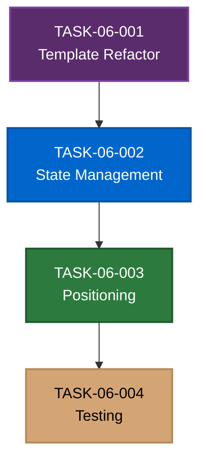

# DROPDOWN-DIALOG Phase 6 Execution Summary

**Project**: DROPDOWN-DIALOG - Dialog Separation Refactor
**Phase**: Phase 6 - CRT Settings Panel Dialog Separation
**Date**: December 16, 2025
**Status**: ⏳ Ready for Execution

---

## 📋 Phase Overview

**Goal**: Refactor the CRT settings panel preset dialogs to appear as independent positioned overlays instead of inline within the dropdown menu content. Implement smooth state transitions where the dropdown closes when dialogs open and reopens when dialogs close.

**Why This Phase**: The current implementation shows dialogs inline within the dropdown-content slot using conditional rendering. This creates confusing UX where dialogs appear "inside" dropdown styling. Users expect dialogs to be independent overlays that replace the dropdown temporarily, then return to the menu when done.

**Success Outcome**: When users click save/rename/delete in the preset dropdown, the dropdown smoothly closes and the dialog appears in the same position. After confirming or cancelling, the dialog closes and the dropdown reopens, providing seamless navigation between menu and dialogs.

---

## 🎯 Strategic Decisions

### Design Philosophy

**Approach**: Dialogs as Independent Siblings
- Move dialogs from inside `
` to siblings of `<lib-dropdown-menu>`
- Use absolute positioning anchored to the preset button (same trigger as dropdown)
- Explicit state coordination: close dropdown before opening dialog, reopen after closing

**Why This Approach**:
- Maintains spatial consistency (dialogs appear where dropdown was)
- Cleaner template structure (no nested conditionals in dropdown content)
- Easier to maintain and extend (clear separation of concerns)
- Follows established UI patterns (modals/dialogs replace their triggers temporarily)

### Implementation Strategy

**Sequential Execution** (tasks have dependencies):
1. **Template Refactor** → Move dialogs structurally before adding logic
2. **State Management** → Implement open/close coordination
3. **Positioning** → Add visual positioning after state works
4. **Testing** → Comprehensive tests after all changes complete

**Rationale**: Each task builds on the previous. Template changes enable state changes, state changes enable positioning verification, and testing validates the complete system.

---

## 📊 Task Breakdown

### Task Sequencing

### Task 1: Template Refactor
**ID**: `DROPDOWN-DIALOG-TASK-06-001-TEMPLATE-REFACTOR`
**Effort**: Small (1 file, simple structural change)
**Agent**: Clean Coder (UI Wizard)

**Objective**: Move dialogs from inside dropdown-content to sibling elements.

**Key Changes**:
- Extract `<lib-preset-name-dialog>` from dropdown-content
- Extract `<lib-confirmation-dialog>` from dropdown-content
- Change from `@if/@else if/@else` to independent `@if` blocks
- Place dialogs as siblings immediately after `</lib-dropdown-menu>`

**Success Criteria**:
- ✅ Dialogs are siblings in template, not children
- ✅ dropdown-content only contains menu items
- ✅ Template compiles without errors

**Files Modified**: `crt-settings-panel.component.html`

---

### Task 2: State Management
**ID**: `DROPDOWN-DIALOG-TASK-06-002-STATE-MANAGEMENT`
**Effort**: Medium (multiple methods, testing complexity)
**Agent**: Clean Coder (UI Wizard)

**Objective**: Implement dropdown open/close coordination with dialog visibility.

**Key Changes**:
- Add `presetDropdown()?.close()` to `onSaveAsPreset()`, `onRenamePreset()`, `onDeletePreset()`
- Add `presetDropdown()?.open()` to dialog completion handlers (confirm/cancel)
- Remove workaround `presetDropdown()?.open()` calls from dialog triggers

**Success Criteria**:
- ✅ Dropdown closes when dialogs open
- ✅ Dropdown reopens when dialogs close
- ✅ All existing business logic preserved

**Files Modified**: `crt-settings-panel.component.ts`, `crt-settings-panel.component.spec.ts`

---

### Task 3: Positioning
**ID**: `DROPDOWN-DIALOG-TASK-06-003-POSITIONING`
**Effort**: Medium (styling + positioning logic)
**Agent**: Clean Coder (UI Wizard)

**Objective**: Position dialogs anchored to preset button, matching dropdown location.

**Key Changes**:
- Add dialog container wrapper with positioning styles
- Use absolute positioning relative to header
- Match dropdown z-index and positioning strategy
- Ensure viewport edge handling

**Success Criteria**:
- ✅ Dialogs appear in same position as dropdown
- ✅ Appropriate z-index (above other content)
- ✅ No layout shifts or flickers

**Files Modified**: `crt-settings-panel.component.html`, `crt-settings-panel.component.scss`

---

### Task 4: Testing
**ID**: `DROPDOWN-DIALOG-TASK-06-004-TESTING`
**Effort**: Medium (comprehensive test updates)
**Agent**: Clean Coder (UI Wizard)

**Objective**: Update test suite for refactored behavior and add new coverage.

**Key Changes**:
- Update template structure assertions
- Add dropdown state coordination tests (open/close)
- Add complete workflow tests (save/rename/delete flows)
- Add positioning verification tests
- Verify regression coverage (existing features still work)

**Success Criteria**:
- ✅ All existing tests pass
- ✅ New tests cover state coordination
- ✅ Code coverage >= 80%

**Files Modified**: `crt-settings-panel.component.spec.ts`

---

## 🔄 Execution Flow

### Recommended Approach

**Execute tasks sequentially** (one at a time, in order):

1. **Start with TASK-06-001** (Template Refactor)
   - Smallest scope, clear deliverable
   - Enables subsequent tasks
   - Quick win to validate approach

2. **Continue with TASK-06-002** (State Management)
   - Builds on template changes
   - Core functionality implementation
   - Testable behavioral changes

3. **Then TASK-06-003** (Positioning)
   - Requires template structure and state working
   - Visual verification possible
   - May need iteration for edge cases

4. **Finish with TASK-06-004** (Testing)
   - Validates all previous work
   - Catches integration issues
   - Ensures no regressions

### Task Handoff Protocol

Each task document follows [SUBAGENT_HANDOFF.md](../../../docs/subagent-planning/SUBAGENT_HANDOFF.md):
- Complete context and requirements
- Clear success criteria
- File scope and changes needed
- Testing expectations
- Output report location

**Report Location**: `docs/projects/DROPDOWN-DIALOG/reports/DROPDOWN-DIALOG-TASK-06-<###>-REPORT.md`

---

## 📏 Success Metrics

### Functional Requirements

- [ ] Clicking "Save as preset" closes dropdown and shows name dialog
- [ ] Clicking rename button closes dropdown and shows name dialog with current name
- [ ] Clicking delete button closes dropdown and shows confirmation dialog
- [ ] Confirming name dialog saves/renames preset and reopens dropdown
- [ ] Cancelling name dialog discards changes and reopens dropdown
- [ ] Confirming delete dialog removes preset and reopens dropdown
- [ ] Cancelling delete dialog keeps preset and reopens dropdown
- [ ] Dialogs appear in same position as dropdown menu

### Technical Requirements

- [ ] Dialogs are siblings of dropdown in template (not children)
- [ ] Dropdown explicitly closes before dialogs open
- [ ] Dropdown explicitly reopens after dialogs close
- [ ] No simultaneous visibility of dropdown and dialogs
- [ ] Positioning correctly anchors dialogs to preset button

### Testing Requirements

- [ ] All existing unit tests pass
- [ ] New tests cover dropdown state coordination
- [ ] New tests cover complete workflows
- [ ] Code coverage >= 80%
- [ ] No console errors or warnings

### User Experience

- [ ] Smooth visual transitions between dropdown and dialogs
- [ ] No jarring layout shifts or flickers
- [ ] Dialogs appear where users expect (where dropdown was)
- [ ] All workflows feel natural and intuitive

---

## 🚀 Getting Started

### For the Clean Coder Agent

**Read First**:
- [ ] This execution summary
- [ ] [Phase 6 Plan](./phases/DROPDOWN-DIALOG-PHASE-06-DIALOG-SEPARATION.md)
- [ ] [DROPDOWN-DIALOG Master Plan](./DROPDOWN-DIALOG-MASTER-PLAN.md) (for context)

**Start With**:
- [ ] Open `DROPDOWN-DIALOG-TASK-06-001-TEMPLATE-REFACTOR.md`
- [ ] Review current implementation in `crt-settings-panel.component.html`
- [ ] Follow task instructions step-by-step
- [ ] Write report when complete

**Remember**:
- Mark subtasks complete as you go (progressive marking)
- Test after each change
- Ask clarifying questions early
- Follow coding standards rigorously

---

## 📚 Reference Documentation

**Project Documentation**:
- [Master Plan](./DROPDOWN-DIALOG-MASTER-PLAN.md) - Complete project overview
- [Phase 6 Plan](./phases/DROPDOWN-DIALOG-PHASE-06-DIALOG-SEPARATION.md) - Detailed phase breakdown

**Task Documents**:
- [TASK-06-001: Template Refactor](./tasks/DROPDOWN-DIALOG-TASK-06-001-TEMPLATE-REFACTOR.md)
- [TASK-06-002: State Management](./tasks/DROPDOWN-DIALOG-TASK-06-002-STATE-MANAGEMENT.md)
- [TASK-06-003: Positioning](./tasks/DROPDOWN-DIALOG-TASK-06-003-POSITIONING.md)
- [TASK-06-004: Testing](./tasks/DROPDOWN-DIALOG-TASK-06-004-TESTING.md)

**Standards**:
- [Coding Standards](../../../docs/CODING_STANDARDS.md)
- [Testing Standards](../../../docs/TESTING_STANDARDS.md)
- [Style Guide](../../../docs/STYLE_GUIDE.md)
- [Component Library](../../../docs/COMPONENT_LIBRARY.md)

**Subagent System**:
- [Subagent Orchestrator Guide](../../../docs/subagent-planning/SUBAGENT_ORCHESTRATOR_GUIDE.md)
- [Subagent Handoff Protocol](../../../docs/subagent-planning/SUBAGENT_HANDOFF.md)
- [Subagent Report Template](../../../docs/subagent-planning/SUBAGENT_REPORT.md)
- [File Naming Conventions](../../../docs/subagent-planning/SUBAGENT_FILE_CONVENTIONS.md)

---

## 🎯 Next Steps

**For Orchestrator**:
1. ✅ Phase 6 planning complete (this document)
2. ✅ Task documents created (all 4 tasks)
3. ⏳ Hand off TASK-06-001 to Clean Coder agent
4. ⏳ Monitor progress and review reports
5. ⏳ Sequence remaining tasks based on completion

**For Clean Coder**:
1. ⏳ Read this summary and phase plan
2. ⏳ Start with TASK-06-001 (Template Refactor)
3. ⏳ Complete task and write report
4. ⏳ Continue with subsequent tasks in order
5. ⏳ Ask questions if blockers arise

---

## ✨ Expected Outcome

After completing Phase 6, the CRT settings panel will have:
- Clean, maintainable template structure (dialogs as siblings)
- Smooth state transitions (dropdown ↔ dialog)
- Professional UX (dialogs positioned where dropdown was)
- Comprehensive test coverage (all workflows verified)
- Zero regressions (existing functionality preserved)

The refactor improves code quality, maintainability, and user experience without breaking any existing functionality.
