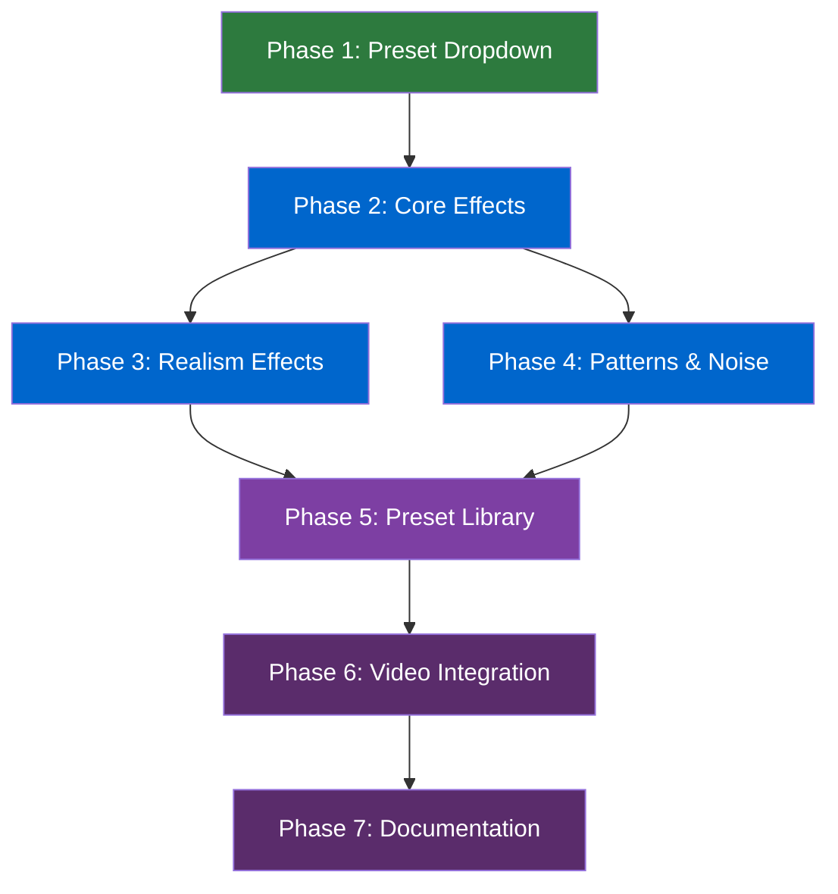

# CRT Enhancements Master Plan

**Project Overview**: Enhance the TeensyROM CRT emulation system with new visual effects, expanded configuration options, and an extensive preset library that emulates specific display technologies from the CRT era. This project adds a preset dropdown to the CRT Settings Panel, introduces new effect parameters (vertical scanlines, grid modes, color tinting, bloom, chromatic aberration, and more), and creates 30+ curated presets organized by category (consumer electronics, arcade monitors, professional displays, computer terminals, connection quality simulation, modern scalers, and artistic styles).

**Standards Documentation**:

- **Coding Standards**: [CODING_STANDARDS.md](../../CODING_STANDARDS.md)
- **Testing Standards**: [TESTING_STANDARDS.md](../../TESTING_STANDARDS.md)
- **Style Guide**: [STYLE_GUIDE.md](../../STYLE_GUIDE.md)
- **Component Library (CRT)**: [COMPONENT_LIBRARY_CRT.md](../../COMPONENT_LIBRARY_CRT.md)
- **Component Library**: [COMPONENT_LIBRARY.md](../../COMPONENT_LIBRARY.md)

---

## 🎯 Project Objective

This project significantly expands the CRT emulation capabilities of the TeensyROM application, transforming a basic scanline/vignette/curvature system into a comprehensive display emulation toolkit. Users will be able to quickly switch between authentic hardware presets (Commodore 1702, Sony Trinitron, arcade monitors, green phosphor terminals, etc.) or fine-tune individual parameters for custom looks.

**User Value**: Users gain access to 30+ authentic hardware presets that accurately emulate specific CRT technologies. Quick preset switching via a dropdown eliminates the need to manually adjust 8+ sliders for common looks. The expanded parameter set (vertical scanlines, grid modes, color temperature, bloom, chromatic aberration) enables effects previously impossible, appealing to retro enthusiasts who want their captures to match specific hardware aesthetics.

**Technical Scope**: The project extends the existing `CrtSettings` interface, `CrtSettingsConfig` feature flags, `CrtEffectWrapperComponent`, and `CrtSettingsPanelComponent`. All effects remain CSS-based for GPU acceleration with no JavaScript animation overhead. The dropdown-menu component will be integrated into the settings panel header for preset selection.

---

## 📋 Implementation Phases

<h3>Phase 1: Preset Dropdown Infrastructure ✅ COMPLETE</h3>

### Objective

Add a functional preset dropdown to the CRT Settings Panel that works with the existing four presets (`full`, `standard`, `small`, `none`). This establishes the UI pattern and dropdown integration before adding new effects, ensuring a testable foundation for subsequent phases.

### Key Deliverables

- [x] Preset dropdown in CRT Settings Panel header using `lib-dropdown-menu`
- [x] Preset selection emits event to parent (existing `presetSelected` output)
- [x] Current preset name displayed in dropdown trigger button
- [x] Dropdown works correctly in both normal and fullscreen modes
- [x] Dropdown styling matches existing glassy card aesthetic
- [x] Unit tests for dropdown integration and preset selection

### Completion Notes

**Completed**: 2025-11-29  
**Report**: [CRT-ENHANCEMENTS-TASK-01-001-REPORT.md](reports/CRT-ENHANCEMENTS-TASK-01-001-REPORT.md)

**Additional Work Completed**:
- Fixed systemic CDK overlay detection issue in `ContentOverlayContainerComponent`
- Added `CRT_PRESET_LABELS` constant for centralized label management
- Added `CrtPresetName` type export for type-safe preset handling

### Resolved Questions

- **Preset Label Format**: Using display-friendly names: "Full CRT", "Standard CRT", "Small CRT", "No Effects"
- **Active Preset Detection**: Deferred to future enhancement - currently just emits preset name on selection

---

<h3>Phase 2: Core Effect Parameters (User-Requested)</h3>

### Objective

Add the most-requested effect parameters that enable authentic CRT reproduction: scanline opacity control, color hue/temperature adjustment, and vertical scanlines with grid modes. These parameters unlock the ability to emulate specific hardware like Trinitron aperture grille monitors and properly color-match different video connection types.

### Key Deliverables

- [ ] `scanlineOpacity` parameter (0-1) for pure black lines vs soft lines
- [ ] `hueRotate` parameter (-180 to 180°) for color shift
- [ ] `colorTemperature` parameter (-1 to 1) for cool blue to warm orange
- [ ] Vertical scanline parameters: intensity, opacity, thickness, spacing
- [ ] `gridMode` selector: 'none', 'horizontal', 'vertical', 'grid', 'dot-matrix'
- [ ] `gridBlendMode` selector: 'multiply', 'overlay', 'darken'
- [ ] Updated `CrtSettingsConfig` with new feature flag groups
- [ ] Settings panel UI with new sliders organized in collapsible sections
- [ ] CSS implementation for all new effects in CRT wrapper
- [ ] Unit tests for new parameters and UI controls

### High-Level Tasks

1. **Extend CrtSettings Interface**: Add new properties for scanline opacity, hue, temperature, vertical scanlines, and grid modes
2. **Extend CrtSettingsConfig Interface**: Add new feature flags for each effect group
3. **Update CRT Effect CSS**: Implement vertical scanlines, grid patterns, hue-rotate, sepia/temperature filters
4. **Create Collapsible Sections**: Organize settings panel into logical groups to prevent overflow
5. **Add Grid Mode Selector**: Implement dropdown/radio selector for grid mode and blend mode
6. **Update Default Settings**: Define sensible defaults for all new parameters
7. **Test Visual Effects**: Verify CSS effects render correctly across all grid modes
8. **Add Unit Tests**: Test slider interactions, grid mode changes, and CSS variable binding

### Open Questions for Phase 2

- **Collapsible Section UI**: Should sections be accordion-style (one open at a time) or independently collapsible?
- **Dot Matrix Implementation**: Use radial gradient or SVG pattern for dot-matrix grid mode?
- **Color Temperature Approach**: Use sepia filter combination or custom color matrix for warm/cool adjustment?

---

<h3>Phase 3: Enhanced Realism Effects</h3>

### Objective

Add visual effects that increase CRT authenticity: bloom/glow around bright areas, chromatic aberration (RGB fringing), phosphor persistence (motion blur/ghosting), interlace flicker, and barrel distortion. These effects differentiate between casual retro aesthetics and authentic hardware emulation.

### Key Deliverables

- [ ] `bloomIntensity` and `bloomRadius` parameters for bright area glow
- [ ] `chromaticAberration` parameter for RGB channel offset
- [ ] `phosphorPersistence` parameter for ghosting effect (CSS blur approach)
- [ ] `interlaceMode` ('none', 'subtle', 'authentic') with flicker animation
- [ ] `flickerIntensity` parameter for brightness variation
- [ ] `barrelDistortion` parameter for geometric warping
- [ ] Accessibility considerations for flicker effects (reduced motion check)
- [ ] Settings panel sections for new effect groups
- [ ] Unit tests for all new effects

### High-Level Tasks

1. **Implement Bloom Effect**: Add blurred, brightened overlay layer with screen blend mode
2. **Implement Chromatic Aberration**: Add RGB channel offset via drop-shadow filters
3. **Implement Phosphor Persistence**: Add subtle blur for phosphor glow simulation
4. **Implement Interlace Flicker**: Add CSS animation with `prefers-reduced-motion` respect
5. **Implement Barrel Distortion**: Add perspective transform approximation
6. **Extend Settings Interface**: Add all new parameters with appropriate ranges
7. **Update Settings Panel**: Add control groups for advanced effects
8. **Add Accessibility Warning**: Display notice when enabling flicker effects
9. **Add Unit Tests**: Test effect rendering and accessibility behavior

### Open Questions for Phase 3

- **Bloom Performance**: Is the dual-layer approach (original + blurred overlay) too costly for lower-end devices?
- **Barrel Distortion Accuracy**: Is CSS perspective transform sufficient, or do we need SVG displacement?
- **Flicker Accessibility**: Should flicker be disabled by default if `prefers-reduced-motion` is set?

---

<h3>Phase 4: Phosphor Patterns & Noise Effects</h3>

### Objective

Add aesthetic variations for phosphor patterns (shadow mask, aperture grille, slot mask) and environmental effects (static noise, screen reflection/glare). These effects add visual texture that differentiates between display technologies.

### Key Deliverables

- [ ] `phosphorPattern` selector: 'none', 'shadow-mask', 'aperture-grille', 'slot-mask'
- [ ] `phosphorScale` parameter for pattern visibility
- [ ] `noiseIntensity` parameter for static/snow
- [ ] `noiseAnimated` toggle for static vs animated noise
- [ ] `reflectionIntensity` parameter for glass glare
- [ ] `reflectionAngle` parameter for light source direction
- [ ] CSS implementations for all phosphor patterns
- [ ] Noise overlay with CSS animation
- [ ] Reflection gradient overlay
- [ ] Unit tests for pattern rendering

### High-Level Tasks

1. **Implement Phosphor Patterns**: Create CSS gradient patterns for shadow-mask, aperture-grille, slot-mask
2. **Implement Noise Overlay**: Add animated or static noise pattern (SVG-based or CSS gradient)
3. **Implement Reflection Layer**: Add linear gradient overlay for glass reflection simulation
4. **Extend Settings Interface**: Add phosphor, noise, and reflection parameters
5. **Update Settings Panel**: Add controls for aesthetic variations
6. **Add Pattern Selector UI**: Implement visual selector for phosphor patterns
7. **Add Unit Tests**: Test pattern rendering and animation states

### Open Questions for Phase 4

- **Noise Generation**: Use SVG filter, canvas generation, or pre-generated data URI?
- **Phosphor Pattern Scale**: Should pattern scale be resolution-aware or fixed pixel sizes?

---

<h3>Phase 5: Comprehensive Preset Library</h3>

### Objective

Create 30+ curated presets organized into meaningful categories that leverage all the new effects added in previous phases. Presets should accurately emulate specific hardware and provide starting points for customization. Update the preset dropdown to display categories.

### Key Deliverables

- [ ] Consumer Electronics presets: Commodore 1702, Sony Trinitron, JVC D-Series
- [ ] Arcade Monitor presets: Generic Arcade, Wells Gardner, Electrohome G07
- [ ] Professional Monitor presets: Sony PVM, Sony BVM
- [ ] Computer Monitor presets: Amber Monochrome, Green Phosphor, White Phosphor
- [ ] Connection Quality presets: RF Fuzzy, Composite Bleed, S-Video Clean
- [ ] Modern Scaler presets: LCD Scanlines, LCD Grid, Dot Matrix LCD
- [ ] Artistic presets: Vaporwave, Cyberpunk, Horror VHS, Synthwave
- [ ] Vector/Specialty presets: Vectrex, Oscilloscope, LED Matrix
- [ ] Categorized dropdown menu with section headers
- [ ] Preset descriptions/tooltips for user guidance
- [ ] Unit tests for all preset definitions

### High-Level Tasks

1. **Define Consumer Electronics Presets**: Create settings for home CRT monitors
2. **Define Arcade Monitor Presets**: Create settings for classic arcade displays
3. **Define Professional Monitor Presets**: Create settings for broadcast/studio monitors
4. **Define Computer Terminal Presets**: Create settings for monochrome terminals
5. **Define Connection Quality Presets**: Create settings simulating different video signals
6. **Define Modern Scaler Presets**: Create settings for LCD filter simulations
7. **Define Artistic Presets**: Create stylized non-realistic presets
8. **Define Vector/Specialty Presets**: Create settings for unique display types
9. **Implement Categorized Dropdown**: Add section headers to preset dropdown
10. **Add Preset Tooltips**: Provide descriptions for each preset
11. **Add Unit Tests**: Verify all presets have valid values within parameter ranges

### Open Questions for Phase 5

- **Preset Organization**: Should the dropdown use nested submenus or section headers within a single list?
- **Preset Count**: Are 30+ presets overwhelming? Should we have "Featured" vs "All Presets" views?
- **Preset Customization**: Should users be able to save custom presets? (Future scope)

---

<h3>Phase 6: Video Dialog & Capture Integration</h3>

### Objective

Ensure all new CRT effects and presets work correctly in the video dialog and video capture components, including fullscreen mode. Verify dropdown overlays render properly and effects are applied correctly to live video streams.

### Key Deliverables

- [ ] Preset dropdown works in video dialog normal and fullscreen modes
- [ ] All new CRT effects render correctly on video streams
- [ ] CRT settings panel scrolls properly with expanded control groups
- [ ] Settings panel visibility toggles work with new collapsible sections
- [ ] Device selector and CRT controls coordinate properly
- [ ] Video capture component uses appropriate default preset
- [ ] E2E tests for video dialog CRT interactions

### High-Level Tasks

1. **Test Preset Dropdown in Dialog**: Verify dropdown overlay positioning in normal and fullscreen
2. **Test New Effects on Video**: Verify all CSS effects apply correctly to live video
3. **Test Settings Panel Scroll**: Ensure expanded panel scrolls within container bounds
4. **Test Fullscreen Transitions**: Verify effects persist correctly through fullscreen toggle
5. **Update Video Capture Defaults**: Apply appropriate preset for embedded capture component
6. **Add E2E Tests**: Test complete CRT control flow in video dialog

### Open Questions for Phase 6

- **Default Preset for Capture**: Should embedded capture use `small` preset or a new `embedded` preset?
- **Settings Persistence**: Should CRT settings persist between sessions? (May be future scope)

---

<h3>Phase 7: Documentation & Polish</h3>

### Objective

Update all documentation to reflect new CRT capabilities, ensure consistent code quality, and polish the user experience. This includes updating the CRT component library documentation, adding usage examples, and performing final testing.

### Key Deliverables

- [ ] Updated COMPONENT_LIBRARY_CRT.md with all new parameters
- [ ] New preset reference table with descriptions
- [ ] Usage examples for new effects
- [ ] Code cleanup and consistency review
- [ ] Accessibility review for all effects
- [ ] Performance testing on various devices
- [ ] Final E2E test pass

### High-Level Tasks

1. **Update CRT Documentation**: Document all new interfaces, parameters, and presets
2. **Add Preset Reference**: Create table of all presets with descriptions and use cases
3. **Add Usage Examples**: Provide code examples for common preset/effect combinations
4. **Review Accessibility**: Ensure flicker effects respect motion preferences
5. **Performance Testing**: Test on various devices to ensure CSS effects remain performant
6. **Code Quality Review**: Clean up any technical debt from implementation phases
7. **Final E2E Testing**: Complete test pass of all CRT functionality

### Open Questions for Phase 7

- **Performance Thresholds**: What frame rate is acceptable for complex effect combinations?
- **Documentation Format**: Should presets have visual thumbnails in documentation?

---

<h2>🏗️ Architecture Overview</h2>

### Key Design Decisions

- **CSS-Only Effects**: All visual effects remain CSS-based (no JavaScript animation loops) for GPU acceleration and battery efficiency. Effects use pseudo-elements, CSS filters, gradients, and blend modes.

- **Additive Parameter Design**: New parameters are additive to existing ones. All existing presets and configurations remain valid with default values for new parameters ensuring backward compatibility.

- **Collapsible Settings Sections**: The settings panel will use collapsible accordion sections to organize the expanded parameter set without overwhelming the UI or requiring excessive scrolling.

- **Categorized Preset Organization**: Presets are organized into logical categories (Consumer, Arcade, Professional, etc.) using section headers in the dropdown rather than nested submenus for simpler navigation.

- **Preset-First Design**: New effects are designed with presets in mind - each effect combination should produce meaningful results when used together in hardware-accurate presets.

### Integration Points

- **CrtSettings Interface**: Extended with 15+ new parameters for advanced effects. Located in `libs/ui/components/src/lib/crt-effect-wrapper/crt-settings.interface.ts`.

- **CrtSettingsConfig Interface**: Extended with new feature flag groups for each effect category. Controls which sliders appear in settings panel.

- **CrtEffectWrapperComponent**: CSS updated to handle new CSS custom properties and effect layers (bloom overlay, noise overlay, reflection layer, phosphor pattern).

- **CrtSettingsPanelComponent**: UI extended with collapsible sections, grid mode selector, pattern selector, and expanded preset dropdown with categories.

- **VideoDialogComponent**: Consumes CRT components with full preset access. Must handle dropdown overlay positioning in fullscreen mode.

- **VideoCaptureComponent**: Consumes CRT components with appropriate default preset for embedded display.

- **Dropdown Menu Component**: Reused for preset selection, integrated into settings panel header.

---

<h2>🧪 Testing Strategy</h2>

### Unit Tests

- [ ] CrtSettings interface accepts all new parameters with correct types
- [ ] CrtSettingsConfig correctly enables/disables setting groups
- [ ] CrtEffectWrapper applies correct CSS custom properties for each parameter
- [ ] Grid mode changes produce correct CSS gradient patterns
- [ ] Phosphor patterns render correct CSS structures
- [ ] Preset dropdown opens/closes correctly
- [ ] Preset selection emits correct preset name
- [ ] Collapsible sections expand/collapse properly
- [ ] Slider changes emit updated settings objects
- [ ] All preset definitions have valid parameter values within ranges
- [ ] Flicker effects check `prefers-reduced-motion`

### Integration Tests

- [ ] Settings panel + effect wrapper coordination (settings changes update visuals)
- [ ] Preset selection updates both panel values and effect wrapper
- [ ] Video dialog CRT controls work in normal mode
- [ ] Video dialog CRT controls work in fullscreen mode
- [ ] Device selector + CRT controls coordinate without interference
- [ ] Dropdown overlays position correctly in fullscreen containers

### E2E Tests

- [ ] User opens video dialog and toggles CRT effect on/off
- [ ] User adjusts CRT slider and sees live effect update
- [ ] User selects preset from dropdown and sees all sliders update
- [ ] User enters fullscreen and CRT effects persist correctly
- [ ] User opens preset dropdown in fullscreen and selects preset
- [ ] User expands/collapses settings panel sections
- [ ] Settings panel scrolls when many sections are expanded

---

<h2>✅ Success Criteria</h2>

- [ ] Preset dropdown in CRT Settings Panel with categorized presets
- [ ] 30+ presets covering consumer, arcade, professional, computer, connection quality, scaler, artistic, and specialty categories
- [ ] New effect parameters: scanline opacity, hue rotate, color temperature, vertical scanlines, grid modes
- [ ] Enhanced realism effects: bloom, chromatic aberration, phosphor persistence, interlace, barrel distortion
- [ ] Aesthetic effects: phosphor patterns, noise, reflection
- [ ] All effects remain CSS-only with GPU acceleration
- [ ] Settings panel organizes parameters in collapsible sections
- [ ] Dropdown works correctly in both normal and fullscreen video dialog
- [ ] Accessibility considerations for flicker/motion effects
- [ ] All unit and integration tests pass
- [ ] E2E tests validate complete CRT workflow in video dialog
- [ ] Documentation updated with all new parameters and presets
- [ ] Backward compatibility maintained with existing preset/config system

---

## 📊 Phase Dependency Graph

**Critical Path**: Phase 1 → Phase 2 → (Phase 3 & Phase 4 in parallel) → Phase 5 → Phase 6 → Phase 7

Phases 3 and 4 can be worked on in parallel after Phase 2 is complete, as they add independent effect groups. Phase 5 (presets) must wait for both to complete as presets use all available effects.

---

## 📁 Related Documents

- [CRT Enhancements Brainstorming](./CRT_ENHANCEMENTS_BRAINSTORMING.md) - Original feature research and ideas
- [Component Library CRT](../../COMPONENT_LIBRARY_CRT.md) - Existing CRT component documentation
- [Component Library](../../COMPONENT_LIBRARY.md) - General UI component catalog
- [Style Guide](../../STYLE_GUIDE.md) - Application styling standards
