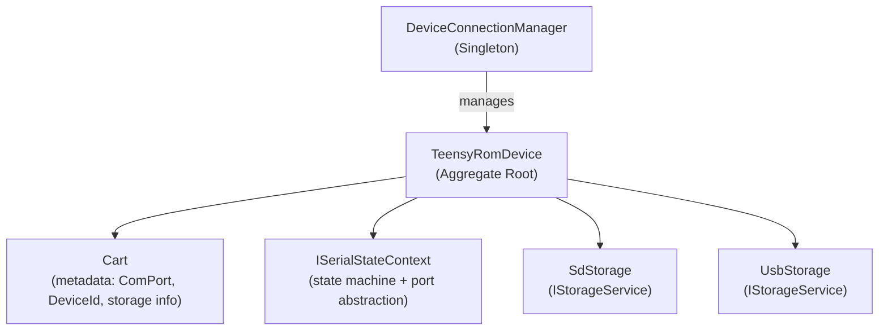
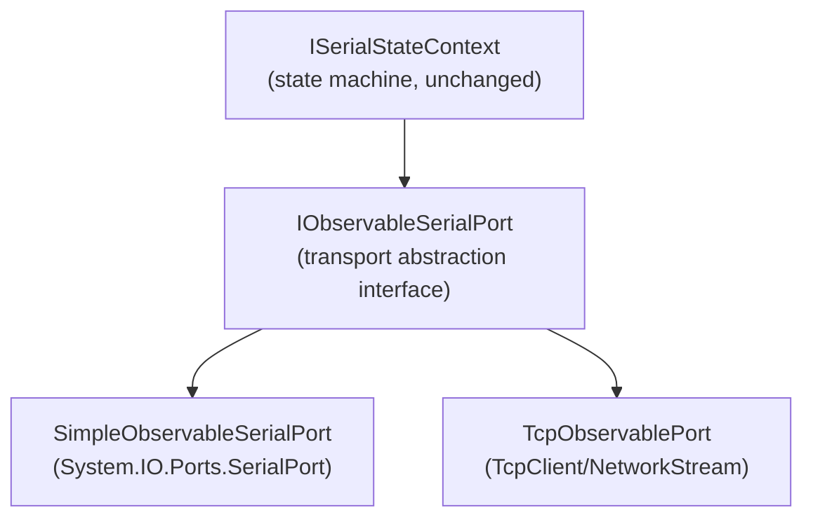
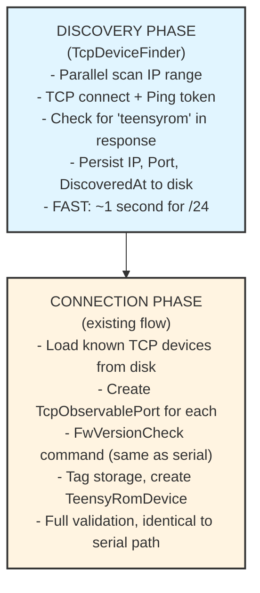

# TCP/IP Connection Support - Brainstorming

## Problem Statement

The current TeensyROM system is built around **serial (COM port) communication** with automatic device discovery. We need to add support for an **alternate TCP/IP connection mechanism** while maintaining full compatibility with the existing serial approach.

**Key challenges:**
- Users should be able to choose connection type per device (Serial vs TCP)
- The stream-based communication protocol is nearly identical - bytes are bytes
- Discovery is harder over TCP: serial scans a short list of COM ports, but TCP requires scanning potentially thousands of IP addresses
- TeensyROM hardware listens on a **fixed port 80**, which simplifies the problem

---

## Current Architecture Analysis

### Device Management Hierarchy



### Key Abstractions

| Interface | Purpose | Current Implementation |
|-----------|---------|----------------------|
| `IObservableSerialPort` | Stream-based I/O (Read, Write, Lock, Unlock) | `SimpleObservableSerialPort` wraps `System.IO.Ports.SerialPort` |
| `ISerialStateContext` | State machine + delegates to transport | `SerialStateContext` |
| `ISerialFactory` | Creates transport contexts | `SerialFactory` creates serial-based contexts |
| `ICartFinder` | Discovers and validates devices | `CartFinder` scans COM ports |

### Current Serial Discovery Flow

1. `CartFinder.FindDevices()` calls `SerialHelper.GetPorts()` → returns `SerialPort.GetPortNames()`
2. For each port, creates `ISerialStateContext` via `SerialFactory`
3. Sends `FwVersionCheckCommand` to validate it's a TeensyROM
4. Tags device with storage info, creates `TeensyRomDevice`

### Why TCP Integration is Feasible

The `IObservableSerialPort` interface is **already transport-agnostic**:

```csharp
public interface IObservableSerialPort : IDisposable
{
    bool IsOpen { get; }
    void Write(byte[] buffer, int offset, int count);
    int Read(byte[] buffer, int offset, int count);
    int ReadByte();
    void Lock();
    void Unlock();
    string? OpenPort();
    Unit ClosePort();
    // ... more stream operations
}
```

A TCP implementation (`TcpObservablePort`) could implement this same interface - handlers and the state machine don't care whether bytes come from COM3 or 192.168.1.50:80.

---

## Proposed Architecture

### Polymorphic Transport Layer



### Extended Cart Model

```csharp
public class Cart
{
    public ConnectionType ConnectionType { get; set; }  // Serial | Tcp
    public string? ComPort { get; set; }                // For serial
    public string? IpAddress { get; set; }              // For TCP
    public int? TcpPort { get; set; }                   // For TCP (default: 80)
    // ... existing properties
}

public enum ConnectionType { Serial, Tcp }
```

### Generalized Factory

```csharp
public interface IDeviceTransportFactory
{
    ISerialStateContext CreateSerial(string portName);
    ISerialStateContext CreateTcp(string ipAddress, int port);
}
```

---

## Discovery Approaches Explored

### Serial Discovery (Current)
- **Approach**: Enumerate `SerialPort.GetPortNames()`, ping each
- **Scope**: ~5-10 ports max
- **Speed**: Instant

### TCP Discovery Options

| Approach | Pros | Cons |
|----------|------|------|
| **Manual Entry** | Simple, user specifies IP:Port | Not "plug and play" |
| **mDNS/Bonjour** | Zero-config discovery | Requires TeensyROM firmware changes to broadcast |
| **UDP Broadcast** | Works if TR responds to broadcast | Same - needs firmware support |
| **Brute Force Scan** | Works without firmware changes | Can be slow for large ranges |
| **Hybrid** | Auto-discover when possible, manual fallback | More complex |

### Recommended: Parallel Brute Force Scan + Persistence

Given the constraints (fixed port 80, no firmware changes required), a **parallel network scan** is practical:

**Key insight**: We only need to scan once. Discovered devices are persisted to disk and loaded on subsequent startups.

#### Performance Estimates

For a typical `/24` subnet (254 hosts):
- **Sequential**: ~50+ seconds (200ms timeout × 254)
- **Parallel (50 threads)**: ~1-2 seconds
- **Parallel (256 threads)**: Sub-second

For a `/16` subnet (65,534 hosts):
- **Parallel (256 threads)**: ~2-3 minutes with aggressive timeouts

---

## Two-Phase Discovery Strategy

### Phase 1: Find Devices (Fast, Minimal)

The `TcpDeviceFinder` focuses **only** on finding TeensyROM devices - no version checking or validation:

```csharp
public async Task<List<DiscoveredTcpDevice>> ScanNetwork(
    IPAddress startIp, 
    IPAddress endIp, 
    CancellationToken ct)
{
    var ipRange = GenerateIpRange(startIp, endIp).ToList();
    var discovered = new ConcurrentBag<DiscoveredTcpDevice>();
    
    await Parallel.ForEachAsync(ipRange, 
        new ParallelOptions { MaxDegreeOfParallelism = 256 },
        async (ip, token) =>
        {
            if (await IsTeensyRom(ip, token))
            {
                discovered.Add(new DiscoveredTcpDevice
                {
                    IpAddress = ip.ToString(),
                    Port = 80,
                    DiscoveredAt = DateTime.UtcNow
                });
            }
        });
    
    return discovered.ToList();
}

private async Task<bool> IsTeensyRom(IPAddress ip, CancellationToken ct)
{
    try
    {
        using var tcpClient = new TcpClient();
        // Quick connect with aggressive timeout
        await tcpClient.ConnectAsync(ip, 80, ct);
        
        var stream = tcpClient.GetStream();
        
        // Send Ping token
        var pingToken = BitConverter.GetBytes(TeensyToken.Ping.Value);
        await stream.WriteAsync(pingToken, ct);
        
        // Check response
        var buffer = new byte[256];
        var bytesRead = await stream.ReadAsync(buffer, ct);
        var response = Encoding.UTF8.GetString(buffer, 0, bytesRead);
        
        return response.IsTeensyRom(); // Contains "teensyrom" or "busy"
    }
    catch
    {
        return false;
    }
}
```

### Phase 2: Connect & Validate (Existing Flow)

Once devices are discovered and persisted, the **existing connection flow** handles validation:

1. Load known TCP devices from disk
2. Create `TcpObservablePort` for each
3. Run `FwVersionCheckCommand` (same as serial)
4. Tag storage, create `TeensyRomDevice`

This separation keeps discovery fast and reuses existing validation logic.



---

## Persistence Strategy

Discovered TCP devices are stored in a JSON file (e.g., `tcp_devices.json`):

```json
[
  {
    "ipAddress": "192.168.1.42",
    "port": 80,
    "discoveredAt": "2025-11-26T10:30:00Z",
    "userAssignedName": "Living Room C64"
  },
  {
    "ipAddress": "192.168.1.105",
    "port": 80,
    "discoveredAt": "2025-11-26T10:30:00Z",
    "userAssignedName": null
  }
]
```

On startup:
1. Load persisted TCP devices
2. Attempt connection to each
3. Failed connections marked as offline (can retry or re-scan)

---

## User Experience Flow

1. **Serial devices**: Auto-discovered as today (unchanged)
2. **TCP devices**:
   - User clicks **"Scan for Network Devices"**
   - UI auto-fills local subnet (e.g., `192.168.1.1` → `192.168.1.254`)
   - Progress bar shows scan progress
   - Found devices appear in list
   - User can assign friendly names
   - Devices persisted - next startup loads them immediately

---

## Smart Defaults

Auto-detect user's local subnet for UX convenience:

```csharp
public static (IPAddress Start, IPAddress End)? GetLocalSubnetRange()
{
    var networkInterface = NetworkInterface.GetAllNetworkInterfaces()
        .Where(n => n.OperationalStatus == OperationalStatus.Up)
        .Where(n => n.NetworkInterfaceType != NetworkInterfaceType.Loopback)
        .SelectMany(n => n.GetIPProperties().UnicastAddresses)
        .FirstOrDefault(a => a.Address.AddressFamily == AddressFamily.InterNetwork);
    
    if (networkInterface is null) return null;
    
    var ip = networkInterface.Address;
    var mask = networkInterface.IPv4Mask;
    
    // Calculate network range from IP and subnet mask
    // Return (start: x.x.x.1, end: x.x.x.254)
}
```

---

## Implementation Components Summary

| Component | Purpose | New/Modified |
|-----------|---------|--------------|
| `TcpObservablePort` | TCP implementation of `IObservableSerialPort` | **New** |
| `TcpDeviceFinder` | Parallel network scanner | **New** |
| `TcpDeviceRegistry` | Persistence layer for discovered devices | **New** |
| `NetworkHelper` | Subnet detection utilities | **New** |
| `IDeviceTransportFactory` | Generalized factory | **New** |
| `Cart` | Extended with `ConnectionType`, `IpAddress`, `TcpPort` | **Modified** |
| `DeviceConnectionManager` | Load TCP devices alongside serial | **Modified** |
| `ScanNetworkEndpoint` | API endpoint to trigger scans | **New** |

---

## Open Questions

1. **Reconnection handling**: If a TCP device's IP changes (DHCP), should we auto-re-scan or prompt user?
2. **Timeouts**: What are optimal timeout values for TCP vs serial? TCP may need longer timeouts over WAN.
3. **Multiple NICs**: If user has multiple network interfaces, which subnet(s) to scan?
4. **Security**: Any concerns with scanning corporate/school networks? Should we add warnings?

---

## Summary

The existing architecture is well-suited for TCP integration due to the transport-agnostic `IObservableSerialPort` interface. The main work involves:

1. **New `TcpObservablePort`** implementing the existing interface
2. **Parallel network scanner** for discovery
3. **Persistence layer** for found devices
4. **Minor model extensions** (`Cart` with connection type)
5. **API/UI** for triggering scans and managing devices

The fixed port 80 and ability to persist discoveries make the brute-force scanning approach practical and fast.

---

*Document created: November 26, 2025*  
*Status: Brainstorming / Pre-planning*
