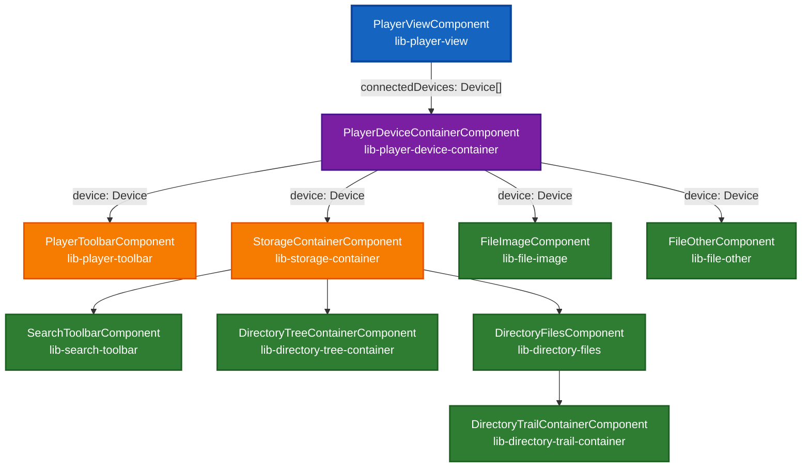
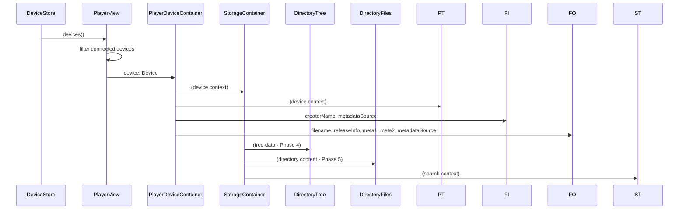

# Player Feature Component Structure

This document provides a visual overview of the Player feature component hierarchy, showing the relationships between components and their input/output properties.

## Component Hierarchy



`DirectoryTreeContainerComponent` and `DirectoryTrailContainerComponent` are thin containers: each wires `StorageStore` to a presentational component promoted to the shared library. `DirectoryFilesComponent` composes the shared `DirectoryItemComponent` and `StorageDeviceItemComponent` directly to render its rows, alongside `ScalingCardComponent`.

Seven presentational row/navigation components now live in `@teensyrom-nx/ui/components` and are shared across features:

- `DirectoryTreeComponent` (`lib-directory-tree`) + `DirectoryTreeNodeComponent` (`lib-directory-tree-node`)
- `DirectoryTrailComponent` (`lib-directory-trail`) + `DirectoryNavigateComponent` (`lib-directory-navigate`) + `DirectoryBreadcrumbComponent` (`lib-directory-breadcrumb`)
- `DirectoryItemComponent` (`lib-directory-item`)
- `StorageDeviceItemComponent` (`lib-storage-device-item`)

## Data Flow



## File Structure

```
libs/features/player/src/lib/player-view/
├── player-view.component.ts              # Root component
├── player-device-container/
│   ├── player-device-container.component.ts  # Device container
│   ├── player-toolbar/                   # Device actions
│   ├── file-image/                       # Image file display
│   ├── file-other/                       # Generic file display
│   └── storage-container/                # Storage coordinator
│       ├── storage-container.component.ts
│       ├── search-toolbar/               # Search interface
│       ├── directory-tree-container/     # Navigation tree (store-wired)
│       ├── directory-trail-container/    # Breadcrumb trail (store-wired)
│       └── directory-files/              # File/directory/storage-device listing
│           └── file-item/                # File row (not promoted)
```
